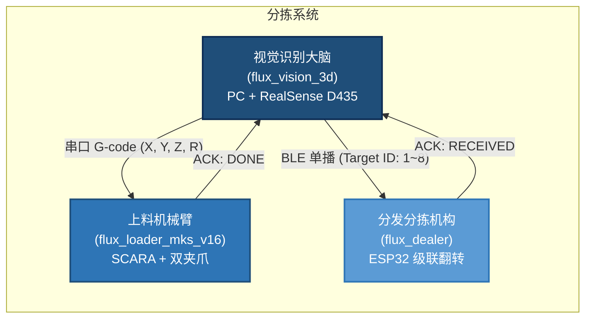

# flux_vision_3d — 芦笋 3D 视觉与抓取位姿估计系统


[](https://python.org)
[](https://opencv.org)
[](https://www.intelrealsense.com)
[]()

`flux_vision_3d` 是专门针对**传送带上多层堆叠、并排贴合的细长果蔬（绿芦笋）**研发的工业级 3D 视觉感知与智能抓取位姿估计系统。

系统通过顶置 3D 深度相机实时解算最顶层芦笋的空间抓取位姿 $(X, Y, Z, R)$，生成标准 G-code 驱动下游 **SCARA 机械臂（flux_loader_mks_v16）** 完成无碰撞下探抓取，并通过 BLE 向 **分发分拣机构（flux_dealer）** 写入多级品质分拣槽位。

---

## 系统拓扑



---

## 核心硬件规格

| 维度 | 规格 | 工程要点 |
| :--- | :--- | :--- |
| **3D 传感器** | Intel RealSense D435 (主动红外双目 RGB-D) | 无 IMU，纯双目结构光 + 彩色图像 |
| **安装方式** | 黑色传送带正上方，大倾角俯视 $(\pm 30°)$ | 算法通过传送带点云平面拟合自解算倾角，无需人工测量 |
| **工作距离** | $550 \sim 700\text{ mm}$（基准 ~640mm） | 避开 D435 近距盲区 (28cm) |
| **空间标靶** | AprilTag 16h5 × 30 枚 (ID 0~29, 50mm) | Tag 0 锁定 SCARA 原点，Tag 1~29 贴机架静止刚体阵列 |
| **坐标标定** | AprilTag 地图在线自定位 + 手眼标定融合 | 支持实时 PnP (`tag_online`)、历史缓存 (`tag_cached`) 与 SVD 接触式标定 (`hand_eye`) |
| **执行机构** | 4 轴 SCARA + 双开闭夹爪 (Marlin G-code) | 串口通信：`G0 X.. Y.. R..` → `G1 Z..` → `M4` |
| **分拣机构** | 8 级级联步进翻料 (ESP32 BLE) | 蓝牙单播：`Target ID: 1~8` |

> [!TIP]
> **多源标定融合与安全降级**：`asparagus_analyzer.py` 优先使用 AprilTag 在线实时解算的世界外参；当现场标靶被遮挡时平滑沿用历史锁定缓存；若无 Tag 地图则回退至手工接触式手眼标定矩阵（`hand_eye`）；若完全未标定则触发防撞兜底，绝对拦截相机高程直接传入机械臂。详见 [apriltag_calibration.md](docs/apriltag_calibration.md)。

---

## 快速上手

### 环境准备

系统推荐 Windows 10/11 64 位，Python 3.10+：

```powershell
cd d:\Software\antigravity\flux_vision_3d
pip install -r requirements.txt
```

### 启动控制终端

```powershell
./run          # PowerShell
run.bat        # CMD
```

进入控制终端后，系统分为顶级核心功能与二级标定专区：

| 顶级功能入口 | 说明 |
| :--- | :--- |
| `[1] 实时相机主视窗` | D435 查看器、鼠标 3D 探测、`[D]` 芦笋检测、`[G]` 打印 G-code、`[S]` 抓拍快照 |
| `[2] 手眼标定与 AprilTag 建图` | **进入标定专区**：制靶、采图、BA 建图平差、在线 AR 验证、审核画板、白名单管理 |
| `[3] 模拟生成快照帧` | 无真实相机时，一键生成虚拟芦笋点云快照帧 |
| `[4] 运行最新快照解算` | 单独载入本地最新快照进行算法快速验证 |
| `[5] 自动化全量测试` | 运行测试专区（真实快照 20 组、仿真管线、空间平差单元测试等） |
| `[9] 硬件与环境诊断` | 诊断 Python、OpenCV、pyrealsense2、固件与连接状态 |

### 查看器快捷键

| 按键 | 功能 |
| :---: | :--- |
| `D` | 开启/关闭芦笋检测与顶层高亮 |
| `G` | 打印当前最顶层芦笋的 SCARA G-code |
| `S` | 抓拍 RGB、深度热力图与点云到 `data/snapshots/` |
| `H` | 切换纠偏高度图 / 原生深度图 |
| `A` / `[` / `]` | 调节深度色彩区间（含自适应拉伸） |

---

## 项目结构

```text
flux_vision_3d/
├── config.yaml                    # 系统核心配置 (相机、滤波、视觉门限、白名单、串口)
├── README.md                      # 本文件：项目总览与快速上手
├── requirements.txt               # Python 依赖清单
├── run.bat / run.ps1              # 一键启动入口
│
├── docs/                          # 📚 技术文档库
│   ├── architecture.md            #    系统分层架构与模块职责
│   ├── algorithm_pipeline.md      #    核心算法处理管线详解
│   ├── requirements.md            #    系统需求与设计规格书
│   └── apriltag_calibration.md    #    AprilTag 多标靶标定设计方案 (v2.0)
│
├── src/vision/                    # 🧠 核心算法源码
│   ├── asparagus_analyzer.py      #    感知引擎 (平面标定→暗缝分离→主轴拟合→顶层解算)
│   └── tag_localizer.py           #    AprilTag 在线相机外参定位器
│
├── tests/                         # ✅ 自动化测试套件
│   ├── test_real_snapshot.py      #    真实快照全量测试 (20 组, 100% 通过)
│   ├── test_mock_pipeline.py      #    仿真管线回归测试
│   ├── test_tag_map_builder.py    #    多标靶建图与两阶段 BA 单元测试
│   ├── test_tag_calibration_verifier.py # 在线 AR 验证器与时域去噪测试
│   ├── test_tag_localizer.py      #    在线定位器单元测试
│   └── test_hand_eye_calibration.py # 手眼标定精度验证
│
├── tools/                         # 🔧 运维与顶级应用 (极简根目录)
│   ├── cli_menu.py                #    交互式统一控制终端主入口
│   ├── d435_viewer.py             #    实时相机查看器与深度探针
│   ├── find_top_asparagus.py      #    单帧抓取解算 (输出 G-code 与 JSON)
│   │
│   └── calibration/               # 🎯 标定与平差全套工具链 (五步黄金工序)
│       ├── generate_apriltags.py         # 工序 1: 标靶 0~29 高清矢量图与 A4 排版 PDF
│       ├── tag_capture_wizard.py         # 工序 2: 交互式多视角采图向导 (1080P @ 8fps 连拍)
│       ├── tag_super_extractor.py        # 工序 3: 离线超精重提取引擎 (16级网格+CLAHE+CONTOUR拟合)
│       ├── tag_manifest_reviewer.py      # 工序 4: 采图清单交互画板 (右键菜单/整帧旁路/主从握手)
│       ├── tag_map_builder.py            # 工序 5A: 离线极限两阶段 BA 建图平差求解器
│       ├── tag_calibration_verifier.py   # 工序 5B: 现场 AR 盲测/时域去噪/原地一键BA与HUD
│       ├── diagnose_tag_frame.py         # 辅助诊断: 标靶漏检病因切片深度诊断
│       └── hand_eye_calibration.py       # 备用通道: SCARA 经典接触式物理标定向导
│
└── data/snapshots/                # 📸 真实快照库 (RGB + 点云 + 标注图)
```

---

## 技术文档导航

| 文档 | 内容概述 | 适用读者 |
| :--- | :--- | :--- |
| [CHANGELOG.md](docs/CHANGELOG.md) | 系统版本演进历程、重大架构升级与实测战报 | 全员、项目管理、架构评审 |
| [architecture.md](docs/architecture.md) | 系统分层架构、模块职责、工具矩阵与数据流 | 新成员入门、架构评审 |
| [algorithm_pipeline.md](docs/algorithm_pipeline.md) | 九大算法环节逐层剖析（含数学推导与 Mermaid 流程图） | 算法开发、调参优化 |
| [requirements.md](docs/requirements.md) | 功能/非功能需求、里程碑进度 | 需求评审、项目管理 |
| [apriltag_calibration.md](docs/apriltag_calibration.md) | AprilTag 16h5 多标靶建图、两阶段 BA 平差与在线自定位方案 | 标定实施、现场部署 |

---

## 质量保证

- **真实快照测试**：覆盖 **20 组**现场快照，**100.0%** 顶层锁定成功率（累计 136 根次）
- **空间平差优化**：实采图全局重投影 RMSE 从 52.28px 压降至 **4.14px**，标准图达 **0.032px**
- **仿真管线测试**：脱机开发环境的虚拟点云与三层叠压回归验证
- **手眼标定验证**：Horn/Kabsch SVD 刚体变换精度与 500+mm 危险深度拦截

---
*文档更新日期: 2026年9月 | flux_vision_3d 团队*
