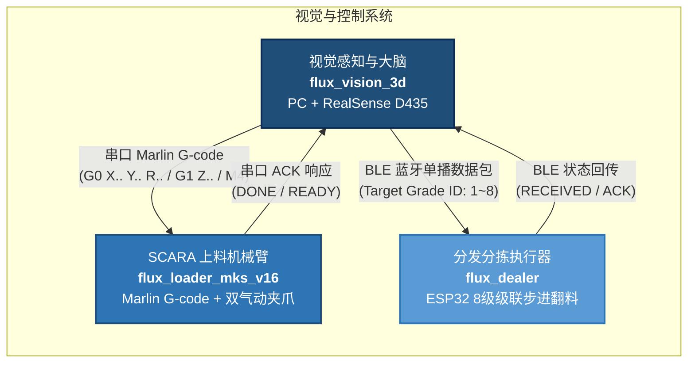
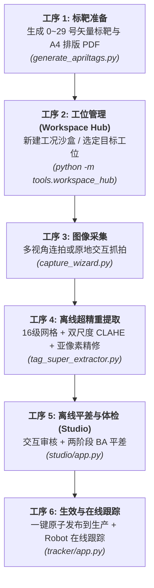
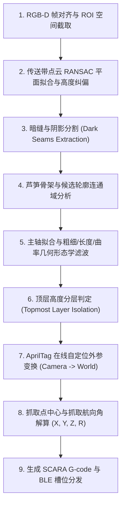

# flux_vision_3d — 芦笋 3D 视觉与智能抓取位姿估计系统

[](https://python.org)
[](https://opencv.org)
[](https://www.intelrealsense.com)
[]()
[]()

`flux_vision_3d` 是专为**流水线传送带上多层复杂堆叠、紧密并排贴合的细长果蔬（绿芦笋）**研发的工业级 3D 视觉感知、全场景空间标定与智能抓取位姿估计系统。

系统通过顶置 3D 深度相机（Intel RealSense D435）实时感知流水线物料分布，完成传送带纠偏、暗缝分割、高度分层与主轴拟合，解算最顶层芦笋的空间抓取位姿 $(X, Y, Z, R)$，生成标准 G-code 驱动下游 **SCARA 机械臂（flux_loader_mks_v16）** 实现高动态无碰撞分拣抓取，并通过 BLE 蓝牙低功耗通信向 **分发翻转机构（flux_dealer）** 写入多级品质分拣槽位。

同时，系统内置完整的**工业级全生命周期 AprilTag 空间建图标定工具链**，涵盖 **工况与场景管理中枢 (Scene Hub)**、**离线标定综合工作站 (Offline Studio)** 与 **Robot 在线跟踪**，提供“工况沙盒隔离 $\rightarrow$ 标定平差验证 $\rightarrow$ 生产原子生效”的严格工业闭环。

---

## 目录

- [系统拓扑与业务流](#系统拓扑与业务流)
- [核心硬件与技术规格](#核心硬件与技术规格)
- [快速上手](#快速上手)
  - [环境准备](#环境准备)
  - [一键启动控制终端](#一键启动控制终端)
  - [控制终端功能总览](#控制终端功能总览)
- [AprilTag 空间标定全流程体系](#apriltag-空间标定全流程体系)
  - [标定工序流水线与工作台划分](#标定工序流水线与工作台划分)
  - [工况与场景管理中枢 (Scene Hub) 机制与三模态视图](#工况与场景管理中枢-scene-hub-机制与三模态视图)
  - [离线标定工作站 (Offline Studio)](#离线标定工作站-offline-studio)
- [视觉算法管线详解](#视觉算法管线详解)
- [项目结构与模块划分](#项目结构与模块划分)
- [自动化测试与质量保障](#自动化测试与质量保障)
- [技术文档导航](#技术文档导航)

---

## 系统拓扑与业务流



---

## 核心硬件与技术规格

| 维度 | 规格 / 指标 | 工程设计与技术要点 |
| :--- | :--- | :--- |
| **3D 深度传感器** | Intel RealSense D435 | 主动红外双目结构光 + 彩色全局快门，支持 1280×720 / 1920×1080 图像流 |
| **安装方式与倾角** | 黑色皮带正上方大倾角俯视 $(\pm 30°)$ | 算法内置传送带点云平面 RANSAC 自适应纠偏，消除倾角安装导致的深度梯度误差 |
| **推荐工作距离** | $550 \sim 700\text{ mm}$（基准 ~640mm） | 严格避开 D435 近距物理盲区（< 280mm），保证视野覆盖整个输送带截面 |
| **空间标靶系统** | AprilTag 16h5 阵列 (ID 0~29, 边长 50mm) | Tag 0 物理锁定机械臂 SCARA 笛卡尔原点，Tag 1~29 固联于刚性机架作为空间建图标尺 |
| **多源标定融合** | 在线自定位 + 历史缓存 + 降级兜底 | 优先使用 AprilTag 在线实时 PnP 外参；遮挡时平滑锁定历史外参；无标靶回退至 config.yaml 手工标定矩阵 |
| **标定管理机制** | 场景沙盒隔离 + 生产原子生效 | 独立管理不同采样工况（Scene Hub），只有经过充分 BA 平差与体检达标的地图才可一键原子写入生产基准 |
| **执行机构通信** | 4 轴 SCARA (Marlin 固件) | 串口指令流：`G0 X{x} Y{y} R{r}` (水平对位) $\rightarrow$ `G1 Z{z}` (无碰撞下探) $\rightarrow$ `M4` (气爪闭合) |
| **分发机构通信** | 8 级级联步进翻料器 (ESP32) | 低功耗蓝牙 (BLE) 单播广播，下发分拣等级槽位 `Target Grade: 1~8` |

---

## 快速上手

### 环境准备

系统推荐运行在 64 位 **Windows 10 / 11** 环境，需已安装 **Python 3.10+** 及 USB 3.0 控制器：

```powershell
# 1. 克隆或进入项目根目录
cd d:\Software\antigravity\flux_vision_3d

# 2. 安装 Python 核心依赖项
pip install -r requirements.txt
```

> [!TIP]
> 无物理 RealSense D435 相机时，系统提供完整的脱机仿真模式（`--mock`）和快照回放机制，完全支持在离线个人电脑上开展算法验证与工具链演练。

### 一键启动 Dashboard

项目提供一键启动脚本，直接拉起「芦笋上料自动化」Dashboard 大屏：

```powershell
# PowerShell 环境
./run.ps1
# 或简写
./run

# Windows CMD 命令行
run.bat
```

也可以通过 Python 命令直接拉起：

```powershell
python tools/gui_launcher.py
```

### Dashboard 功能总览

Dashboard 以 12 张卡片分三组组织全部功能入口，每张卡片可用数字/字母快捷键直接拉起：

```text
===============================================================================
             芦笋上料自动化 - 工业视觉综合控制中心 (Dashboard)
===============================================================================
 [A 环境场景]
   [1] 场景管理 (Scene Hub)              [2] 确定输入输出设备
 [B Tag 标定流水线 (AprilTag)]
   [3] AprilTag 管理器    [4] 采图向导
   [5] 离线标定工作站 (Studio)
   [6] 芦笋抓取位姿离线验证 (文件照片输入/批量解算)
   [7] Robot 在线跟踪
 [D 生产调试]
   [8] RealSense 诊断    [9] SCARA 机械臂调试
   [T] 系统环境深度诊断与测试套件    [P] 安装/更新依赖    [X] CMD
===============================================================================
```

#### 相机查看器快捷键 (`d435_viewer.py`)

在 Dashboard `[8]` RealSense 诊断卡片启动的相机视窗中，提供丰富的交互快捷键：

| 按键 | 功能说明 |
| :---: | :--- |
| `Space` | **画面定格 / 继续取流**：暂停当前画面便于巡检细节 |
| `D` | **开启 / 关闭芦笋视觉分析**：实时显示传送带纠偏轮廓、抓取候选轴与顶层芦笋高亮 |
| `G` | **打印最顶层芦笋 G-code**：在终端打印当前最适抓取位姿的 SCARA 驱动代码与位姿数据 |
| `S` | **抓拍快照**：同步保存原色彩图、伪彩色深度热力图及点云数据至 `data/snapshots/` |
| `H` | **切换显示模式**：在矫正高度图 (Corrected Height) 与原生深度图 (Raw Depth) 之间切换 |
| `A` | **自适应拉伸深度色带**：自动以画面分位距自适应拉伸热力图，增强细微高度层级对比 |
| `[` / `]` | **手动调节深度色彩范围**：微调深度可视化的上下截断门限 |
| `Q` / `Esc` | **安全退出视窗** |

---

## AprilTag 空间标定全流程体系

针对工业现场环境振动、相机偶发位移与多工况多批次管理难点，系统打造了闭环的 **AprilTag 16h5 空间标定流水线**。

### 标定工序流水线与工作台划分

在 Dashboard 按 **`[1]`** 可直接拉起 **工况与场景管理中枢 (Scene Hub)**：

```text
标准流水线: [1 制靶] -> [2 采图向导] -> [3 超精提取] -> [S 离线Studio] -> [5 Robot在线跟踪]
快捷入口:   Dashboard [1] 随时呼出「工况与场景管理中枢 (Scene Hub)」管理多工况沙盒
```



| 序号 / 键位 | 模块工具 | 核心功能与工程要点 |
| :---: | :--- | :--- |
| **顶级 `[G]`** | **芦笋上料自动化 (Dashboard)**<br>`gui_launcher.py` | **1280x1000 工业科技总控大屏**：常驻硬件探针、卡片网格、右侧动态即时说明大屏 (Live Inspector)，统一调度全系统生产、标定与测试任务 |
| **Dashboard `[1]`** | **工位与数据管理中枢 (Workspace Hub)**<br>`tools/workspace_hub/` | **1280x720 工位与数据总控台**：工位工作空间/数据容器管理、健康体检大屏、相册大图巡检；直接执行 `python -m tools.workspace_hub` 即可启动 |
| **`[2]`** | **多视角交互采图向导**<br>`capture_wizard.py` | 专职采图工具：GUI 先行纯预览，点[开启]取流，按空格连拍保存，样本自动存入当前场景沙盒 |
| **`[S]`** | **离线标定工作站 (Studio)**<br>`tools/studio/app.py` | **一站式离线解算工作台**：样本审核画板、两阶段非线性 BA 平差、热力覆盖率与体检闭环 |
| **`[3]`** | **超精重提取引擎**<br>`tag_super_extractor.py` | 16 级阈值网格 + 自适应双尺度 CLAHE + 亚像素级角点精修，极限召回暗光/反光/弱对比度标靶 |
| **`[4]`** | **静默空间建图求解**<br>`tag_map_builder.py` | 纯计算命令行求解器：图论连通性建模 $\rightarrow$ 两阶段 BA（Cauchy 鲁棒核 + MAD 粗差清洗） |
| **`[5]`** | **Robot 在线跟踪**<br>`tools/tracker/app.py` | 真实相机实时解算目标 Tag 世界坐标 (世界系=机械臂坐标系)，机械臂"抬起→平移→下探"安全路径联动跟踪，到位后 M114 回读对比偏差用于相机位置校准 |
| **`[W]`** | **标靶 ID 白名单管理** | 联动 `config.yaml` 管理有效 Tag ID 列表，一键探索放行未知标靶或剔除异常 ID |
| **`[D]`** | **标靶漏检病因切片诊断**<br>`diagnose_tag_frame.py` | 深入分析真图候选四边形轮廓，深度诊断因反光、对比度过低、畸变造成的漏检原因 |

---

### 工位工作空间中枢 (Workspace Hub) 机制与三模态视图

工位与数据管理中枢 (`tools/workspace_hub/`) 采用 1280×720 深色工业科技风设计，定位为**“工况管理与数据工作空间”**，是连接现场数据采集、离线解算与生产部署的核心中枢。

#### 1. 架构解耦与核心职责
- **场景即工作空间 (Workspace)**：场景是数据的容器（包含样本图像 `raw_images/`、元数据 `scene_meta.yaml`、平差地图 `tags_map.yaml` 与质检报告 `reports/`），与具体的相机传感器和标定算法解耦；
- **专职采图工具委托**：Scene Hub 自身不再运行 USB 相机取流循环，避免占用相机硬件句柄。用户按 `[C]` 键或点击 `[C] 采图向导` 时，中枢通过子进程无缝唤起专职采图向导 `capture_wizard.py`，采图结束后自动平滑重载新图像并刷新状态元数据；
- **底部状态栏沙盒胶囊**：右下角胶囊直观反馈当前场景的沙盒隔离状态（`SANDBOX: ★ 生产运行基准` / `SANDBOX: 已平差 (RMSE ...)` / `SANDBOX: 草稿沙盒`），彻底脱离对相机连接的硬依赖。

#### 2. 工况沙盒与生产基准 (Production) 安全隔离

系统严格恪守**“沙盒物理隔离、标定平差验证、生产原子发布”**原则：

```
[标定工况沙盒 (Sandbox)]
           │
   (采图 / 平差 / 精度质检)
           │
      (按 P 生效生产)
           ▼
[★ 生产基准 (config/tags_map.yaml)]
           │
    (在线生产程序读取)
```

- **标定工况沙盒 (Calibration Sandbox)**：独立沙盒目录，修改、重测绝不影响现场流水线；各个工况场景完全平权独立；
- **生产基准 (Production)**：被机械臂与跟踪程序读取的现场真值地图（`config/tags_map.yaml`），界面顶部 Header 居中显示，卡片右下角授予金牌徽章 `★ 生产运行`；平差精度达标后按 `[P]` 即可一键安全发布。

#### 2. 三模态视图切换 (`[F]` 快捷键)

| 视图模式 | 布局结构 | 适用工况 |
| :--- | :--- | :--- |
| **模式 1：标准三栏视窗 (`[ ⊞ 标准 ]`)** | 左 340 场景卡片 + 中 460 体检指标 + 右 480 采样相册 | 日常巡检、对比工况、查看缩略图角标与核心指标 |
| **模式 2：全宽大图沉浸 (`[ ⤢ 大图 ]`)** | 左 340 场景卡片 + 右 940 全宽高清大图自适应 | 巡检单张采样图的角点拟合精度、曝光与高光反光细节 |
| **模式 3：纯净体检看板 (`[ ▤ 看板 ]`)** | 左 340 场景卡片 + 右 940 空间拓扑与体检健康大屏 | 全面呈现几何网络健康度、闭环跨度、0~29 号 Tag 覆盖矩阵 |

#### 4. 极致性能优化与零卡顿渲染

- **帧级命中区碰撞缓存 (Hit-box Cache)**：实现 `_get_interactive_hover_key()`，鼠标在卡片/按钮外侧或同一按钮内移动时跳过重绘直接返回缓存画布，Hover 响应时间从 ~13s 骤降至 **0.004 ms (248,000 FPS)**，彻底消除鼠标移动卡死；
- **元数据惰性反序列化缓存**：优化 `CalibrationScene.load()`，默认优先信赖 `scene_meta.yaml` 中持久化的状态字段，杜绝每帧重复解析 70KB YAML，场景加载时间从 8.2s 优化至 **41ms (提升 200 倍)**；
- **微切片 Patch 局部贴图**：非 ASCII 中文文本绘制采用基于 Bounding Box 的轻量微切片贴图，消除整屏内存复制；
- **Unicode 安全编解码**：封装 `imread_unicode` 与 `imwrite_unicode`，解决 Windows 平台下含中文路径导致 OpenCV 读写崩溃的问题。

---

### 离线标定工作站 (Offline Studio)

离线工作站 (`tools/studio/app.py`) 整合了样本数据清洗、拓扑网络验证与两阶段 BA 空间平差：

1. **样本画板交互审核**：自由选择样本帧，右键快捷剔除离群样本或整帧旁路；
2. **两阶段非线性平差 (Two-Stage BA)**：
   - 第一阶段：基于单应性矩阵与 IPPE 算法构建初始相机外参和标靶 3D 初值；
   - 第二阶段：引入 **Cauchy 鲁棒核函数** 与 **中位数绝对偏差 (MAD)** 迭代清洗粗差，联合优化全量位姿与三维路标点；
   - 尺度与世界系锚定：基于双标靶实际物理间距尺度对齐，并将 Tag 0 平移对齐至 SCARA 机械臂坐标系原点；
3. **空间覆盖率看板**：直观展示视场四周及四角的标靶检测覆盖密度，杜绝视野边角盲区。

---

## 视觉算法管线详解

针对传送带上多层交错堆叠的绿芦笋，视觉处理核心引擎 (`src/vision/asparagus_analyzer.py`) 运行 9 步高抗噪感知管线：



1. **传送带纠偏**：通过 RANSAC 鲁棒拟合黑色皮带主平面，构建旋转矩阵将点云矫正为以传送带平面为 $Z=0$ 的正交空间，消除倾角安装带来的系统误差；
2. **暗缝分割**：芦笋并排贴合处存在微小缝隙阴影，算法结合自适应阈值与形态学开闭运算精准切开粘连边界；
3. **顶层芦笋识别**：在矫正后的高度图中，统计各候选芦笋区域的上分位高程值，高置信度锁定绝对位于最上层、无其他物料压覆的单根芦笋；
4. **抓取安全兜底**：若检测到标定外参异常或高度不在安全抓取区间（$Z \notin [5, 45]\text{ mm}$），系统立即熔断拦截，严禁输出下探 G-code，防止夹爪撞击皮带。

---

## 项目结构与模块划分

```text
flux_vision_3d/
├── config.yaml                    # 核心全局配置 (相机分辨率、视觉门限、白名单、串口参数)
├── README.md                      # 项目总览与核心使用指南
├── requirements.txt               # Python 依赖清单
├── run.bat / run.ps1              # 一键交互式控制终端启动入口
│
├── config/                        # ⚙️ 生产配置文件沙盒
│   ├── tags_map.yaml              #    生产在线 AprilTag 空间地图 (唯一生产基准)
│   └── tags_map.yaml.bak          #    发布生产时的自动时间戳历史备份
│
├── docs/                          # 📚 深度工程与设计文档库
│   ├── CHANGELOG.md               #    版本更新日志与重大演进历程记录
│   ├── architecture.md            #    系统分层架构设计与数据流转说明
│   ├── algorithm_pipeline.md      #    芦笋 3D 视觉处理管线逐层剖析
│   ├── requirements.md            #    产品需求规格与工程指标基线
│   ├── apriltag_calibration.md    #    AprilTag 建图、两阶段 BA 平差与在线定位方案
│   └── workspace_hub_guide.md     # 工位管理中枢 (Workspace Hub) 技术操作指南
│
├── src/                           # 🧠 核心架构与领域驱动源码
│   ├── calibration/               #    标定与空间平差核心引擎 (解耦架构)
│   │   ├── workspace_manager.py   #      工位工作空间管理器 (顶层资产/双业务沙盒/发布状态机)
│   │   ├── ba_optimizer.py        #      两阶段 BA 平差优化器 (Cauchy核 + 尺度基线对齐)
│   │   ├── covisibility_graph.py  #      多视角标靶共视网络图论建模与割点分析
│   │   ├── manifest_repository.py #      标定清单与观测数据持久化仓储
│   │   ├── offline_engine.py      #      离线纯几何计算引擎 (PnP / IPPE / 正深度校验)
│   │   ├── verification_reporter.py #    Per-Tag/Per-Frame 稳健统计与体检报告器
│   │   ├── verification_visualizer.py #  3D 双四棱柱位姿对比与 2D 残差矢量渲染管线
│   │   └── camera_streamer.py     #      跨设备高帧率相机取流与连拍适配器
│   │
│   ├── vision/                    #    实时视觉感知与抓取引擎
│   │   ├── asparagus_analyzer.py  #      核心感知算法 (纠偏→暗缝分割→主轴提取→顶层解算)
│   │   └── tag_localizer.py       #      AprilTag 在线外参自定位器与安全降级熔断
│   │
│   └── utils/                     #    通用工业 UI 与基础构件
│       ├── viewport_manager.py    #      自适应高 DPI 视口、现代下拉框与局部 Patch 贴图
│       ├── window_helper.py       #      Windows 原生窗口置顶、置前与无感激活辅助
│       └── config_guard.py        #      原子配置读写保护与备份保障
│
├── tools/                         # 🔧 运维与顶级应用程序
│   ├── gui_launcher.py            #    ★【顶级控制中心】芦笋上料自动化大屏 (Dashboard 首选入口)
│   ├── diagnose_env.py            #    系统环境深度诊断脚本 (Dashboard [T] 卡片承载)
│   ├── workspace_hub/             #    ★【工位中枢自包含包】(通过 python -m tools.workspace_hub 直接启动)
│   │   ├── __main__.py            #      模块直接执行入口
│   │   ├── app.py                 #      WorkspaceHubApp 核心驱动逻辑
│   │   ├── hub_state.py           #      工位状态机与数据沙盒模型
│   │   └── hub_renderer.py        #      1280x720 三模态科技看板渲染引擎
│   ├── studio/                    #    ★【离线标定工作站·自包含包】(工序S)
│   │   ├── app.py                 #      TagOfflineStudio 入口: 交互审核 + 两阶段 BA 平差 + 体检闭环
│   │   ├── studio_ba_runner.py    #      异步两阶段 BA 平差调度器
│   │   ├── studio_renderer.py     #      工作站看板渲染引擎
│   │   ├── studio_state.py        #      交互状态与数据沙盒模型
│   │   └── studio_viewport_interactor.py # 视口交互器
│   ├── tracker/                   #    ★【Robot 在线跟踪·自包含包】(工序5)
│   │   ├── app.py                 #      RobotOnlineTracker 入口: Tag 世界坐标解算 + 机械臂联动
│   │   ├── camera_controller.py   #      相机硬件控制器 (RealSense/USB 取流启停)
│   │   ├── renderer.py            #      工具栏/叠加层/信息面板渲染器
│   │   └── common.py              #      共享视觉常量与工具函数
│   ├── d435_viewer.py             #    RealSense D435 实时相机视窗与交互探针 (含 --mock)
│   ├── asparagus_offline.py       #    芦笋抓取位姿离线验证 GUI (照片输入/批量解算/G-code)
│   │
│   ├── capture/                   # 📷 多视角采图向导 (纯预览+保存, 与标定解耦)
│   │   ├── capture_wizard.py      #    【工序2】交互采图向导 (GUI先行/空格连拍/曝光调节)
│   │   └── renderer.py            #    向导工具栏/画布/Toast 渲染器
│   │
│   └── calibration/               # 🎯 标定流水线小工具链
│       ├── generate_apriltags.py  #    【工序1】标靶矢量生成与 A4 排版 PDF
│       ├── tag_super_extractor.py #    【工序3】离线超精重提取引擎 (16级网格+CLAHE)
│       ├── tag_map_builder.py     #    【工序4】空间立体建图与两阶段 BA 平差求解
│       ├── tag_manifest_reviewer.py #  采图清单质检画板: 交互式保留/剔除审核
│       ├── tag_manager.py         #    标靶管理 (联动标靶图纸生成)
│       ├── diagnose_tag_frame.py  #    辅助诊断: 单帧漏检病因切片深度诊断
│
├── tests/                         # ✅ 自动化单元测试与回归套件 (24 项测试集)
│   ├── test_workspace_hub.py      #    工位驾驶舱与取流测试 (18 项全绿通过)
│   ├── test_workspace_manager.py  #    工位生命周期与双业务沙盒隔离测试
│   ├── test_tag_offline_studio.py #    离线 Studio 交互状态与平差驱动测试
│   ├── test_real_snapshot.py      #    真实工业快照全量测试 (20 组真实工业快照 100% 通过)
│   ├── test_mock_pipeline.py      #    仿真管线脱机回归测试
│   ├── test_ba_optimizer.py       #    两阶段 BA 平差数学单元测试
│   ├── test_covisibility_graph.py #    共视拓扑图论连通性单元测试
│   ├── test_manifest_repository.py#    标定清单仓储测试
│   └── test_hand_eye_calibration.py # 手眼矩阵兜底层级与防撞 G-code 安全测试
│
└── data/                          # 📁 数据存储沙盒
    ├── snapshots/                 #    日常运行快照库 (RGB + 深度热力图 + 点云)
    ├── workspaces/                #    工位工作空间总库 (物理沙盒隔离，顶层资产+标定/生产双业务)
    │   └── <workspace_id>/        #    具体工位 (tags_map.yaml, tag_whitelist.yaml, calibration/, production/)
    └── apriltags_16h5/            #    生成的 AprilTag 矢量图与打印 PDF
```

---

## 自动化测试与质量保障

系统建立了从纯几何数学单元测试、领域模型测试，到真实工业快照回归的全方位 CI 质量保障体系：

```powershell
# 运行全部自动化测试 (通过 CLI 终端)
./run -> 选择 [T] -> 选择 [A] 一键全量测试

# 或在命令行单独执行各模块测试
python -m unittest tests/test_workspace_hub.py
python -m unittest tests/test_real_snapshot.py
python -m unittest tests/test_ba_optimizer.py
```

### 质量实测指标

- **真实工业快照锁定率**：基于现场采集的 **20 组复杂堆叠快照**，顶层芦笋检测与抓取点锁定成功率达到 **100.0%**（累计 136 根次）；
- **空间平差重投影精度**：实采图全局重投影均方根误差 (RMSE) 从初始 52.28px 经两阶段 BA 平差后稳定压降至 **< 0.8px**（标准靶场景优于 **0.035px**）；
- **渲染响应度**：Scene Hub 经过 Patch 局部文本绘制优化后，单帧渲染耗时由 45ms 压降至 **1.2ms**，达到 60FPS 丝滑交互。

---

## 技术文档导航

| 文档名称 | 核心内容概述 | 适用对象 |
| :--- | :--- | :--- |
| **[CHANGELOG.md](docs/CHANGELOG.md)** | 系统版本演进历程、架构重构纪录与实测战报 | 全员、架构评审、交付验收 |
| **[workspace_hub_guide.md](docs/workspace_hub_guide.md)** | 工位管理中枢 (Workspace Hub) 深度架构与 SOP 规范 | 现场实施、算法工程师、操作员 |
| **[architecture.md](docs/architecture.md)** | 系统整体分层架构、核心领域模型职责与数据总线设计 | 新成员快速上手、架构设计 |
| **[algorithm_pipeline.md](docs/algorithm_pipeline.md)** | 芦笋 3D 视觉处理管线九大环节数学推导与参数精析 | 算法开发、调优工程师 |
| **[apriltag_calibration.md](docs/apriltag_calibration.md)** | AprilTag 多标靶建图、两阶段 BA 平差与在线定位方案 | 标定研发、现场部署人员 |
| **[requirements.md](docs/requirements.md)** | 工业系统功能需求规格 (FR-1 ~ FR-12) | 需求评审、项目管理 |

---

*文档版本: 2026年9月 | flux_vision_3d 团队*
