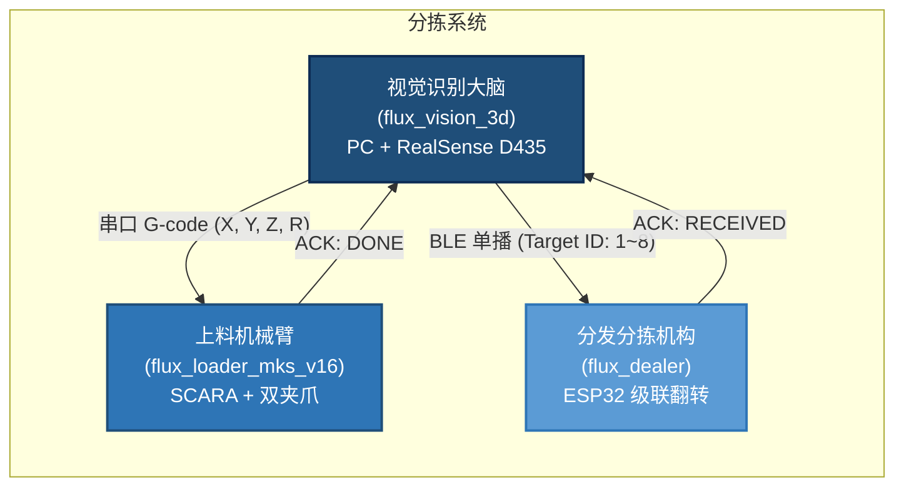

# flux_vision_3d — 芦笋 3D 视觉与抓取位姿估计系统

[](https://python.org)
[](https://opencv.org)
[](https://www.intelrealsense.com)
[]()

`flux_vision_3d` 是专门针对**传送带上多层堆叠、并排贴合的细长果蔬（绿芦笋）**研发的工业级 3D 视觉感知与智能抓取位姿估计系统。

系统通过顶置 3D 深度相机实时解算最顶层芦笋的空间抓取位姿 $(X, Y, Z, R)$，生成标准 G-code 驱动下游 **SCARA 机械臂（flux_loader_mks_v16）** 完成无碰撞下探抓取，并通过 BLE 向 **分发分拣机构（flux_dealer）** 写入多级品质分拣槽位。

---

## 系统拓扑



---

## 核心硬件规格

| 维度 | 规格 | 工程要点 |
| :--- | :--- | :--- |
| **3D 传感器** | Intel RealSense D435 (主动红外双目 RGB-D) | 无 IMU，纯双目结构光 + 彩色图像 |
| **安装方式** | 黑色传送带正上方，大倾角俯视 $(\pm 30°)$ | 算法通过传送带点云平面拟合自解算倾角，无需人工测量 |
| **工作距离** | $550 \sim 700\text{ mm}$（基准 ~640mm） | 避开 D435 近距盲区 (28cm) |
| **空间标靶** | AprilTag 16h5 × 20 枚 (ID 0~19, 50mm) | Tag 0 锁定 SCARA 原点，Tag 1~19 贴机架静止刚体阵列 |
| **坐标标定** | AprilTag 地图在线定位 *(设计目标)* | 当前过渡方案：手工多点触碰 SVD 配准（见下方说明） |
| **执行机构** | 4 轴 SCARA + 双开闭夹爪 (Marlin G-code) | 串口通信：`G0 X.. Y.. R..` → `G1 Z..` → `M4` |
| **分拣机构** | 8 级级联步进翻料 (ESP32 BLE) | 蓝牙单播：`Target ID: 1~8` |

> [!IMPORTANT]
> **坐标标定双轨现状**：当前代码中 `asparagus_analyzer.py` 的世界坐标变换仍使用 `hand_eye_calibration.py`（手工多点触碰 SVD 配准），**尚未集成 `tag_localizer.py` 的 AprilTag 在线定位**。按设计方案，最终目标是用 AprilTag 多标靶地图完全替代手工点触标定——详见 [apriltag_calibration.md](docs/apriltag_calibration.md)。

---

## 快速上手

### 环境准备

系统推荐 Windows 10/11 64 位，Python 3.10+：

```powershell
cd d:\Software\antigravity\flux_vision_3d
pip install -r requirements.txt
```

### 启动控制终端

```powershell
./run          # PowerShell
run.bat        # CMD
```

进入控制终端后，通过编号触发功能：

| 编号 | 功能 | 说明 |
| :---: | :--- | :--- |
| `1` | D435 实时相机查看器 | 鼠标探测 3D 坐标，`[D]` 检测高亮，`[G]` 打印 G-code，`[S]` 抓拍 |
| `4` | 离线快照抓取解算 | 读取本地最新快照进行算法验证 |
| `7` | 真实快照自动测试 | 遍历全部快照统计成功率与尺寸指标 |
| `9` | 环境与驱动诊断 | 检测 Python、OpenCV、D435 连接与固件 |

### 查看器快捷键

| 按键 | 功能 |
| :---: | :--- |
| `D` | 开启/关闭芦笋检测与顶层高亮 |
| `G` | 打印当前最顶层芦笋的 SCARA G-code |
| `S` | 抓拍 RGB、深度热力图与点云到 `data/snapshots/` |
| `H` | 切换纠偏高度图 / 原生深度图 |
| `A` / `[` / `]` | 调节深度色彩区间（含自适应拉伸） |

---

## 项目结构

```text
flux_vision_3d/
├── config.yaml                    # 系统核心配置 (相机、滤波、视觉门限、串口)
├── README.md                      # 本文件：项目总览与快速上手
├── requirements.txt               # Python 依赖清单
├── run.bat / run.ps1              # 一键启动入口
│
├── docs/                          # 📚 技术文档库
│   ├── architecture.md            #    系统架构与模块职责
│   ├── algorithm_pipeline.md      #    核心算法处理管线详解
│   ├── requirements.md            #    系统需求与设计规格书
│   └── apriltag_calibration.md    #    AprilTag 多标靶标定设计方案
│
├── src/vision/                    # 🧠 核心算法源码
│   ├── asparagus_analyzer.py      #    感知引擎 (平面标定→暗缝分离→主轴拟合→顶层解算)
│   └── tag_localizer.py           #    AprilTag 在线相机外参定位器
│
├── tests/                         # ✅ 自动化测试
│   ├── test_real_snapshot.py      #    真实快照全量测试 (20 组, 100% 通过)
│   ├── test_mock_pipeline.py      #    仿真管线回归测试
│   ├── test_tag_map_builder.py    #    多标靶建图单元测试
│   ├── test_tag_localizer.py      #    在线定位器单元测试
│   └── test_hand_eye_calibration.py # 手眼标定精度验证
│
├── tools/                         # 🔧 运维与调试工具
│   ├── cli_menu.py                #    交互式统一控制终端
│   ├── d435_viewer.py             #    实时相机查看器与深度探针
│   ├── find_top_asparagus.py      #    单帧抓取解算 (输出 G-code)
│   ├── generate_apriltags.py      #    AprilTag 标靶高清图生成器
│   ├── tag_map_builder.py         #    多标靶空间建图与 BA 平差工具
│   └── hand_eye_calibration.py    #    SCARA 手眼标定向导
│
└── data/snapshots/                # 📸 真实快照库 (RGB + 点云 + 标注图)
```

---

## 技术文档导航

| 文档 | 内容概述 | 适用读者 |
| :--- | :--- | :--- |
| [architecture.md](docs/architecture.md) | 系统分层架构、模块职责与数据流 | 新成员入门、架构评审 |
| [algorithm_pipeline.md](docs/algorithm_pipeline.md) | 九大算法环节逐层剖析（含数学推导与 Mermaid 流程图） | 算法开发、调参优化 |
| [requirements.md](docs/requirements.md) | 功能/非功能需求、里程碑进度 | 需求评审、项目管理 |
| [apriltag_calibration.md](docs/apriltag_calibration.md) | AprilTag 16h5 多标靶建图与在线自定位方案 | 标定实施、现场部署 |

---

## 质量保证

- **真实快照测试**：覆盖 **20 组**现场快照，**100.0%** 顶层锁定成功率（累计 136 根次）
- **仿真管线测试**：脱机开发环境的虚拟点云与三层叠压回归验证
- **手眼标定验证**：Horn/Kabsch SVD 刚体变换精度与 500+mm 危险深度拦截

---
*文档更新日期: 2026年9月 | flux_vision_3d 团队*
