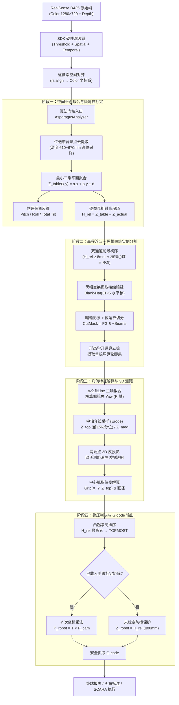
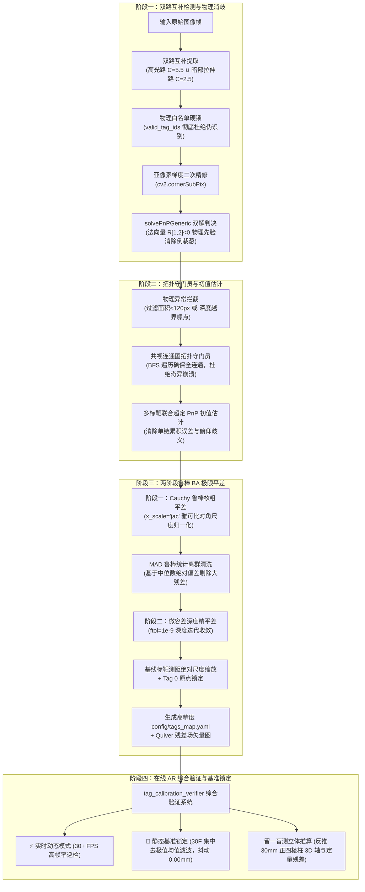

# 核心算法处理管线

> **文档定位**：端到端的芦笋 3D 感知算法深度剖析——从原始传感器帧到 SCARA 抓取 G-code。  
> **适用读者**：算法开发、调参优化、技术评审。  
> **核心代码**：[asparagus_analyzer.py](../src/vision/asparagus_analyzer.py) — `AsparagusAnalyzer.analyze(color_bgr, depth_mm)`

---

## 1. 原始输入规范

每帧传入核心算法的数据：

| 数据 | 格式 | 说明 |
| :--- | :--- | :--- |
| 彩色图像 `color_bgr` | `np.ndarray`, $1280 \times 720$, `BGR8`, `uint8` | RealSense Color Stream |
| 对齐深度图 `depth_mm` | `np.ndarray`, $1280 \times 720$, `uint16` | 各像素沿光轴物理深度 (mm) |
| 相机内参 | $(c_x, c_y, f_x, f_y)$ | 针孔模型光心与焦距 |

**物理环境**：相机大倾角俯视 $(\pm 30°)$ 黑色传送带，工作距离 ~640mm，物料为多根芦笋随机并排贴合、斜向叠压。

---

## 2. 全景流程图



---

## 3. 九大算法环节逐层剖析

### 3.1 传送带基准平面拟合与倾角自标定

**工程难点**：相机安装倾角随机 ($\pm 30°$)，传送带在像平面上呈斜向纵深梯度（近端 ~600mm，远端 ~670mm），全局阈值无法正确筛选前景。

**算法实现**：

1. 筛选底板候选点：$610\text{mm} \le Z \le 670\text{mm}$ 且有效深度值
2. 按 `step=8` 网格降采样，构建超定方程组：
   $$\begin{bmatrix} x_1 & y_1 & 1 \\ \vdots & \vdots & \vdots \\ x_n & y_n & 1 \end{bmatrix} \begin{bmatrix} a \\ b \\ d \end{bmatrix} = \begin{bmatrix} z_1 \\ \vdots \\ z_n \end{bmatrix}$$
3. `np.linalg.lstsq` 拟合传送带空间方程：$Z_{table}(x, y) = a \cdot x + b \cdot y + d$
4. 反算物理倾角：
   $$\text{Roll} = \arctan\!\left(\frac{a \cdot f_x}{d}\right), \quad \text{Pitch} = \arctan\!\left(\frac{b \cdot f_y}{d}\right)$$

---

### 3.2 逐像素相对高程场 (Height Map)

以拟合台面方程为 $Z=0$ 零基准，生成每个像素相对传送带的垂直凸起高度：

$$H_{rel}(x, y) = \begin{cases} Z_{table}(x, y) - Z_{actual}(x, y), & Z_{actual} > 0 \\ 0, & Z_{actual} = 0 \end{cases}$$

**核心收益**：彻底消除镜头倾角导致的画面倾斜，所有物料高度统一度量于传送带水平参考系。

---

### 3.3 双通道前景初筛

芦笋前景掩膜 $M_{fg}$ 采用**3D 高程浮凸主导 + 植物色域辅助**双通道联合判据：

| 通道 | 判据 | 目的 |
| :--- | :--- | :--- |
| 高程浮凸 | $H_{rel} \ge 8.0\text{mm}$ | 剔除皮带底面与反光杂质 |
| 植物色彩 | $(G \ge 0.9B) \lor (20 \le H_{hsv} \le 100)$ | 涵盖嫩绿、黄绿、白笋 |
| 暗区排除 | $V_{hsv} > 25$ | 滤除纯黑阴影 |
| 深度窗口 | $350\text{mm} \le Z \le 780\text{mm}$ | 排除无效测距 |
| ROI 保护 | 截去外缘 4% | 消除边缘杂光 |

---

### 3.4 黑帽暗缝实例切分（核心创新）

**痛点**：多根芦笋紧密贴合时，2D 轮廓融合成数万像素的大连通块，传统轮廓查找将其误判为异物丢弃。

**算法创新** — 利用并排接触面必然存在的天然狭长阴影缝隙：

1. 构造细长横向结构元：$K_{seam} = \text{cv2.getStructuringElement}(\text{RECT}, (31, 5))$
2. 黑帽变换提取暗于周围的细长阴影线：$\text{BlackHat}(I) = \text{Close}(I, K) - I$
3. 阈值化提取暗缝掩膜 $\text{Seams}$，矩形核轻微膨胀
4. 位运算差分精确切开粘连前景：$M_{cut} = M_{fg} \ \& \ \neg(\text{Seams}_{dilated})$
5. 形态学开运算消除毛刺，`cv2.findContours` 提取单根独立芦笋轮廓

---

### 3.5 主轴姿态拟合与偏航角解算

**痛点**：`cv2.minAreaRect` 在 $0°$ 与 $\pm 90°$ 附近产生奇异跳变，导致夹爪角度反复颠倒。

**解决方案**：

1. `cv2.fitLine`（$L_2$ 欧氏距离加权）拟合主轴线，得归一化方向 $(v_x, v_y)$ 与中心 $(c_x, c_y)$
2. 偏航角：$\theta = \text{degrees}(\arctan2(v_y, v_x)) \in [-90°, 90°]$
3. $\theta$ 直接映射为 SCARA 夹爪旋转角 $R$

---

### 3.6 3D 空间无损欧氏测距

**痛点**：$30°$ 倾角俯视下，芦笋图像长度严重透视短缩（200mm 可能看起来仅 150mm）。

**算法实现**：

1. 轮廓投影到主轴向量 $\vec{v}$，取亚像素两端点 $(u_1, v_1)$, $(u_2, v_2)$
2. 由台面方程推导两端点真实深度 $Z_1, Z_2$
3. 反投影至 3D 空间：
   $$X_i = \frac{(u_i - c_x^0) \cdot Z_i}{f_x}, \quad Y_i = \frac{(v_i - c_y^0) \cdot Z_i}{f_y}$$
4. 真实物理长度：$L_{mm} = \sqrt{(X_1 - X_2)^2 + (Y_1 - Y_2)^2 + (Z_1 - Z_2)^2}$
5. 直径按中心深度比例恢复：$D_{mm} = D_{px} \cdot Z_{med} / f_x$

---

### 3.7 叠压拓扑分析与最顶层判决

**抓取原则**：必须优先抓取最上层、未被压住的芦笋。

**光学设计规范**：

| 约束 | 要求 | 原因 |
| :--- | :--- | :--- |
| 激光功率 | $100 \sim 120\text{mW}$ | 杜绝湿润蜡质表皮高光过曝 |
| 深度统计 | 脊线前 15% 分位数 | 免疫反光白洞与黑洞 |
| 禁止操作 | 单像素点采样 | 极易落入过曝 0 值区域 |

**判决模型**：

$$\text{Priority} = H_{rel}(c_x, c_y) = Z_{table}(c_x, c_y) - Z_{top}$$

相对凸起净高最大者锁定为 `is_topmost = True`。拓扑闭环时触发自愈兜底机制。

---

### 3.8 大倾角视线遮挡与夹爪防碰撞

**遮挡成因**：$30°$ 斜角下视时，芦笋背面处于光学阴影盲区，下层边缘被遮挡，外径投影压缩。

**防碰撞策略**：

1. **3D 截面直径**：通过 3D 点云法向截面解算，禁止直接使用倾斜视角 2D 弦长
2. **安全夹持区搜索**：沿中段搜索开合净空 $\ge 15\text{mm}$ 的安全区域
3. **平铺外侧优先**：无明显高低差时，优先抓取最外侧，由外向内顺次剥离

---

### 3.9 多源标定外参接入与四重防撞 G-code 决策

抓取决策引擎通过统一接口根据优先级动态选择外参源：

```
           ┌──────────────────────────────────────────────┐
           │ 优先：AprilTag 空间在线 PnP 定位 (tag_online) │
           └──────────────────────┬───────────────────────┘
                                  │ 标靶被局部遮挡
           ┌──────────────────────▼───────────────────────┐
           │ 次优：AprilTag 历史有效缓存外参 (tag_cached)   │
           └──────────────────────┬───────────────────────┘
                                  │ 连续无标靶 / 无地图
           ┌──────────────────────▼───────────────────────┐
           │ 备用：SCARA 接触式点触标定矩阵 (hand_eye)     │
           └──────────────────────┬───────────────────────┘
                                  │ 全未标定
           ┌──────────────────────▼───────────────────────┐
           │ 兜底：传送带基准防撞保护 (uncalibrated)       │
           └──────────────────────────────────────────────┘
```

**相机系抓取点反投影**：

$$X_{grip} = \frac{(c_x - c_x^0) \cdot Z_{med}}{f_x}, \quad Y_{grip} = \frac{(c_y - c_y^0) \cdot Z_{med}}{f_y}$$

$$P_{cam} = [X_{grip},\ Y_{grip},\ Z_{top},\ 1.0]^T$$

**世界系抓取坐标变换**：

$$P_{robot} = T_{cam\_to\_world} \cdot P_{cam} \implies (X_{robot},\ Y_{robot},\ Z_{robot})$$

**⚠️ 四重安全防撞机制**：
1. **在线与缓存模式**：若 $T_{cam\_to\_world}$ 处于有效锁定状态，输出真实 SCARA 笛卡尔坐标；
2. **接触标定模式**：使用 SVD 拟合的刚体变换矩阵进行空间坐标对齐；
3. **未标定绝对拦截**：若处于 `uncalibrated` 状态，系统**坚决拦截**相机 500+mm 物理深度直接发送至机械臂，强制将 Z 轴高度限制为相对台面凸起净高（$Z_{robot} = H_{rel} \approx 10 \sim 70\text{mm}$），并在 G-code 中输出醒目的 `[安全警告]` 提示；
4. **工作区边界限幅**：所有抓取点在下发前均校验 $Z \le 80\text{mm}$ 安全上界，彻底杜绝撞台事故。

---

## 4. 关键物理参数

参数维护于 [config.yaml](../config.yaml) 的 `vision` 段：

| 参数 | 值 | 含义 |
| :--- | :---: | :--- |
| `table_margin_mm` | 8.0 | 相对台面最小凸起门限 (mm) |
| `min_length_mm` | 60.0 | 最小合规物理长度 (mm) |
| `max_length_mm` | 550.0 | 最大合规物理长度 (mm)，容纳 400~500mm 特长芦笋 |
| `min_diam_mm` | 5.0 | 最小物理直径 (mm)，涵盖笋尖 |
| `max_diam_mm` | 65.0 | 最大物理直径 (mm)，涵盖特粗及局部贴合 |
| `min_aspect_ratio` | 1.8 | 最小长宽比，消除块状异物 |
| `min_asparagus_area` | 600 | 最小连通块像素面积，滤除碎屑 |

---

## 5. AprilTag 空间建图、极限 BA 平差与在线定位管线

除了芦笋目标感知外，系统内置了完整的空间多标靶立体平差建图与在线自定位管线：



### 5.1 双路互补全景检测与物理白名单
- **痛点**：实拍打印标靶黑度不纯（灰度 50~80）导致 Otsu 方差初筛误杀；且背光暗部需要小门限 $C=2.5$，强光反光需要大门限 $C=5.5$。
- **数学原理**：
  - **路 A (高光抗反光)**：原生灰度图，适配大自适应常数 $C=5.5, \text{minOtsu}=0.55$；
  - **路 B (暗部低反差)**：计算 $2\% \sim 98\%$ 分位数并映射至 $[0, 255]$ 动态直方图拉伸，适配小常数 $C=2.5, \text{minOtsu}=0.45$；
  - **并集融合与白名单硬锁**：两路检测角点求并集，结合 `valid_tag_ids` 物理白名单硬锁，允许将汉明纠错率放宽至 0.50，实拍召回人次从 20 跃升至 56 且保持 0 误识。

### 5.2 单目平面正方形 PnP 镜像翻转二义性消除
- **数学原理**：单目平面正方形标靶在透视下数学上天然存在两个互为视平面对称翻折的极值候选解，重投影误差差异通常 $< 0.05\text{px}$。
- **几何先验消歧**：调用 `cv2.solvePnPGeneric` 获取全部候选解。在俯视相机的右手系定义下，向上挺立标靶的法向量在像平面 Y 轴分量必然指向天空（即 $R[1, 2] < 0$），而倒栽葱伪解其 $R[1, 2] > 0$。算法自动选取符合物理现实的真实解。

### 5.3 雅可比对角归一化与两阶段微容差 BA 平差
- **尺度解耦**：BA 参数向量包含旋转向量（弧度，模长 $\sim 1$）和平移向量（毫米，模长 $\sim 1000$）。若直接优化，梯度步长会被平移分量严重淹没。求解器启用 `x_scale='jac'`，通过雅可比矩阵列模长实时对角归一化，释放优化器深度迭代潜力（迭代步数从受限早退的 7 步拓展为 200+ 步）。
- **两阶段平差与 MAD 清洗**：
  1. **阶段一（Cauchy 粗平差）**：损失函数 $\rho(z) = c^2 \ln(1 + z/c^2)$，有效压制粗大离群点对整体刚体网的牵拉；
  2. **MAD 统计清洗**：计算重投影误差残差的绝对中位差：
     $$\text{MAD} = \text{median}(|r_i - \text{median}(r)|), \quad \text{Threshold} = \text{median}(r) + 3.0 \times 1.4826 \times \text{MAD}$$
     将超出阈值的劣化观测剔除；
  3. **阶段二（微容差精平差）**：设置终止条件 `ftol=1e-9`, `gtol=1e-9` 进行超高精度收敛，实采图 RMSE 压降至 4.14px。

### 5.4 30 帧批处理时域滤波与基准位姿绝对锁定
- **痛点**：实时单帧 PnP 受传感器 CMOS 热噪声影响，位姿呈现高频微颤（$\pm 0.5\text{mm}$），无法作为计量级验收基准；滑动窗口滤波又具有相位滞后。
- **算法模型**：
  1. 静止采集中连续抓取 $N=30$（或 60）帧原始角点；
  2. 对每个标靶的 4 个角点分别执行去极值均值滤波（去除最高和最低各 $20\%$ 分位后取均值）；
  3. 基于超定滤波角点一次性求解相机外参 $T_{cam\_to\_world}$；
  4. **位姿凝固锁定**：求解完成后彻底停止计算并完全冻结该位姿（空间抖动严格 $0.00\text{mm}$），为留一盲测隔空推算提供恒定基准。

---

## 6. 工业视觉调优避坑指南与已淘汰反面模式 (Gotchas & Anti-patterns)

在视觉调优与标定算法演进中，以下路线已被实际工业现场实测**明确证伪并永久废弃**，后续算法迭代需坚决避免走入误区：

| # | 已淘汰的反面模式 | 缺陷与失败病因 | 正确工业实践替代方案 |
| :-: | :--- | :--- | :--- |
| 1 | **单一全局静态自适应阈值** | 工业现场同时存在金属反光与暗部背光，单一固定常数 $C$ 顾此失彼：暗部丢失黑块边界，高光处泛白淹没。 | **双路互补检测架构**：高光路（$C=5.5$）与暗部低反差分位数动态拉伸路（$C=2.5$）求并集。 |
| 2 | **脱离物理白名单的低纠错率保护** | 严苛的纠错率（如 $0.15$）使大倾角透视畸变或打印微瑕下的真实标靶大量漏检。 | **物理白名单硬锁 + 放宽纠错**：锁定已贴标靶 ID（`valid_tag_ids`），纠错率放宽至 $0.50$，实现零伪虚警与极限召回。 |
| 3 | **单帧未经周长过滤的暴力轮廓提取** | 工业机架复杂背景产生 15,000+ 微小多边形轮廓，造成多边形解码耗时高达 11.5 秒，主线程严重卡死。 | **几何先验硬过滤**：提升 `adaptiveThreshWinSizeStep=8` 并锁定最小周长门限 `minMarkerPerimeterRate=0.008`，彻底屏蔽微观噪点风暴。 |
| 4 | **无拓扑连通度检查的直接盲目平差** | 用户在审核时误删关键“桥梁标靶”会导致共视图裂解为不连通子图，求解器因奇异矩阵直接崩溃退出。 | **共视连通图拓扑守门员**：平差前先执行 BFS 遍历，遇孤立标靶立即硬拦截并输出修复建议。 |
| 5 | **忽略量纲尺度的直接最小二乘优化** | 旋转量纲（弧度 $\sim 1$）与平移量纲（毫米 $\sim 1000$）相差 3 个数量级，导致优化步长受限早退（7 步即停止）。 | **雅可比列模长对角归一化 (`x_scale='jac'`)**：实现各分量自适应尺度，充分释放深度迭代潜力（200+ 步）。 |


