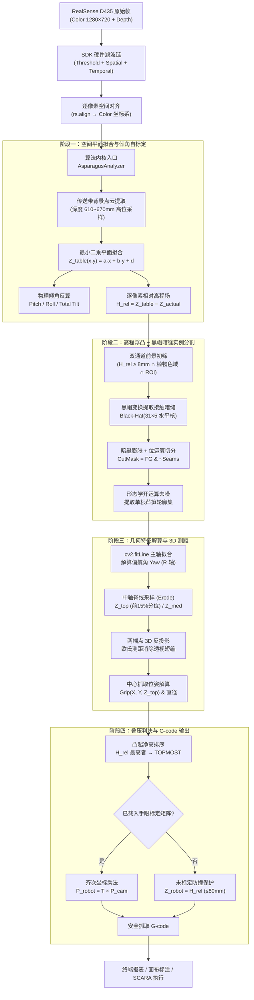

# 核心算法处理管线

> **文档定位**：端到端的芦笋 3D 感知算法深度剖析——从原始传感器帧到 SCARA 抓取 G-code。  
> **适用读者**：算法开发、调参优化、技术评审。  
> **核心代码**：[asparagus_analyzer.py](../src/vision/asparagus_analyzer.py) — `AsparagusAnalyzer.analyze(color_bgr, depth_mm)`

---

## 1. 原始输入规范

每帧传入核心算法的数据：

| 数据 | 格式 | 说明 |
| :--- | :--- | :--- |
| 彩色图像 `color_bgr` | `np.ndarray`, $1280 \times 720$, `BGR8`, `uint8` | RealSense Color Stream |
| 对齐深度图 `depth_mm` | `np.ndarray`, $1280 \times 720$, `uint16` | 各像素沿光轴物理深度 (mm) |
| 相机内参 | $(c_x, c_y, f_x, f_y)$ | 针孔模型光心与焦距 |

**物理环境**：相机大倾角俯视 $(\pm 30°)$ 黑色传送带，工作距离 ~640mm，物料为多根芦笋随机并排贴合、斜向叠压。

---

## 2. 全景流程图

---

## 3. 九大算法环节逐层剖析

### 3.1 传送带基准平面拟合与倾角自标定

**工程难点**：相机安装倾角随机 ($\pm 30°$)，传送带在像平面上呈斜向纵深梯度（近端 ~600mm，远端 ~670mm），全局阈值无法正确筛选前景。

**算法实现**：

1. 筛选底板候选点：$610\text{mm} \le Z \le 670\text{mm}$ 且有效深度值
2. 按 `step=8` 网格降采样，构建超定方程组：
   $$\begin{bmatrix} x_1 & y_1 & 1 \\ \vdots & \vdots & \vdots \\ x_n & y_n & 1 \end{bmatrix} \begin{bmatrix} a \\ b \\ d \end{bmatrix} = \begin{bmatrix} z_1 \\ \vdots \\ z_n \end{bmatrix}$$
3. `np.linalg.lstsq` 拟合传送带空间方程：$Z_{table}(x, y) = a \cdot x + b \cdot y + d$
4. 反算物理倾角：
   $$\text{Roll} = \arctan\!\left(\frac{a \cdot f_x}{d}\right), \quad \text{Pitch} = \arctan\!\left(\frac{b \cdot f_y}{d}\right)$$

---

### 3.2 逐像素相对高程场 (Height Map)

以拟合台面方程为 $Z=0$ 零基准，生成每个像素相对传送带的垂直凸起高度：

$$H_{rel}(x, y) = \begin{cases} Z_{table}(x, y) - Z_{actual}(x, y), & Z_{actual} > 0 \\ 0, & Z_{actual} = 0 \end{cases}$$

**核心收益**：彻底消除镜头倾角导致的画面倾斜，所有物料高度统一度量于传送带水平参考系。

---

### 3.3 双通道前景初筛

芦笋前景掩膜 $M_{fg}$ 采用**3D 高程浮凸主导 + 植物色域辅助**双通道联合判据：

| 通道 | 判据 | 目的 |
| :--- | :--- | :--- |
| 高程浮凸 | $H_{rel} \ge 8.0\text{mm}$ | 剔除皮带底面与反光杂质 |
| 植物色彩 | $(G \ge 0.9B) \lor (20 \le H_{hsv} \le 100)$ | 涵盖嫩绿、黄绿、白笋 |
| 暗区排除 | $V_{hsv} > 25$ | 滤除纯黑阴影 |
| 深度窗口 | $350\text{mm} \le Z \le 780\text{mm}$ | 排除无效测距 |
| ROI 保护 | 截去外缘 4% | 消除边缘杂光 |

---

### 3.4 黑帽暗缝实例切分（核心创新）

**痛点**：多根芦笋紧密贴合时，2D 轮廓融合成数万像素的大连通块，传统轮廓查找将其误判为异物丢弃。

**算法创新** — 利用并排接触面必然存在的天然狭长阴影缝隙：

1. 构造细长横向结构元：$K_{seam} = \text{cv2.getStructuringElement}(\text{RECT}, (31, 5))$
2. 黑帽变换提取暗于周围的细长阴影线：$\text{BlackHat}(I) = \text{Close}(I, K) - I$
3. 阈值化提取暗缝掩膜 $\text{Seams}$，矩形核轻微膨胀
4. 位运算差分精确切开粘连前景：$M_{cut} = M_{fg} \ \& \ \neg(\text{Seams}_{dilated})$
5. 形态学开运算消除毛刺，`cv2.findContours` 提取单根独立芦笋轮廓

---

### 3.5 主轴姿态拟合与偏航角解算

**痛点**：`cv2.minAreaRect` 在 $0°$ 与 $\pm 90°$ 附近产生奇异跳变，导致夹爪角度反复颠倒。

**解决方案**：

1. `cv2.fitLine`（$L_2$ 欧氏距离加权）拟合主轴线，得归一化方向 $(v_x, v_y)$ 与中心 $(c_x, c_y)$
2. 偏航角：$\theta = \text{degrees}(\arctan2(v_y, v_x)) \in [-90°, 90°]$
3. $\theta$ 直接映射为 SCARA 夹爪旋转角 $R$

---

### 3.6 3D 空间无损欧氏测距

**痛点**：$30°$ 倾角俯视下，芦笋图像长度严重透视短缩（200mm 可能看起来仅 150mm）。

**算法实现**：

1. 轮廓投影到主轴向量 $\vec{v}$，取亚像素两端点 $(u_1, v_1)$, $(u_2, v_2)$
2. 由台面方程推导两端点真实深度 $Z_1, Z_2$
3. 反投影至 3D 空间：
   $$X_i = \frac{(u_i - c_x^0) \cdot Z_i}{f_x}, \quad Y_i = \frac{(v_i - c_y^0) \cdot Z_i}{f_y}$$
4. 真实物理长度：$L_{mm} = \sqrt{(X_1 - X_2)^2 + (Y_1 - Y_2)^2 + (Z_1 - Z_2)^2}$
5. 直径按中心深度比例恢复：$D_{mm} = D_{px} \cdot Z_{med} / f_x$

---

### 3.7 叠压拓扑分析与最顶层判决

**抓取原则**：必须优先抓取最上层、未被压住的芦笋。

**光学设计规范**：

| 约束 | 要求 | 原因 |
| :--- | :--- | :--- |
| 激光功率 | $100 \sim 120\text{mW}$ | 杜绝湿润蜡质表皮高光过曝 |
| 深度统计 | 脊线前 15% 分位数 | 免疫反光白洞与黑洞 |
| 禁止操作 | 单像素点采样 | 极易落入过曝 0 值区域 |

**判决模型**：

$$\text{Priority} = H_{rel}(c_x, c_y) = Z_{table}(c_x, c_y) - Z_{top}$$

相对凸起净高最大者锁定为 `is_topmost = True`。拓扑闭环时触发自愈兜底机制。

---

### 3.8 大倾角视线遮挡与夹爪防碰撞

**遮挡成因**：$30°$ 斜角下视时，芦笋背面处于光学阴影盲区，下层边缘被遮挡，外径投影压缩。

**防碰撞策略**：

1. **3D 截面直径**：通过 3D 点云法向截面解算，禁止直接使用倾斜视角 2D 弦长
2. **安全夹持区搜索**：沿中段搜索开合净空 $\ge 15\text{mm}$ 的安全区域
3. **平铺外侧优先**：无明显高低差时，优先抓取最外侧，由外向内顺次剥离

---

### 3.9 手眼标定空间变换与防撞 G-code

**相机系抓取点**：

$$X_{grip} = \frac{(c_x - c_x^0) \cdot Z_{med}}{f_x}, \quad Y_{grip} = \frac{(c_y - c_y^0) \cdot Z_{med}}{f_y}$$

$$P_{cam} = [X_{grip},\ Y_{grip},\ Z_{top},\ 1.0]^T$$

**坐标变换** (Eye-to-Hand)：

$$P_{robot} = T_{cam\_to\_scara} \cdot P_{cam} \implies (X_{robot},\ Y_{robot},\ Z_{robot})$$

**⚠️ 未标定防撞安全机制**：

若手眼矩阵未配置：
- **绝对拦截**：禁止将相机深度 (530mm+) 直接发送到机械臂 Z 轴
- **强制使用相对凸起高度**：$Z_{robot} = H_{rel} \approx 20 \sim 50\text{mm}$
- G-code 中输出醒目 `[安全警告]`

---

## 4. 关键物理参数

参数维护于 [config.yaml](../config.yaml) 的 `vision` 段：

| 参数 | 值 | 含义 |
| :--- | :---: | :--- |
| `table_margin_mm` | 8.0 | 相对台面最小凸起门限 (mm) |
| `min_length_mm` | 60.0 | 最小合规物理长度 (mm) |
| `max_length_mm` | 550.0 | 最大合规物理长度 (mm)，容纳 400~500mm 特长芦笋 |
| `min_diam_mm` | 5.0 | 最小物理直径 (mm)，涵盖笋尖 |
| `max_diam_mm` | 65.0 | 最大物理直径 (mm)，涵盖特粗及局部贴合 |
| `min_aspect_ratio` | 1.8 | 最小长宽比，消除块状异物 |
| `min_asparagus_area` | 600 | 最小连通块像素面积，滤除碎屑 |
