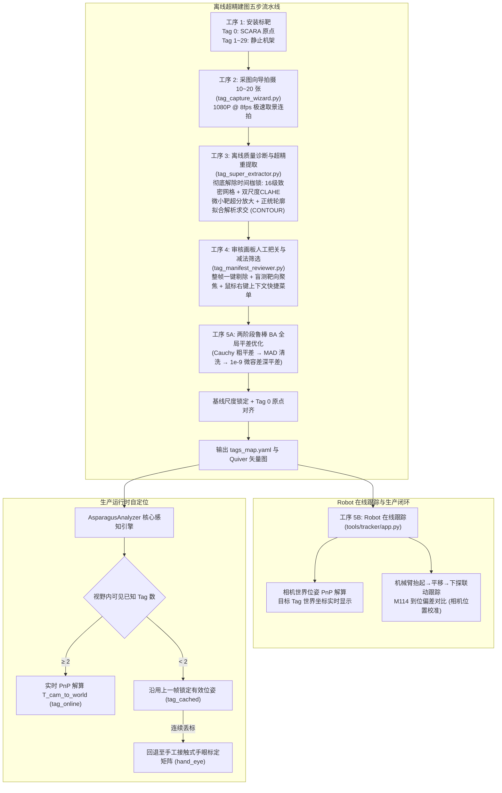

# AprilTag 多标靶空间建图与相机自定位方案

> **文档版本**：v2.0 (已同步 Phase 1 极限平差与模块化工具链)  
> **适用范围**：`flux_vision_3d` 视觉系统的多标靶空间标定、Tag 地图建图与生产运行时相机在线自定位。  
> **适用读者**：标定实施、现场部署、算法开发。

---

## 1. 需求背景

在工业分拣流水线中，相机通过机械支架安装在大倾角俯视位置。由于物理装配偏差与机械震动，相机的精确 6DoF 位姿无法通过人工量具测量，且纯平面标靶在单目 PnP 中易出现俯仰角翻转歧义。

### 1.1 设计理念

| # | 要点 | 说明 |
| :---: | :--- | :--- |
| 1 | 多标靶空间散布 | 视野与机架周围布设 ~30 个标靶 (ID 0~29) |
| 2 | 免高精装配 | 各 Tag 高低错落、微小倾斜，非共面消除 PnP 歧义 |
| 3 | 边长免精测 | 同批次打印统一尺寸即可，无需预先精密测量 |
| 4 | 大基线尺度锁定 | 两个远距标靶中心用卷尺测距，一键锁定全场绝对物理尺寸 |
| 5 | 离线极限 BA 建图 | 多视角拍摄 + 鲁棒核函数 + MAD 离群清洗，输出高精度 `tags_map.yaml` |
| 6 | 在线单帧自定位 | 视野内 $\ge 2$ 个标靶即实时解算相机 6DoF 外参，支持时域滤波锁定 |

---

## 2. 标靶规格与角色划分

### 2.1 标靶选型：AprilTag 16h5

| 属性 | 规格 |
| :--- | :--- |
| 族类 | AprilTag `tag16h5` (4×4 数据格，汉明距离 5) |
| API | `cv2.aruco.DICT_APRILTAG_16h5` (OpenCV 4.x+ 内置) |
| ID 范围 | ID 0 ~ ID 29（共 30 个） |
| 推荐尺寸 | $50.0\text{mm} \times 50.0\text{mm}$ (白边外框 60mm) |
| 角点精度 | 正统轮廓边界亚像素直线拟合解析求交 (`CORNER_REFINE_CONTOUR`)，亚像素稳定性 0.01~0.03 像素 |

### 2.2 双角色体系

标靶分为两个角色，实现原点锁定与刚体定位的解耦：

```
┌──────────────────────────────────────┐
│        Tag 0 — SCARA 旋转轴心原点       │
│  · 中心 (X=0, Y=0) 严格锁定原点        │
│  · 表面法向锁定垂直 Z 轴               │
│  · Yaw 角随臂旋转 (非固定刚体)         │
└──────────────┬───────────────────────┘
               │ 空间联合约束
┌──────────────▼───────────────────────┐
│      Tag 1 ~ 29 — 静止刚体阵列         │
│  · 贴在传送带/机架/立柱，高低错落       │
│  · 6DoF 位置与姿态完全静止              │
│  · 联合锁定水平面 X/Y 旋转基准          │
└──────────────────────────────────────┘
```

#### Tag 0 的特殊约束

| 约束 | 说明 |
| :--- | :--- |
| **位置固定** | 贴在 SCARA J1 转轴中心顶端，$P_{center}^{(0)} = (0, 0, Z_{base})$ |
| **法向固定** | 表面法向 $\vec{n}_z$ 恒平行于 SCARA 垂直 $Z$ 轴 |
| **Yaw 自由** | 绕 $Z$ 轴存在未知转角，**禁止**将 Tag 0 局部 $X$ 轴当世界 $X$ 轴 |

#### Tag 1~29 的刚体约束

- 全部贴在**绝对静止结构**（机架、立柱、传送带支撑梁）
- 各 Tag 间相对位姿 100% 固定，形成三维立体刚体网络

#### 世界坐标系锁定

| 轴 | 锁定依据 |
| :--- | :--- |
| 原点 $(0,0,0)$ | Tag 0 几何中心 |
| $Z$ 轴 | Tag 0 表面法向量 |
| $X$ 轴 | Tag 0 中心→Tag 1 中心在水平面上的投影方向 |

> **关键优势**：即使 Tag 0 被机械臂挡住，只要看到 Tag 1~29 中任意 2 个，相机位姿依然精准无漂移。

---

## 3. 基线尺度标定模型

传统标定强依赖单个 Tag 边长测量（50mm 上 0.5mm 误差即 1% 漂移），本方案采用**"无尺度重构 + 大基线物理测距"**：

| 步骤 | 操作 |
| :--- | :--- |
| **1. 同构重构** | 以名义边长 $s_{nominal} = 50.0\text{mm}$ 进行 BA 平差，恢复高保真相对几何拓扑 |
| **2. 基线测距** | 现场选定两个远距标靶 $A, B$ (推荐相距 $\ge 500\text{mm}$)，卷尺测量中心物理距离 $D_{real}$ |
| **3. 尺度锁定** | $\text{Scale} = D_{real} / D_{nominal}$，全局等比缩放所有坐标与边长 |

$$\mathbf{P}_i^{metric} = \text{Scale} \times \mathbf{P}_i^{nominal}, \quad s_{real} = \text{Scale} \times s_{nominal}$$

> **工程价值**：选择相距 600mm 的两点，0.5mm 量尺误差仅占全局 $0.08\%$。

---

## 4. 离线超精建图与在线定位全景流程

本方案严格遵循**“前台快采、后台精解、人工把关、实时闭环”**的五步黄金工序体系：



---

## 5. 核心平差与稳健性攻坚机制

### 5.1 物理噪点守门员 (Physical Outlier Guard)
在离线建图与采图中，背景反光物（如紧固螺栓、金属反光点）在汉明纠错放宽时可能被误判为极小标靶。求解器内置了严格的物理守门员：
- **面积过滤**：角点四边形面积 $< 120\text{px}$ 坚决拦截；
- **深度过滤**：单靶 PnP 深度超出工作区间 ($150\text{mm} \le Z \le 2200\text{mm}$) 直接丢弃；
- **杜绝毒瘤**：彻底杜绝远景微小噪点带偏整个全局优化场。

### 5.2 共视连通图拓扑守门员 (Covisibility Gatekeeper)
为防止人工剔除标记时误删关键“桥梁帧”导致共视图裂解为不连通子图，求解器在优化前执行基于 NetworkX 的连通度分析。若发现孤立标靶，自动阻断并输出明确的修复建议，杜绝优化器奇异崩溃。

### 5.3 雅可比对角归一化 (`x_scale='jac'`)
旋转分量（弧度量纲，约 $0 \sim 3$）与平移分量（毫米量纲，约 $100 \sim 1000$）尺度相差近 3 个数量级。采用雅可比列模长对角归一化后，彻底释放优化器潜力，优化步数从受限早退的 7 步拓展为深层收敛的 200+ 步。

### 5.4 两阶段平差与 MAD 鲁棒清洗
1. **阶段一（Cauchy 粗平差）**：采用 Cauchy 鲁棒损失函数降低离群点对整体几何结构的拉偏；
2. **MAD 统计清洗**：基于中位数绝对偏差（MAD）动态计算重投影残差门限，清洗大残差观测；
3. **阶段二（微容差精平差）**：设置 `ftol=1e-9`, `gtol=1e-9` 进行极致深层收敛，实测真实照片 RMSE 压降至 4.14px。

### 5.5 角点几何保真度与 CONTOUR 轮廓拟合攻坚
在 AprilTag 提取中，角点亚像素精度直接决定了单目 PnP 与全局 BA 的几何硬度。过去系统曾误用通用图像处理的 `cv2.cornerSubPix`，引发了严重的几何畸变（如 Tag 22 对角线拉伸变形、Tag 25 菱形失真）：
- **病因物理机理**：`cornerSubPix` 基于局部灰度梯度点乘为 0 的正交准则（$\sum (\nabla I)(\nabla I)^T \Delta p = 0$）。该模型假设角点周围具有中心对称的梯度分布（如棋盘格黑白鞍点）。然而 AprilTag 标靶的外四个顶点属于典型的 **90° L 型单向阶跃边缘**。当采用 $11\times 11$（窗口尺寸 23px）的大窗口时，窗口内大量像素落在单一的主边缘上，导致方程法矩阵（Hessian）严重病态甚至奇异。角点坐标被强单向梯度向外严重“吸附”滑移达 8~10 个像素，未收敛点滞留于粗糙整数，形成严重的对角线拉扯与局部塌陷；
- **算法彻底根治**：废除大窗口梯度流精修，全面采用 AprilTag 行业正统的 **`CORNER_REFINE_CONTOUR`（轮廓边界亚像素直线拟合与正交解析求交点法）**：
  1. 对二值化或自适应阈值提取出的闭合标靶四边形，分别抽取 4 条独立边缘上的亚像素轮廓点集；
  2. 对每条边界点集分别进行加权最小二乘直线拟合（Line Fitting: $\rho = x \cos \theta + y \sin \theta$）；
  3. 通过相邻两条拟合直线的解析方程联立求解交点坐标：
     $$\begin{cases} L_1: A_1 x + B_1 y + C_1 = 0 \\ L_2: A_2 x + B_2 y + C_2 = 0 \end{cases} \implies \mathbf{p}_{corner} = \left( \frac{B_1 C_2 - B_2 C_1}{A_1 B_2 - A_2 B_1}, \, \frac{A_2 C_1 - A_1 C_2}{A_1 B_2 - A_2 B_1} \right)$$
- **实测成果**：Tag 22 四边长比例从严重畸变恢复至 **0.943**（边长 `106.1, 107.2, 107.8, 101.7`），对角线拉长彻底消除；Tag 25 四边长比例达 **0.946**，四个角点全部恢复平滑连续的高精亚像素坐标。

### 5.6 交互审核画板上下文快捷菜单与靶向聚焦
人工审核把关是保障全局建图 100% 纯净的“减法工程”。在 `tag_manifest_reviewer.py` 中引入了现代工业 GUI 的人机交互体系：
- **右键上下文菜单 (Context Menu)**：
  - 鼠标右键单击任意标靶，就地弹出半透明磨砂科技感菜单（半透明深色底板 + 科技青边框）；
  - **[🚫 剔除该标靶 / ✅ 恢复该标靶]**：根据当前状态自适应变色（红/绿），一键切换有效/无效状态，毫秒级更新连通图拓扑与统计；
  - **[🎯 靶向排查 Tag #X]**：自动过滤仅显示命中该 Tag 的图像帧子集，开启定向排查翻页（如 `1/4 -> 2/4`）；
  - **[🔄 局部重新计算/精修角点 (Refine)]**：外扩 35px 局部 ROI 区域，结合原生图与局部 CLAHE 增强图，调用 `CORNER_REFINE_CONTOUR` 针对单个标靶重新拟合解算角点；
  - **[⚡ 完成审核并保存退出]**：一键将当前标注清单写盘并退出画板，BA 求解交由 Offline Studio 统一执行；
  - **防溢出对齐机制**：智能检测屏幕边缘，右侧或底部空间不足时自动向左/向上翻折，确保菜单项 100% 完整可视。
- **整帧临时剔除/恢复 (X 键)**：
  - 针对严重手抖、虚焦或遮挡严重的废片，支持按 `X` 键整帧停用，建图平差直接干净旁路，随时按 `X` 一键恢复。

---

## 6. 配置文件格式

标定完成后导出 `config/tags_map.yaml`：

```yaml
tag_family: "DICT_APRILTAG_16h5"
marker_size_mm: 50.0              # 标靶外框边长 (mm)
rmse_reprojection_px: 4.14        # 全局重投影均方根误差 (px)

world_definition:
  origin_tag_id: 0                # SCARA J1 旋转中心原点
  x_axis_align_tag_id: 1          # 水平面 X 轴对齐基准

tags:
  0:
    position_mm: [0.0, 0.0, 0.0]
    is_origin: true
    is_dynamic_yaw: true          # 中心固定，朝向随臂旋转
  1:
    position_mm: [150.2, 0.0, -12.4]
    rpy_deg: [0.5, -1.2, 0.0]
    is_origin: false
    is_dynamic_yaw: false
  # ... Tag 2 ~ 29 (包含空间 3D 棱柱顶点与位姿)
```

---

## 7. 实施工具链矩阵

标定流水线工具封装于 `tools/calibration/`；三个顶层标定应用位于 `tools/` 子包 (入口 `app.py`)：

| 工具名称 | 物理路径 | 定位与核心功能 |
| :--- | :--- | :--- |
| **工况与场景管理中枢** | `tools/scene_hub/app.py` | 工序 0：采样场景与批次分组管理、三模态视图、黄金闭环 SOP (新建场景→采图→一键生效生产) |
| **标靶图纸生成** | `tools/calibration/generate_apriltags.py` | 工序 1：生成 0~29 号 16h5 高清标靶与 1:1 A4 排版可打印 PDF |
| **交互采图向导** | `tools/calibration/tag_capture_wizard.py` | 工序 2：实时视频流 + 双路互补极速检测 + 空格连拍 1080P @ 8fps 原始照片 |
| **超精重提取引擎** | `tools/calibration/tag_super_extractor.py` | **工序 3（离线超精重提取引擎）**：离线重算，16级致密自适应阈值网格 + 双尺度CLAHE增强 + 2x超分放大 + 正统轮廓拟合解析求交 (CONTOUR)，无损继承历史清洗标注，输出高质量观测清单 |
| **采图清单画板** | `tools/calibration/tag_manifest_reviewer.py` | **工序 4（交互审核画板）**：原生 GUI 审核画板，鼠标右键上下文菜单（红绿自适应剔除/恢复、局部Refine重算、靶向聚焦）、整帧临时旁路、一键保存并自动触发平差热重载 |
| **离线标定综合工作站** | `tools/studio/app.py` | **工序 5A（空间建图平差）**：帧序列资产管理、交互审核、两阶段/迭代剪枝 BA 平差、MAD 清洗、Quiver 矢量图与离线精度体检 |
| **Robot 在线跟踪** | `tools/tracker/app.py` | **工序 5B（在线跟踪与验证）**：真实相机实时解算目标 Tag 世界坐标，机械臂"抬起→平移→下探"安全路径联动跟踪，M114 回读末端实际坐标同屏对比偏差用于相机位置校准 |
| **接触标定向导** | `tools/calibration/hand_eye_calibration.py` | 备用通道：SCARA 经典接触式点对物理标定向导 (极端无标靶场景) |
| **在线定位器** | `src/vision/tag_localizer.py` | 运行时每帧毫秒级检测已知标靶，输出相机外参 $T_{cam\_to\_world}$ |

---

> **硬性解耦约束 (Anchor Decoupling Principle)**：Tag 0 仅用于"离线建图确定原点"，运行时世界坐标系由静止机架刚体锁死。**绝对禁止**在生产中随 Tag 0 旋转动态修改世界原点。
