# AprilTag 多标靶空间建图与相机自定位方案

> **文档版本**：v1.1  
> **适用范围**：`flux_vision_3d` 视觉系统的多标靶空间标定、Tag 地图建图与生产运行时相机在线自定位。  
> **适用读者**：标定实施、现场部署、算法开发。

---

## 1. 需求背景

在工业分拣流水线中，相机通过机械支架安装在大倾角俯视位置。由于物理装配偏差与机械震动，相机的精确 6DoF 位姿无法通过人工量具测量，且纯平面标靶在单目 PnP 中易出现俯仰角翻转歧义。

### 1.1 设计理念

| # | 要点 | 说明 |
| :---: | :--- | :--- |
| 1 | 多标靶空间散布 | 视野与机架周围布设 ~20 个标靶 (ID 0~19) |
| 2 | 免高精装配 | 各 Tag 高低错落、微小倾斜，非共面消除 PnP 歧义 |
| 3 | 边长免精测 | 同批次打印统一尺寸即可，无需预先精密测量 |
| 4 | 大基线尺度锁定 | 两个远距标靶中心用卷尺测距，一键锁定全场绝对物理尺寸 |
| 5 | 离线多视角建图 | ~20 个视角拍摄，BA 平差输出 `tags_map.yaml` |
| 6 | 在线单帧自定位 | 视野内 $\ge 2$ 个标靶即实时解算相机 6DoF 外参 |

---

## 2. 标靶规格与角色划分

### 2.1 标靶选型：AprilTag 16h5

| 属性 | 规格 |
| :--- | :--- |
| 族类 | AprilTag `tag16h5` (4×4 数据格，汉明距离 5) |
| API | `cv2.aruco.DICT_APRILTAG_16h5` (OpenCV 4.x+ 内置) |
| ID 范围 | ID 0 ~ ID 19（共 20 个） |
| 推荐尺寸 | $50.0\text{mm} \times 50.0\text{mm}$ |
| 角点精度 | 灰度梯度连续边界拟合，重复性 0.05~0.1 像素 |

### 2.2 双角色体系

标靶分为两个角色，实现原点锁定与刚体定位的解耦：

```
┌──────────────────────────────────────┐
│        Tag 0 — SCARA 旋转轴心原点       │
│  · 中心 (X=0, Y=0) 严格锁定原点        │
│  · 表面法向锁定垂直 Z 轴               │
│  · Yaw 角随臂旋转 (非固定刚体)         │
└──────────────┬───────────────────────┘
               │ 空间联合约束
┌──────────────▼───────────────────────┐
│      Tag 1 ~ 19 — 静止刚体阵列         │
│  · 贴在传送带/机架/立柱，高低错落       │
│  · 6DoF 位置与姿态完全静止              │
│  · 联合锁定水平面 X/Y 旋转基准          │
└──────────────────────────────────────┘
```

#### Tag 0 的特殊约束

| 约束 | 说明 |
| :--- | :--- |
| **位置固定** | 贴在 SCARA J1 转轴中心顶端，$P_{center}^{(0)} = (0, 0, Z_{base})$ |
| **法向固定** | 表面法向 $\vec{n}_z$ 恒平行于 SCARA 垂直 $Z$ 轴 |
| **Yaw 自由** | 绕 $Z$ 轴存在未知转角，**禁止**将 Tag 0 局部 $X$ 轴当世界 $X$ 轴 |

#### Tag 1~19 的刚体约束

- 全部贴在**绝对静止结构**（机架、立柱、传送带支撑梁）
- 各 Tag 间相对位姿 100% 固定，形成三维立体刚体网络

#### 世界坐标系锁定

| 轴 | 锁定依据 |
| :--- | :--- |
| 原点 $(0,0,0)$ | Tag 0 几何中心 |
| $Z$ 轴 | Tag 0 表面法向量 |
| $X$ 轴 | Tag 0 中心→Tag 1 中心在水平面上的投影方向 |

> **关键优势**：即使 Tag 0 被机械臂挡住，只要看到 Tag 1~19 中任意 2 个，相机位姿依然精准无漂移。

---

## 3. 基线尺度标定模型

传统标定强依赖单个 Tag 边长测量（50mm 上 0.5mm 误差即 1% 漂移），本方案采用**"无尺度重构 + 大基线物理测距"**：

| 步骤 | 操作 |
| :--- | :--- |
| **1. 同构重构** | 以名义边长 $s_{nominal} = 50.0\text{mm}$ 进行 BA 平差，恢复完美相对拓扑 |
| **2. 基线测距** | 现场选定两个远距标靶 $A, B$，卷尺测量中心直线距离 $D_{real}$ |
| **3. 尺度锁定** | $\text{Scale} = D_{real} / D_{nominal}$，全局等比缩放所有坐标与边长 |

$$\mathbf{P}_i^{metric} = \text{Scale} \times \mathbf{P}_i^{nominal}, \quad s_{real} = \text{Scale} \times s_{nominal}$$

> **工程价值**：选择相距 600mm 的两点，0.5mm 量尺误差仅占全局 $0.08\%$。

---

## 4. 标定流程

```mermaid
graph TD
    subgraph 离线建图
        A["安装标靶<br>Tag 0: SCARA 中心<br>Tag 1~19: 静止机架"] --> B["移动相机拍摄 ~20 张<br>(每张覆盖 ≥ 2 个 Tag)"]
        B --> C["Aruco 提取<br>2D 亚像素角点"]
        C --> D["构建共视连通图"]
        D --> E["BA 平差求解<br>Tag 0~19 相对刚体结构"]
        E --> F["输入两标靶真实距离<br>计算 Scale 锁定绝对尺寸"]
        F --> G["Tag 0 中心平移至原点"]
        G --> H["Tag 0→Tag 1 矢量<br>锁定世界 X 轴"]
        H --> I["导出 tags_map.yaml"]
    end

    subgraph 在线定位
        J["固定相机拍摄<br>(芦笋 + ≥ 2 个 Tag)"] --> K["检测 Tag 并查询地图"]
        K --> L["匹配 3D↔2D 角点"]
        L --> M["cv2.solvePnPRansac()<br>(< 3ms, 亚毫米级)"]
        M --> N["输出 T_cam_to_world"]
        N --> O["芦笋抓取位姿直通 SCARA"]
    end
```



---

## 5. 容错降级策略

在高速生产中，可能因芦笋遮挡、强光反射或过载导致检出标靶不足：

| 场景 | 策略 |
| :--- | :--- |
| 静止 Tag $\ge 2$ | 实时刷新并缓存外参矩阵 |
| 静止 Tag $< 2$ | **禁止异常中断**，沿用上一帧锁定的有效外参 |
| 连续 $> 10$ 帧不足 | 输出黄色预警，触发声光提示，但主调度保持运转 |

---

## 6. 配置文件格式

标定完成后导出 `config/tags_map.yaml`：

```yaml
tag_family: "DICT_APRILTAG_16h5"
marker_size_mm: 50.0              # 标靶外框边长 (mm)

world_definition:
  origin_tag_id: 0                # SCARA J1 旋转中心原点
  x_axis_align_tag_id: 1          # 水平面 X 轴对齐基准

tags:
  0:
    position_mm: [0.0, 0.0, 0.0]
    is_origin: true
    is_dynamic_yaw: true          # 中心固定，朝向随臂旋转
  1:
    position_mm: [150.2, 0.0, -12.4]
    rpy_deg: [0.5, -1.2, 0.0]
    is_origin: false
    is_dynamic_yaw: false
  2:
    position_mm: [280.5, 95.3, 45.2]
    rpy_deg: [-3.1, 2.0, 44.5]
    is_origin: false
    is_dynamic_yaw: false
  # ... Tag 3~19

rmse_reprojection_px: 0.35        # BA 重投影均方根误差 (px)
```

---

## 7. 实施工具链

| 步骤 | 工具 | 功能 |
| :--- | :--- | :--- |
| 标靶生成 | `tools/generate_apriltags.py` | 生成 0~19 号高清标靶图，支持排版打印 |
| 多视角采集 | `tools/tag_photo_collector.py` | 交互辅助采图，实时显示可见 Tag 数 |
| 全局建图 | `tools/tag_map_builder.py` | 角点检测→共视边→BA 平差→锁定原点→导出 YAML |
| 在线集成 | `src/vision/tag_localizer.py` | 每帧自动检测背景 Tag，实时获取 6DoF 外参 |

---

> **硬性解耦约束 (Anchor Decoupling Principle)**：Tag 0 仅用于"离线建图确定原点"，运行时世界坐标系由静止机架刚体锁死。**绝对禁止**在生产中随 Tag 0 旋转动态修改世界原点。
