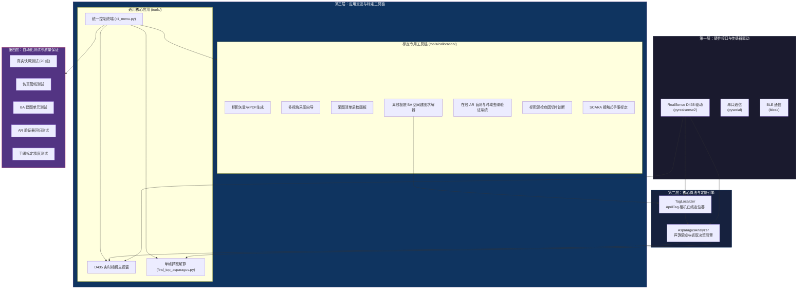
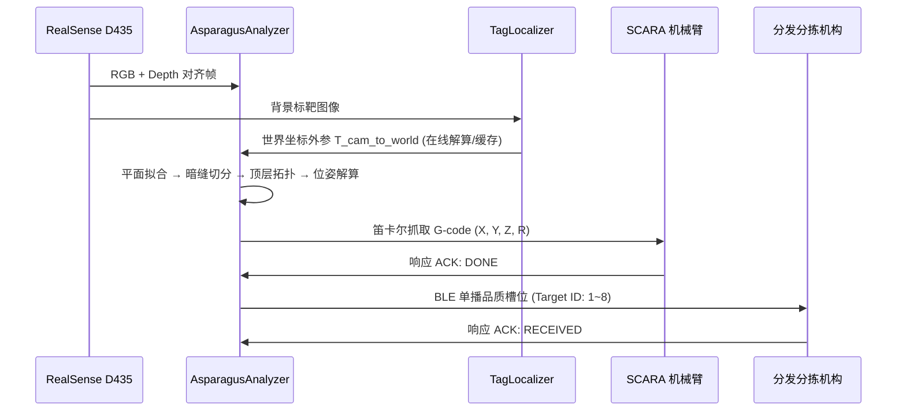

# 系统架构与模块职责

> **文档定位**：描述 `flux_vision_3d` 的分层架构设计、模块划分与数据流关系。  
> **适用读者**：新成员入门、架构评审、代码走查。

---

## 1. 架构总览

系统采用**模块化分层解耦**架构，从底层硬件驱动到上层业务调度形成清晰的四层结构：

---

## 2. 核心模块职责

### 2.1 感知引擎 — `src/vision/asparagus_analyzer.py`

系统的"视觉大脑"，封装端到端的芦笋感知算法：

| 职责 | 说明 |
| :--- | :--- |
| 传送带平面自标定 | 最小二乘拟合台面方程，反求相机安装倾角 |
| 3D 高程浮凸初筛 | 以台面为 $Z=0$ 基准，滤除背景杂质 |
| 黑帽暗缝实例切分 | 形态学 Black-Hat 结合横向结构元切开并排贴合物料 |
| 主轴拟合与偏航角解算 | `cv2.fitLine` 求解中心轴线方向，映射夹爪角度 $R$ |
| 3D 空间欧氏测距 | 消除 $\pm 30°$ 大倾角的透视短缩畸变 |
| 顶层拓扑排序 | 按相对凸起净高锁定最顶层目标 (`is_topmost`) |
| 多源标定外参接入 | 自动选择 AprilTag 在线外参、历史缓存或手眼标定矩阵 |
| G-code 位姿生成 | 输出 SCARA 笛卡尔抓取指令，内置未标定防撞拦截 |

**调用接口**：`analyze(color_bgr, depth_mm) -> List[AsparagusTarget]`

### 2.2 标靶定位器 — `src/vision/tag_localizer.py`

基于离线平差建好的 AprilTag 空间地图，单帧毫秒级解算相机在 SCARA 世界系下的 6DoF 外参：

| 职责 | 说明 |
| :--- | :--- |
| 标靶检测 | 识别视野内的 AprilTag 16h5 标靶 |
| 地图查询 | 匹配 `config/tags_map.yaml` 中的 3D 空间坐标 |
| PnP 解算 | `cv2.solvePnPRansac()` 求解相机在机械臂世界系下的外参 |
| 容错降级 | 检出 $< 2$ 个标靶时沿用历史锁定外参，平滑抗遮挡 |

---

## 3. 工具链矩阵 (Tools Architecture)

`tools/` 根目录保持极简，仅保留 3 个顶级通用入口应用；所有标定、采图与平差相关工具统一封装于 `tools/calibration/` 子包：

### 3.1 根目录核心应用

| 工具 | 文件路径 | 定位与核心功能 |
| :--- | :--- | :--- |
| **控制终端主入口** | `tools/cli_menu.py` | 统一入口，集成应用启动、标定二级专区与测试执行 |
| **实时相机主视窗** | `tools/d435_viewer.py` | 双流实时预览、鼠标 3D 探测、动态色谱拉伸、G-code 打印 |
| **单帧抓取解算** | `tools/find_top_asparagus.py` | 载入单帧或最新快照，输出标准抓取位姿与 JSON 报表 |

### 3.2 标定与平差工具链 (`tools/calibration/`)

| 工具 | 文件路径 | 定位与核心功能 |
| :--- | :--- | :--- |
| **标靶图纸生成** | `tools/calibration/generate_apriltags.py` | 生成 0~29 号 16h5 高清标靶与 1:1 A4 排版 PDF |
| **交互采图向导** | `tools/calibration/tag_capture_wizard.py` | 实时视频流 + 双路互补检测 + 空格一键连拍多视角相片 |
| **采图清单质检画板**| `tools/calibration/tag_manifest_reviewer.py` | 轻量级原生 GUI 画板，鼠标点击保留/剔除，连通性实时状态 |
| **空间平差建图求解器**| `tools/calibration/tag_map_builder.py` | 极限精度 BA 求解器、两阶段平差、MAD清洗、Quiver 图与体检报告 |
| **Robot 在线跟踪**| `tools/calibration/robot_online_tracker.py` | Tag 世界坐标实时解算、机械臂"抬起→平移→下探"联动跟踪、M114 到位偏差对比 (相机位置校准) |
| **病因深度切片诊断**| `tools/calibration/diagnose_tag_frame.py` | 单帧漏检/残差异常病因分析（反差/面积/梯度/倾角） |
| **接触式手眼标定向导**| `tools/calibration/hand_eye_calibration.py` | SCARA 经典接触式物理点对标定 (极端无 Tag 备用) |

---

## 4. 测试验证体系 (Test Suite)

| 测试模块 | 文件路径 | 覆盖范围与断言标准 |
| :--- | :--- | :--- |
| **真实快照全量测试** | `tests/test_real_snapshot.py` | 20 组现场快照，验证并排分离、顶层识别与 G-code 抓取决策 |
| **仿真管线回归测试** | `tests/test_mock_pipeline.py` | 无真实相机时的虚拟芦笋点云与三层叠压回归验证 |
| **空间建图单元测试** | `tests/test_tag_map_builder.py` | 验证多标靶超定 PnP、BA 求解收敛、原点闭环与连通图拓扑阻断 |
| **在线定位器单元测试**| `tests/test_tag_localizer.py` | 在线单帧外参定位器精度与历史缓存降级 |
| **接触式标定验证** | `tests/test_hand_eye_calibration.py` | Horn/Kabsch SVD 配准精度与 500+mm 危险深度拦截 |

---

## 5. 配置文件规格 (`config.yaml`)

| 配置段 | 内容说明 | 核心参数示例 |
| :--- | :--- | :--- |
| `camera` | RealSense 彩色与深度流参数 | 分辨率 1280x720, 帧率 30fps, `align: color` |
| `filters` | SDK 硬件级滤波链 | Spatial Filter, Temporal Filter, Threshold (400~700mm) |
| `depth_colormap`| 深度可视化伪彩色映射参数 | 映射区间, 自适应百分位数拉伸 |
| `vision` | 芦笋感知与切分几何门限 | 高程门限 8mm, 长度 60~550mm, 直径 5~65mm |
| `calibration` | **空间标定与物理白名单策略** | `valid_tag_ids: []` (空为全量探索，指定则杜绝虚警), 基线测距标靶对 |
| `serial` | SCARA 机械臂下位机通信 | 串口波特率 115200, 超时时间, 安全高度 |

---

## 6. 数据流概览

