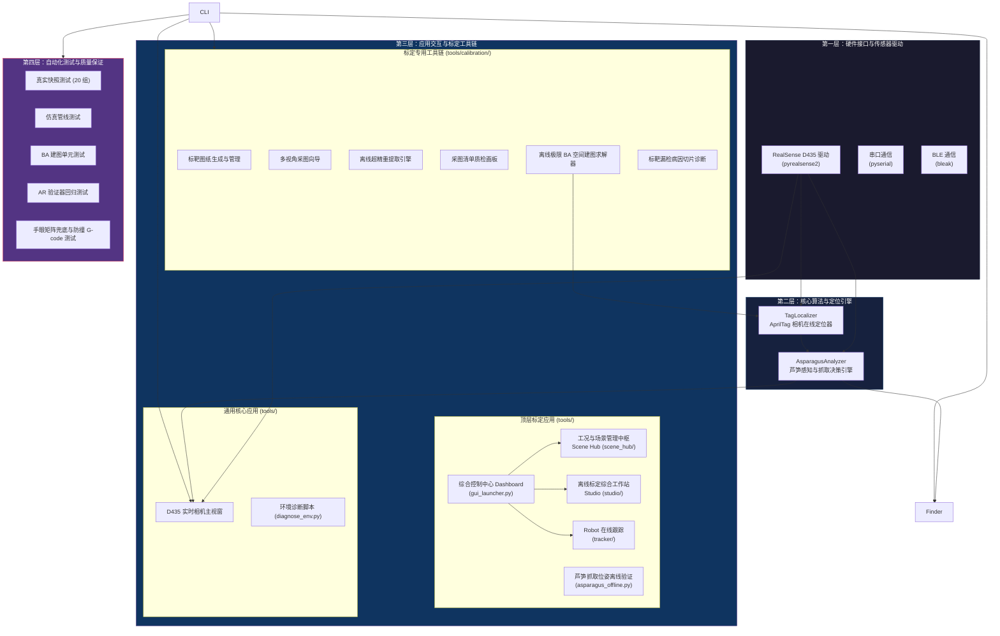
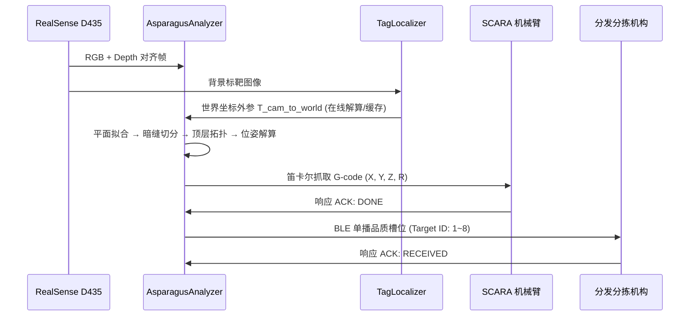

# 系统架构与模块职责

> **文档定位**：描述 `flux_vision_3d` 的分层架构设计、模块划分与数据流关系。  
> **适用读者**：新成员入门、架构评审、代码走查。

---

## 1. 架构总览

系统采用**模块化分层解耦**架构，从底层硬件驱动到上层业务调度形成清晰的四层结构：

---

## 2. 核心模块职责

### 2.1 感知引擎 — `src/vision/asparagus_analyzer.py`

系统的"视觉大脑"，封装端到端的芦笋感知算法：

| 职责 | 说明 |
| :--- | :--- |
| 传送带平面自标定 | 最小二乘拟合台面方程，反求相机安装倾角 |
| 3D 高程浮凸初筛 | 以台面为 $Z=0$ 基准，滤除背景杂质 |
| 黑帽暗缝实例切分 | 形态学 Black-Hat 结合横向结构元切开并排贴合物料 |
| 主轴拟合与偏航角解算 | `cv2.fitLine` 求解中心轴线方向，映射夹爪角度 $R$ |
| 3D 空间欧氏测距 | 消除 $\pm 30°$ 大倾角的透视短缩畸变 |
| 顶层拓扑排序 | 按相对凸起净高锁定最顶层目标 (`is_topmost`) |
| 多源标定外参接入 | 自动选择 AprilTag 在线外参、历史缓存或 config.yaml 手工矩阵 |
| G-code 位姿生成 | 输出 SCARA 笛卡尔抓取指令，内置未标定防撞拦截 |

**调用接口**：`analyze(color_bgr, depth_mm) -> List[AsparagusTarget]`

### 2.2 标靶定位器 — `src/vision/tag_localizer.py`

基于离线平差建好的 AprilTag 空间地图，单帧毫秒级解算相机在 SCARA 世界系下的 6DoF 外参：

| 职责 | 说明 |
| :--- | :--- |
| 标靶检测 | 识别视野内的 AprilTag 16h5 标靶 (CONTOUR 轮廓精修角点) |
| 地图查询 | 匹配 `config/tags_map.yaml` 中的 3D 空间坐标 |
| 静止标靶守门 | 原点 Tag 0 (随臂旋转, 动态偏航) 强制排除; 至少 2 枚静止标靶 (8 个 3D-2D 点对) 才参与解算 |
| PnP 解算 | `cv2.solvePnPRansac()` (SQPNP + ITERATIVE 降级) 求解相机在机械臂世界系下的外参 |

---

## 3. 工具链矩阵 (Tools Architecture)

`tools/` 采用"通用入口 + 顶层应用 + 专用工具链"三层结构：通用入口与顶层标定应用位于 `tools/` 根目录，标定流水线工具封装于 `tools/calibration/` 子包。

### 3.1 通用入口 (`tools/` 根目录)

| 工具 | 文件路径 | 定位与核心功能 |
| :--- | :--- | :--- |
| **综合控制中心 Dashboard** | `tools/gui_launcher.py` | 1280x1000 工业大屏，卡片式统一调度全部核心应用与测试入口；含 12 张卡片三模式 (GUI/CMD/TERM)，右侧大屏可切换为内嵌终端视图 |
| **硬件环境配置** | `tools/hardware_config.py` | 输入 (相机类型/分辨率) 与输出 (机械臂类型/默认串口) 设备选型，配置写入 `config/hardware_env.json` 全系统自动读取 |
| **环境诊断脚本** | `tools/diagnose_env.py` | 系统环境深度诊断输出 (Dashboard [T] 卡片 TERM 模式承载)；原交互式 CLI 菜单 (cli_menu.py) 已退役，其功能全部由 Dashboard 卡片覆盖 |
| **实时相机主视窗** | `tools/d435_viewer.py` | 双流实时预览、鼠标 3D 探测、动态色谱拉伸、G-code 打印 |
| **单帧抓取解算** | `tools/asparagus_offline.py` | 完全离线的芦笋抓取位姿验证 GUI：文件照片 (png+npy 成对) 输入解算顶层位姿与 SCARA G-code，纯照片降级 2D 预览，支持批量解算汇总报表 |

### 3.2 顶层标定应用 (`tools/` 子包, 入口 `app.py`)

| 工具 | 文件路径 | 定位与核心功能 |
| :--- | :--- | :--- |
| **工况与场景管理中枢** | `tools/scene_hub/app.py` | 采样场景与批次分组管理、三模态视图、黄金闭环 SOP (新建场景→采图→一键生效生产) |
| **离线标定综合工作站** | `tools/studio/app.py` | 帧序列资产管理、交互审核画板、迭代剪枝 BA 平差、离线精度体检 |
| **Robot 在线跟踪** | `tools/tracker/app.py` | Tag 世界坐标实时解算、机械臂"抬起→平移→下探"联动跟踪、M114 到位偏差对比 (相机位置校准)；真矢量模式 1:1 imshow 消除鼠标坐标漂移 |
| **SCARA 机械臂调试** | `tools/scara_debug/app.py` | MKS Base V1.6 (Marlin) 调试终端：串口点动、回零设零、夹爪舵机、搬运宏、G-code 透传 |

### 3.3 标定与平差工具链 (`tools/calibration/`)

| 工具 | 文件路径 | 定位与核心功能 |
| :--- | :--- | :--- |
| **标靶图纸生成** | `tools/calibration/generate_apriltags.py` | 生成 0~29 号 16h5 高清标靶与 1:1 A4 排版 PDF |
| **AprilTag 管理器** | `tools/calibration/tag_manager.py` | 左右两栏 GUI：图纸生成 + 30 个 Tag ID 白名单管理 (写回 `config.yaml`) |
| **交互采图向导** | `tools/capture/capture_wizard.py` | 实时视频流纯预览 + 空格一键连拍保存多视角相片 |
| **离线超精重提取引擎** | `tools/calibration/tag_super_extractor.py` | 16 级致密阈值网格 + CLAHE + 2x 超分 + CONTOUR 轮廓拟合，输出高质量观测清单 |
| **采图清单质检画板** | `tools/calibration/tag_manifest_reviewer.py` | 轻量级原生 GUI 画板，鼠标点击保留/剔除，连通性实时状态 |
| **空间平差建图求解器** | `tools/calibration/tag_map_builder.py` | 极限精度 BA 求解器、两阶段平差、MAD 清洗、Quiver 图与体检报告；`solve_single_tag_pnp` 支持 `expected_z_cam` 法向先验参数防 180° 翻转 |
| **病因深度切片诊断** | `tools/calibration/diagnose_tag_frame.py` | 单帧漏检/残差异常病因分析（反差/面积/梯度/倾角） |

---

## 4. GUI 基础设施层 (`src/utils/`)

Dashboard、Tracker、Scene Hub 等 GUI 应用共享以下基础设施，统一从单源获取主题、视口与终端能力：

| 模块 | 文件路径 | 定位与核心功能 |
| :--- | :--- | :--- |
| **GuiTheme** | `src/utils/gui_theme.py` | 暗/亮调色板单源入口 (BG/CARD/TEXT/ACCENT/GOLD 等)，6 个 GUI 全部用别名引用；主题切换仅需改此一处 |
| **GuiWindowManager** | `src/utils/gui_window_manager.py` | 统一窗口/缩放/视口/Ctrl 状态管理，支持多应用隔离的 `settings_file`；消除各 GUI 中重复的 resize/zoom 逻辑 |
| **TerminalPanel** | `src/utils/terminal_panel.py` | Dashboard 内嵌终端面板：ANSI 颜色解析、进度条更新、事件驱动渲染；右侧大屏切换为终端视图后承载系统诊断与 pip 安装输出 |
| **TextRendering** | `src/utils/text_rendering.py` | PIL+msyh 掩膜缓存的中文绘制统一通道 (`put_text`/`draw_text`/`fit_font_size`)，禁用 `cv2.putText` 的 Hershey ASCII 字模 |
| **Logger** | `src/utils/logger.py` | 标准化日志入口 `get_logger(__name__)`；诊断/状态输出统一走 Logger，菜单 UI/表格/stdout 数据保留 print |

### 4.1 SCARA 机械臂坐标系硬约束

| 约束 | 取值 / 说明 |
| :--- | :--- |
| **机械零位绝对坐标** | `(X0, Y600, Z80, R90°)` (毫米+度)，与 SCARA 物理装配刚性绑定 |
| **Marlin 轴映射** | SCARA R 轴 (旋转) 在 Marlin 固件中映射至 E 轴；G92 命令需写 `G92 X0.00 Y600.00 Z80.00 E90.00`，禁用 `G92 X0 Y0 Z0` |
| **零点设置流程** | M84 (释放电机) → G92 (设零) → M114 (回读确认) 三步串行 |
| **世界坐标系锚点** | Tag 0 = `(0, 0, 405)mm`、Tag 1 = `(0, 520, 196)mm` 作为绝对参考，BA 平差后引入 anchor scale factor (锚点尺度因子) 同步 marker 尺寸模型：`real_marker_size = nominal_size × anchor_scale` |

---

## 5. 测试验证体系 (Test Suite)

共 17 个测试套件，按模块分组：

| 分组 | 测试套件 | 覆盖范围 |
| :--- | :--- | :--- |
| **感知管线** | `tests/test_real_snapshot.py` | 20 组现场快照：并排分离、顶层识别与 G-code 抓取决策 |
| | `tests/test_mock_pipeline.py` | 无真实相机时的虚拟芦笋点云与三层叠压回归验证 |
| **建图与 BA** | `tests/test_tag_map_builder.py` | 多标靶超定 PnP、BA 求解收敛、原点闭环与连通图拓扑阻断 |
| | `tests/test_ba_optimizer.py` | BA 优化器数学模型与鲁棒核 |
| | `tests/test_covisibility_graph.py` | 共视连通图拓扑守门员 |
| | `tests/test_manifest_repository.py` | 观测清单仓储与物理有效性前置拦截 |
| | `tests/test_tag_integration.py` | 标定链路端到端集成 |
| | `tests/test_audit_p0_fixes.py` | 标定体系审查 P0 问题修复回归锁定 |
| **在线定位** | `tests/test_tag_localizer.py` | 在线单帧外参定位精度与守门降级 |
| **GUI 与应用** | `tests/test_gui_launcher.py`、`tests/test_gui_window_manager.py` | Dashboard 调度与动态分辨率窗口管理 |
| | `tests/test_scene_hub.py`、`tests/test_scene_manager.py` | Scene Hub 渲染状态机与场景管理器 |
| | `tests/test_tag_offline_studio.py` | Offline Studio 工作站 |
| | `tests/test_viewport_manager.py`、`tests/test_verification_reporter.py` | 视口管理与精度体检报告生成 |
| | `tests/test_hardware_config.py`、`tests/test_terminal_panel.py` | 硬件环境配置应用与 Dashboard 内嵌终端面板 |
| **手眼矩阵兜底** | `tests/test_hand_eye_calibration.py` | config.yaml 手工矩阵层级变换与 500+mm 危险深度拦截 |

---

## 6. 配置文件规格 (`config.yaml`)

| 配置段 | 内容说明 | 核心参数示例 |
| :--- | :--- | :--- |
| `camera` | RealSense 彩色与深度流参数 | 分辨率 1280x720, 帧率 30fps, `align: color` |
| `filters` | SDK 硬件级滤波链 | Spatial Filter, Temporal Filter, Threshold (400~700mm) |
| `depth_colormap`| 深度可视化伪彩色映射参数 | 映射区间, 自适应百分位数拉伸 |
| `vision` | 芦笋感知与切分几何门限 | 高程门限 8mm, 长度 60~550mm, 直径 5~65mm |
| `calibration` | **空间标定与物理白名单策略** | `valid_tag_ids: []` (空为全量探索，指定则杜绝虚警), 基线测距标靶对 |
| `serial` | SCARA 机械臂下位机通信 | 串口波特率 115200, 超时时间, 安全高度 |

---

## 7. 数据流概览

