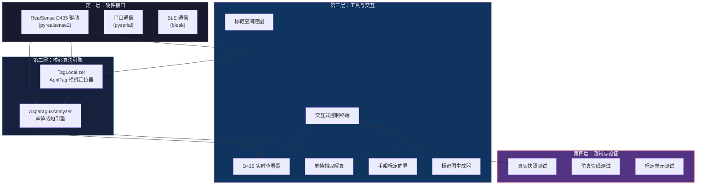
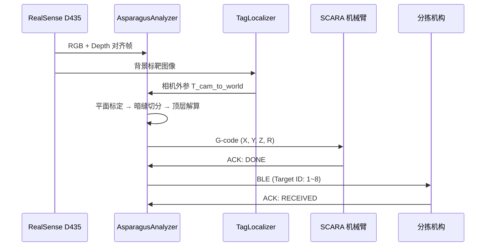

# 系统架构与模块职责

> **文档定位**：描述 `flux_vision_3d` 的分层架构设计、模块划分与数据流关系。  
> **适用读者**：新成员入门、架构评审、代码走查。

---

## 1. 架构总览

系统采用**模块化分层解耦**架构，从底层硬件驱动到上层业务调度形成清晰的四层结构：

---

## 2. 核心模块职责

### 2.1 感知引擎 — `src/vision/asparagus_analyzer.py`

系统的"视觉大脑"，封装端到端的芦笋感知算法：

| 职责 | 说明 |
| :--- | :--- |
| 传送带平面自标定 | 最小二乘拟合台面方程，反求相机安装倾角 |
| 3D 高程浮凸初筛 | 以台面为 $Z=0$ 基准，滤除背景噪点 |
| 黑帽暗缝实例切分 | 形态学 Black-Hat 切开并排贴合物料 |
| 主轴拟合与偏航角解算 | `cv2.fitLine` 求解中心轴线方向 $R$ |
| 3D 空间欧氏测距 | 消除 $\pm 30°$ 大倾角的透视短缩畸变 |
| 顶层拓扑排序 | 按相对凸起净高锁定最顶层目标 |
| G-code 位姿生成 | 输出 SCARA 笛卡尔抓取指令 |

**调用接口**：`analyze(color_bgr, depth_mm) -> List[AsparagusTarget]`

### 2.2 标靶定位器 — `src/vision/tag_localizer.py`

基于预先建好的 AprilTag 空间地图，单帧毫秒级解算相机在 SCARA 世界系下的 6DoF 外参：

| 职责 | 说明 |
| :--- | :--- |
| 标靶检测 | 识别视野内的 AprilTag 16h5 标靶 |
| 地图查询 | 匹配 `tags_map.yaml` 中的 3D 物理角点 |
| PnP 解算 | `cv2.solvePnPRansac()` 求解相机外参 |
| 容错降级 | 检出 $< 2$ 个标靶时沿用历史锁定外参 |

---

## 3. 工具链矩阵

| 工具 | 文件 | 定位 |
| :--- | :--- | :--- |
| **控制终端** | `tools/cli_menu.py` | 统一入口，集成诊断、工具启动与测试菜单 |
| **实时查看器** | `tools/d435_viewer.py` | 双流显示、3D 深度探针、动态色谱、G-code 打印 |
| **抓取解算** | `tools/find_top_asparagus.py` | 单帧采集或载入快照，输出 G-code 与 JSON |
| **标靶生成** | `tools/generate_apriltags.py` | 生成 0~19 号 AprilTag 16h5 高清图 |
| **空间建图** | `tools/tag_map_builder.py` | 多视角 BA 平差，导出 `tags_map.yaml` |
| **手眼标定** | `tools/hand_eye_calibration.py` | 多点接触配准，解算 $T_{cam \to scara}$ |

---

## 4. 测试验证体系

| 测试模块 | 文件 | 覆盖范围 |
| :--- | :--- | :--- |
| **真实快照** | `tests/test_real_snapshot.py` | 20 组现场快照，验证分离、顶层识别与 G-code |
| **仿真管线** | `tests/test_mock_pipeline.py` | 无物理相机时的虚拟点云回归验证 |
| **建图验证** | `tests/test_tag_map_builder.py` | 多标靶空间建图与 Tag 0 原点闭环 |
| **定位验证** | `tests/test_tag_localizer.py` | 在线单帧外参定位器精度 |
| **标定验证** | `tests/test_hand_eye_calibration.py` | Horn/Kabsch SVD 精度与危险深度拦截 |

---

## 5. 配置文件

### `config.yaml`

系统核心配置文件，包含以下模块：

| 配置段 | 内容 |
| :--- | :--- |
| `camera` | RealSense 流参数（分辨率、帧率、对齐模式） |
| `filters` | SDK 硬件滤波链（Spatial / Temporal / Threshold） |
| `depth_colormap` | 深度可视化色谱映射参数 |
| `vision` | 芦笋感知门限（高程、长度、直径、面积、长宽比） |
| `serial` | SCARA 机械臂串口通信参数 |

---

## 6. 数据流概览

