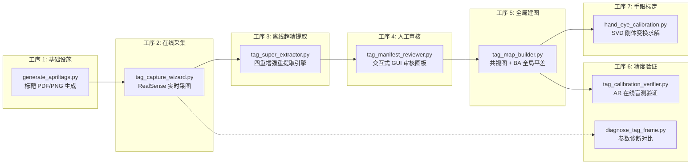

# AprilTag 标定工具套件代码审查报告

> 审查范围: [`flux_vision_3d/tools/calibration/`](file:///d:/Software/antigravity/flux_vision_3d/tools/calibration)  
> 文件总数: 9 个源文件 (含 `__init__.py`)，总代码量约 **5,900+ 行**  
> 审查日期: 2026-09-12

---

## 1. 架构总览与流水线拓扑



| 文件 | 职责 | 代码行数 | 复杂度 |
|:---|:---|---:|:---:|
| [`tag_map_builder.py`](file:///d:/Software/antigravity/flux_vision_3d/tools/calibration/tag_map_builder.py) | 核心引擎: 检测、共视图、BA 平差、坐标对齐、诊断报告 | 1731 | 🔴 极高 |
| [`tag_calibration_verifier.py`](file:///d:/Software/antigravity/flux_vision_3d/tools/calibration/tag_calibration_verifier.py) | AR 在线验证: 实时 6DoF 定位、盲测、时间序列锁定 | ~1500+ | 🔴 极高 |
| [`tag_manifest_reviewer.py`](file:///d:/Software/antigravity/flux_vision_3d/tools/calibration/tag_manifest_reviewer.py) | GUI 交互审核: 标靶状态切换、拓扑安全灯、右键菜单 | 1120 | 🟡 高 |
| [`tag_capture_wizard.py`](file:///d:/Software/antigravity/flux_vision_3d/tools/calibration/tag_capture_wizard.py) | RealSense 在线采图: 实时检测、自适应曝光、连通性追踪 | ~800+ | 🟡 高 |
| [`tag_super_extractor.py`](file:///d:/Software/antigravity/flux_vision_3d/tools/calibration/tag_super_extractor.py) | 离线超精提取: 5 通道增强、2x 超分、CONTOUR 角点 | 490 | 🟢 中 |
| [`diagnose_tag_frame.py`](file:///d:/Software/antigravity/flux_vision_3d/tools/calibration/diagnose_tag_frame.py) | 参数敏感性诊断: 双路对比、Markdown 报告生成 | ~450 | 🟢 中 |
| [`generate_apriltags.py`](file:///d:/Software/antigravity/flux_vision_3d/tools/calibration/generate_apriltags.py) | 标靶打印: A4 PDF + 高清 PNG 生成 | ~260 | 🟢 低 |
| [`hand_eye_calibration.py`](file:///d:/Software/antigravity/flux_vision_3d/tools/calibration/hand_eye_calibration.py) | 手眼标定: SVD 刚体变换、SCARA 旋转中心对齐 | ~230 | 🟢 低 |
| [`__init__.py`](file:///d:/Software/antigravity/flux_vision_3d/tools/calibration/__init__.py) | 包初始化 | 5 | ⚪ 无 |

---

## 2. 架构与设计亮点 ✅

整套工具呈现出**工业级标定系统**的核心特征：

### 2.1 鲁棒检测策略
- **双路互补融合检测** ([`tag_map_builder.py:135-179`](file:///d:/Software/antigravity/flux_vision_3d/tools/calibration/tag_map_builder.py#L135-L179))：路 A 高光抗反射 (C=5.5)、路 B 暗部低反差 (C=2.5, minOtsu=0.45)，白名单并集取最优，彻底解决单路检测盲区
- **IPPE_SQUARE 翻转二义性消歧** ([`tag_map_builder.py:266-317`](file:///d:/Software/antigravity/flux_vision_3d/tools/calibration/tag_map_builder.py#L266-L317))：利用工作台法向量向上物理先验 (R[1,2] < 0)，精准拒绝 Z 轴翻转伪解
- **超精提取引擎** ([`tag_super_extractor.py`](file:///d:/Software/antigravity/flux_vision_3d/tools/calibration/tag_super_extractor.py))：5 路增强 + 远景 Bicubic 2x 超分 + CORNER_REFINE_CONTOUR 轮廓正交求解，彻底解耦在线实时性与离线极致精度

### 2.2 全局优化严谨性
- **共视连通性安全守门员** ([`tag_map_builder.py:701-799`](file:///d:/Software/antigravity/flux_vision_3d/tools/calibration/tag_map_builder.py#L701-L799))：BA 前必须通过 BFS 连通分量检查 + 关键桥梁 (Critical Bridge) 预警
- **两阶段 BA 平差** ([`tag_map_builder.py:801-1095`](file:///d:/Software/antigravity/flux_vision_3d/tools/calibration/tag_map_builder.py#L801-L1095))：
  - Phase 1: Cauchy 鲁棒核粗差清洗 (f_scale=1.5)
  - Phase 2: 微容差极限收敛 (ftol/xtol/gtol=1e-9) + MAD 鲁棒离群检测
- **观测权重矩阵** ([`tag_map_builder.py:210-264`](file:///d:/Software/antigravity/flux_vision_3d/tools/calibration/tag_map_builder.py#L210-L264))：面积 × 入射角 × 径向畸变三维综合权重
- **3σ 协方差不确定度估计** ([`tag_map_builder.py:1097-1134`](file:///d:/Software/antigravity/flux_vision_3d/tools/calibration/tag_map_builder.py#L1097-L1134))：基于 J^T J 伪逆提取每个 Tag 的空间置信区间

### 2.3 人机交互设计
- **全 GUI 交互审核画板** ([`tag_manifest_reviewer.py`](file:///d:/Software/antigravity/flux_vision_3d/tools/calibration/tag_manifest_reviewer.py))：左键翻转、右键上下文菜单、局部 ROI 精修、靶向排查聚焦、拓扑实时红绿灯
- **交互式两阶段工作流** ([`tag_map_builder.py:1491-1661`](file:///d:/Software/antigravity/flux_vision_3d/tools/calibration/tag_map_builder.py#L1491-L1661))：6 选项菜单 + 安全守门员拦截非法 BA 调用
- **Toast 通知与视觉反馈**：半透明磨砂叠加层、悬停高亮、状态变迁动画

### 2.4 防呆自愈
- **磁盘自动同步** ([`tag_manifest_reviewer.py:201-279`](file:///d:/Software/antigravity/flux_vision_3d/tools/calibration/tag_manifest_reviewer.py#L201-L279))：启动时自动扫描新增采图，增量检测录入并保留已有审核标记
- **历史人工标记 100% 无损继承**：所有 rescan、重提取操作严格保留用户 `keep: false` 状态与 `note` 备注
- **物理有效性前置过滤**：面积 < 120px² 或测距深度 > 2200mm 的噪点自动拦截

---

## 3. 问题发现与改进建议

### 🔴 P0 — 严重/架构级问题

#### 3.1 `TagMapBuilder` 上帝类 (God Class) — 职责过载
[`tag_map_builder.py`](file:///d:/Software/antigravity/flux_vision_3d/tools/calibration/tag_map_builder.py) (1731 行) 承载了过多职责：

| 职责群 | 方法 |
|:---|:---|
| 标靶检测 | `detect_tags`, `refine_corners_subpix` |
| PnP 求解 | `solve_single_tag_pnp` |
| 观测权重 | `compute_observation_weight` |
| 可视化渲染 | `render_tag_3d_axes`, `render_annotated_frame` |
| 清单 I/O | `export_observations_manifest`, `load_observations_manifest` |
| 共视图分析 | `validate_covisibility` |
| BA 优化 | `optimize_bundle_adjustment`, `compute_3d_uncertainties` |
| 坐标对齐 | `_align_to_scara_world`, `apply_baseline_scale` |
| 诊断报告 | `export_diagnostic_report` |
| 交互工作流 | `interactive_workflow` (模块级函数) |

**建议**：拆分为 `TagDetector`、`BundleAdjustmentSolver`、`CovisibilityAnalyzer`、`DiagnosticReporter`、`TagMapIO` 等聚焦类，通过组合 (Composition) 在 `TagMapBuilder` 中编排。

#### 3.2 `rescan_current_frame` 直接使用相对路径读图可能失败
[`tag_manifest_reviewer.py:328`](file:///d:/Software/antigravity/flux_vision_3d/tools/calibration/tag_manifest_reviewer.py#L328)：
```python
raw_img = cv2.imread(raw_path)  # raw_path 可能是相对路径
```
当 `raw_path` 为 `data/tag_calibration_images/view_0001.png` 时，若 CWD 不是 `PROJECT_ROOT`，`cv2.imread` 会返回 `None`。而 [`refine_single_tag`](file:///d:/Software/antigravity/flux_vision_3d/tools/calibration/tag_manifest_reviewer.py#L432-L500) 中已正确处理了回退逻辑 (L443-444)，但 `rescan_current_frame` 中缺失。

**建议**：统一为绝对路径解析：
```python
if not os.path.isabs(raw_path):
    raw_path = os.path.join(PROJECT_ROOT, raw_path)
```

#### 3.3 `rescan_all_frames` 同样缺少路径回退
[`tag_manifest_reviewer.py:389-390`](file:///d:/Software/antigravity/flux_vision_3d/tools/calibration/tag_manifest_reviewer.py#L389-L390)：`raw_path` 取自清单字段，与 3.2 相同问题。

#### 3.4 `tag_super_extractor.py` 中 `total_enabled` 计数器永远为 0
[`tag_super_extractor.py:388`](file:///d:/Software/antigravity/flux_vision_3d/tools/calibration/tag_super_extractor.py#L388)：
```python
total_enabled = 0  # 声明后从未递增
...
manifest_data["summary"]["total_enabled_images"] = total_enabled  # 永远是 0
```
`total_enabled` 在循环体内没有 `+= 1` 逻辑，导致写出的 summary 中 `total_enabled_images` 恒为 0。

**修复**：在 L404 后添加：
```python
if is_frame_enabled:
    total_enabled += 1
```

---

### 🟡 P1 — 中等/功能性问题

#### 3.5 硬编码分辨率常量 (1920×1080) 散布于 UI 代码
- [`tag_manifest_reviewer.py:525`](file:///d:/Software/antigravity/flux_vision_3d/tools/calibration/tag_manifest_reviewer.py#L525)：`min(x, 1920 - menu_w - 15)` — 菜单位置夹紧到 1920px
- [`tag_manifest_reviewer.py:526`](file:///d:/Software/antigravity/flux_vision_3d/tools/calibration/tag_manifest_reviewer.py#L526)：`min(y, 1080 - menu_h - 60)` — 菜单位置夹紧到 1080px
- [`tag_manifest_reviewer.py:720`](file:///d:/Software/antigravity/flux_vision_3d/tools/calibration/tag_manifest_reviewer.py#L720)：`np.zeros((1080, 1920, 3))` — 空白画布尺寸

**问题**：当原始图像分辨率不是 1920×1080 时，右键菜单可能被裁切或溢出；空白占位图也不匹配实际分辨率。

**建议**：从当前帧图像的实际 `h, w` 动态计算菜单边界。

#### 3.6 BA 残差函数内 `np.linalg.inv` 高频调用
[`tag_map_builder.py:918`](file:///d:/Software/antigravity/flux_vision_3d/tools/calibration/tag_map_builder.py#L918)：
```python
T_c_w = np.linalg.inv(T_w_c)  # 每次残差计算均调用
```
`residuals_func` 在 `least_squares` 中被调用数百次，每次对每个 frame 都执行矩阵求逆。虽然 4×4 矩阵求逆极快，但可以通过预计算或直接参数化 `T_c_w` (而非 `T_w_c`) 消除冗余。

**建议**：将相机位姿直接参数化为 `T_c_w` (相机到世界的逆变换)，省去每轮循环的 `inv` 调用。

#### 3.7 `tag_super_extractor.py` 与 `tag_map_builder.py` 检测逻辑大量重复
两者都独立实现了：
- AprilTag 检测器初始化与参数配置
- 白名单过滤
- CLAHE 增强
- 亚像素角点精修
- 像元分辨率指标计算

但检测策略却不同 (Builder 用双路融合 + `CORNER_REFINE_SUBPIX`，Extractor 用 5 路增强 + `CORNER_REFINE_CONTOUR`)。

**建议**：抽取公共 `TagDetector` 基类，通过策略模式 (Strategy Pattern) 切换在线/离线检测配置，避免维护两套近似逻辑。

#### 3.8 `config.yaml` 路径硬编码为相对路径
[`tag_map_builder.py:61-62`](file:///d:/Software/antigravity/flux_vision_3d/tools/calibration/tag_map_builder.py#L61-L62)：
```python
cfg_file = "config.yaml"
if os.path.exists(cfg_file):
```
取决于当前工作目录。若从其他目录调用 `TagMapBuilder`，配置加载会静默失败。

**建议**：统一使用 `os.path.join(PROJECT_ROOT, "config.yaml")` 或通过构造函数显式传入配置路径。

#### 3.9 `tag_manifest_reviewer.py` 中 `render_current_frame` 缺少 `RESCAN_CURR` GUI 按钮
底部按钮栏 [`btn_defs`](file:///d:/Software/antigravity/flux_vision_3d/tools/calibration/tag_manifest_reviewer.py#L869-L886) 中没有定义 `RESCAN_CURR` 按钮，但鼠标回调 [`on_mouse_event`](file:///d:/Software/antigravity/flux_vision_3d/tools/calibration/tag_manifest_reviewer.py#L652) 中有 `RESCAN_CURR` 的处理分支。用户只能通过键盘 `F` 键触发重新识别，GUI 按钮栏缺失这一操作入口。

文档头注释 (L9) 宣称有 `[🔍 重新识别本图]` 和 `[🔄 全量重扫全部]` 按钮，但实际 `btn_defs` 中均未包含。

**建议**：在 `btn_defs` 中补充 `RESCAN_CURR` 和 `RESCAN_ALL` 按钮定义。

#### 3.10 `compute_3d_uncertainties` 中协方差计算的正则化偏差
[`tag_map_builder.py:1113-1114`](file:///d:/Software/antigravity/flux_vision_3d/tools/calibration/tag_map_builder.py#L1113-L1114)：
```python
JTJ_reg = JTJ + np.eye(JTJ.shape[0]) * 1e-6
cov = np.linalg.pinv(JTJ_reg) * (sigma_res_px ** 2)
```
对已加正则化的矩阵再用 `pinv` 是不必要的——正则化后 `JTJ_reg` 已确保非奇异，应使用 `np.linalg.inv`。此外，`pinv(JTJ_reg)` 与 `inv(JTJ_reg)` 在非奇异情况下理论一致，但 `pinv` 的 SVD 分解计算量显著更大。

**建议**：改用 `np.linalg.solve(JTJ_reg, np.eye(JTJ_reg.shape[0]))` 或 `np.linalg.inv(JTJ_reg)`.

---

### 🟢 P2 — 低优先级/代码质量改进

#### 3.11 重复的打印横幅
[`tag_super_extractor.py:351-357`](file:///d:/Software/antigravity/flux_vision_3d/tools/calibration/tag_super_extractor.py#L351-L357) 与 [`L393-399`](file:///d:/Software/antigravity/flux_vision_3d/tools/calibration/tag_super_extractor.py#L393-L399) 打印了几乎完全相同的启动横幅——"工序 3 启动"信息被输出了两次。

**建议**：删除其中一个重复横幅块。

#### 3.12 `tag_manifest_reviewer.py` 大量 Magic Number
UI 渲染代码中散布着大量未命名常量，例如：
- 颜色值: `(240, 160, 30)`, `(0, 220, 255)`, `(42, 48, 65)` 等
- 像素偏移: `35`, `58`, `52`, `34` 等
- 字号: `0.48`, `0.46`, `0.55` 等

**建议**：将 UI 主题参数抽取为类级常量字典 (如 `THEME = {"bar_height": 58, "toolbar_height": 52, "color_accent": (0, 220, 255), ...}`)。

#### 3.13 裸 `except Exception` 吞噬异常
以下位置使用了裸 `except` 捕获并静默忽略所有异常：
- [`tag_map_builder.py:72`](file:///d:/Software/antigravity/flux_vision_3d/tools/calibration/tag_map_builder.py#L72)：配置文件解析
- [`tag_map_builder.py:389-390`](file:///d:/Software/antigravity/flux_vision_3d/tools/calibration/tag_map_builder.py#L389-L390)：3D 轴渲染
- [`tag_map_builder.py:1132-1133`](file:///d:/Software/antigravity/flux_vision_3d/tools/calibration/tag_map_builder.py#L1132-L1133)：协方差计算
- [`tag_super_extractor.py:81`](file:///d:/Software/antigravity/flux_vision_3d/tools/calibration/tag_super_extractor.py#L81)：配置加载

**建议**：至少添加 `logging.debug` 级别日志，便于排查静默失败。

#### 3.14 `on_mouse_click` 冗余别名
[`tag_manifest_reviewer.py:708-710`](file:///d:/Software/antigravity/flux_vision_3d/tools/calibration/tag_manifest_reviewer.py#L708-L710)：
```python
def on_mouse_click(self, event, x, y, flags, param):
    """兼容别名回调"""
    self.on_mouse_event(event, x, y, flags, param)
```
未被任何调用方使用 (实际绑定的是 `on_mouse_event`)。属于死代码。

#### 3.15 BFS 实现使用 `list.pop(0)` 而非 `collections.deque`
[`tag_map_builder.py:754-758`](file:///d:/Software/antigravity/flux_vision_3d/tools/calibration/tag_map_builder.py#L754-L758)：
```python
q = [root]
while q:
    curr = q.pop(0)  # O(n) 操作
```
`list.pop(0)` 的时间复杂度为 O(n)，对于小规模标靶图无影响，但规范写法应使用 `collections.deque` 的 `popleft()`。

#### 3.16 `refine_corners_orthogonal` 是空操作
[`tag_super_extractor.py:114-120`](file:///d:/Software/antigravity/flux_vision_3d/tools/calibration/tag_super_extractor.py#L114-L120)：
```python
def refine_corners_orthogonal(self, gray: np.ndarray, corners: np.ndarray) -> np.ndarray:
    return np.array(corners, dtype=np.float32).reshape(4, 2)
```
该函数仅执行类型转换和 reshape，实际上是一个 no-op。方法名暗示"正交精修"但未执行任何精修操作。

**建议**：明确为 `identity passthrough` 并在文档字符串中解释设计意图 (即信任 CONTOUR 求解结果)，或直接内联消除。

#### 3.17 缺少类型标注
`TagMapBuilder` 和 `TagManifestReviewer` 的部分实例变量未在 `__init__` 或类体中声明类型：
- `self.is_running` 仅在 `run()` 中初始化
- `self.display_img` 声明为 `None` 但无类型注解

---

## 4. 安全与健壮性

| 项目 | 状态 | 说明 |
|:---|:---:|:---|
| YAML 注入安全 | ✅ | 使用 `yaml.safe_load` 而非 `yaml.load` |
| 路径遍历保护 | ⚠️ | `sync_with_disk` 使用 `glob` 限定了文件模式，但未校验路径是否在预期目录内 |
| 除零保护 | ✅ | `max_radius`, `nominal_dist` 等关键除数均有 `> 0` 前置检查 |
| 图像读取空检查 | ✅ | 所有 `cv2.imread` 后均有 `is None` 检查 |
| 相机内参回退 | ✅ | `resolve_camera_intrinsics` 不可用时有硬编码默认值 |
| `cv2.destroyAllWindows` | ✅ | 审核画板和验证器退出时正确清理窗口资源 |

---

## 5. 性能热点

| 热点 | 位置 | 影响 | 优化建议 |
|:---|:---|:---|:---|
| `np.linalg.inv` 在残差函数内 | `tag_map_builder.py:918` | BA 求解期间每帧每轮循环调用 | 参数化为 `T_c_w` |
| `cv2.addWeighted` 大量叠加层 | `tag_manifest_reviewer.py` 多处 | 每次渲染帧创建多个全尺寸叠加副本 | 单次叠加层合并渲染 |
| 5 路检测器逐路全图扫描 | `tag_super_extractor.py:166-191` | 离线模式设计意图即为不计耗时 | 可按需跳过（已有标靶足够时短路退出） |

---

## 6. 总结与优先行动建议

### 立即修复 (P0)
1. **修复 `total_enabled` 计数器 bug** — `tag_super_extractor.py:388`，当前恒为 0
2. **统一 `rescan_current_frame` / `rescan_all_frames` 的图片路径解析** — 补充绝对路径回退逻辑

### 短期改进 (P1)
3. **消除 1920×1080 硬编码** — 从实际图像尺寸动态计算菜单/画布边界
4. **补充 `RESCAN_CURR` / `RESCAN_ALL` GUI 按钮** — 兑现文档承诺的全 GUI 操作栏
5. **统一 `config.yaml` 路径为 `PROJECT_ROOT` 绝对拼接**
6. **`compute_3d_uncertainties` 改用 `inv` 替代 `pinv`**

### 中长期重构 (P2)
7. **拆分 `TagMapBuilder` 上帝类**：至少抽出 `TagDetector`、`BundleAdjustmentSolver`
8. **统一 `TagDetector` 基础设施**：消除 `tag_map_builder.py` 与 `tag_super_extractor.py` 的检测逻辑冗余
9. **引入结构化日志** (`logging` 模块) 替代散布的 `print` 语句
10. **UI 主题常量化**：将 Magic Numbers 收拢为主题配置字典

> [!TIP]
> 整体代码质量在工业视觉标定工具中属于**高水平**。架构设计严谨 (共视安全守门员、两阶段 BA、人工审核闭环、磁盘自愈同步)，注释极为充分，防呆逻辑覆盖全面。核心 bug 仅有计数器遗漏和路径回退缺失两处，其余均为架构层面的可维护性改进。
