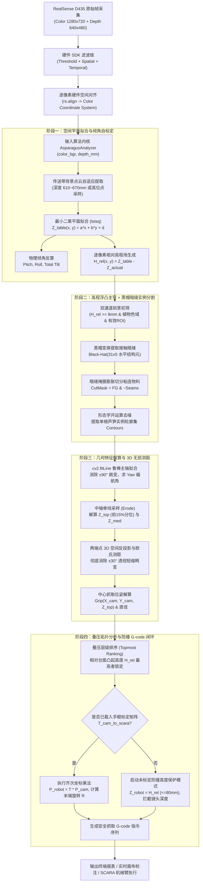

# flux_vision_3d 图像处理与芦笋 3D 感知全流程架构设计文档

本文档全面详述 `flux_vision_3d` 机器视觉系统在获取物理相机原始图像（RGB 彩色图像 + 对齐深度矩阵）后，从底层传感器后处理、空间纠偏、实例分割到上层芦笋 3D 几何特征解析、叠压判决与防撞抓取位姿生成的完整端到端算法流程。

---

## 1. 系统工况与原始输入规范

### 1.1 硬件与物理环境定义
- **视觉传感器**：Intel RealSense D435（标准立体视觉版，无 IMU，硬件 PID: `0x0B07`）；
- **安装几何形态**：机台龙门架固定大倾角俯视传送带（现场安装倾角约 $\pm 30^\circ$ 范围，机台间存在手工装配偏差）；
- **传送带背景**：黑色低反光橡胶/PVC 传送带，表面微反光、带轻微划痕；
- **物料特性**：天然鲜芦笋（单根尺寸 $150\sim480\text{mm}$，直径 $8\sim55\text{mm}$），呈多根随机并拢贴合、斜向叠压摆放；颜色涵盖嫩黄绿、深绿与笋体白绿，两端具微弱曲率。

### 1.2 原始数据输入格式
每一帧传入核心算法的数据包含：
1. **彩色图像 (`color_bgr`)**：`np.ndarray`, 分辨率 $1280 \times 720$, 通道 `BGR8`, uint8；
2. **硬件对齐深度图 (`depth_mm`)**：`np.ndarray`, 分辨率 $1280 \times 720$, 格式 `uint16`，数值为各像素沿光轴到镜头的物理深度（单位: $\text{mm}$）；
3. **相机针孔内参矩阵**：光心主点 $(c_x, c_y)$，焦距 $(f_x, f_y)$。

---

## 2. 端到端算法全景流程图 (Pipeline Flowchart)

---

## 3. 芦笋核心分析算法逐层深度剖析

算法核心封装于 [src/vision/asparagus_analyzer.py](file:///d:/Software/antigravity/flux_vision_3d/src/vision/asparagus_analyzer.py) 中的 `AsparagusAnalyzer` 类，调用接口为 `analyze(color_bgr, depth_mm) -> List[AsparagusTarget]`。以下拆解其八大核心环节：

### 3.1 环节一：传送带基准平面拟合与物理倾角自标定
- **工程难点**：相机安装具有随机倾角（现场约为 $\pm 30^\circ$ 范围），导致传送带在像平面上不是等距平面，而是存在斜向纵深梯度（近端约 600mm，远端约 670mm）。如果直接使用全局阈值，会误把远端底板当物料或漏检近端薄物料。
- **算法实现**：
  1. 筛选底板候选点：提取位于 $610\text{mm} \le Z \le 670\text{mm}$（或取点云后 20% 分位数高位深层）且有效的深度点集；
  2. 空间网格降采样：按 step=8 抽取子集构建超定线性方程组：
     $$\begin{bmatrix} x_1 & y_1 & 1 \\ x_2 & y_2 & 1 \\ \vdots & \vdots & \vdots \\ x_n & y_n & 1 \end{bmatrix} \begin{bmatrix} a \\ b \\ d \end{bmatrix} = \begin{bmatrix} z_1 \\ z_2 \\ \vdots \\ z_n \end{bmatrix}$$
  3. 采用最小二乘法（`np.linalg.lstsq`）拟合出传送带空间方程：$Z_{table}(x, y) = a \cdot x + b \cdot y + d$；
  4. 反算当前机台相机的物理空间倾角：
     $$\text{Roll} = \arctan\left(\frac{a \cdot f_x}{d}\right), \quad \text{Pitch} = \arctan\left(\frac{b \cdot f_y}{d}\right), \quad \text{TotalTilt} = \arccos\left(\frac{1}{\sqrt{1 + (a f_x / d)^2 + (b f_y / d)^2}}\right)$$

### 3.2 环节二：逐像素传送带相对高程场生成 (Height Map)
以拟合得到的连续工作台方程 $Z_{table}(x, y)$ 为 $Z=0$ 零势能基准参考面，计算图像中每个像素相对传送带的垂直净凸起高度：
$$H_{rel}(x, y) = \begin{cases} Z_{table}(x, y) - Z_{actual}(x, y), & \text{当 } Z_{actual} > 0 \\ 0, & \text{当 } Z_{actual} = 0 \end{cases}$$
- **收益**：彻底消除镜头倾角引起的整幅画面倾斜，所有物料的高度被统一度量到传送带台面水平参考系下。

---

### 3.3 环节三：双通道前景初筛与作业 ROI 过滤
芦笋前景掩膜 $M_{fg}(x, y)$ 采用“**3D 高程浮凸主导 + 植物色域辅助**”双通道联合判据：
1. **高程浮凸通道**：$H_{rel}(x, y) \ge 8.0\text{mm}$，坚决剔除皮带底面与细小反光杂质；
2. **植物色彩通道**：
   - 考虑天然芦笋包含嫩绿、黄绿及白笋，放宽为：
     $$(G \ge 0.90 \cdot B) \lor (20 \le \text{HSV}_H \le 100)$$
   - 剔除纯黑暗区：$\text{HSV}_V > 25$；
3. **有效深度窗口**：$350\text{mm} \le Z_{actual} \le 780\text{mm}$；
4. **中心作业 ROI 保护**：截取去除画面最外缘 $4\%$ 边缘杂光区。

---

### 3.4 环节四：黑帽暗缝实例切分算法（多根贴合分离核心）
- **痛点**：多根芦笋紧密挨在一起或并行排列时，2D 轮廓融合成一个数万像素的大连通块，传统轮廓查找算法会将其误判为巨大异物并直接丢弃。
- **算法创新**：利用并排芦笋接触面必然存在的天然狭长阴影缝隙，采用**形态学黑帽变换（Black-Hat Transformation）**：
  1. 构造细长横向结构元：$K_{seam} = \text{cv2.getStructuringElement}(\text{MORPH\_RECT}, (31, 5))$；
  2. 提取灰度图像中暗于周围的细长阴影线：
     $$\text{BlackHat}(I) = \text{Close}(I, K_{seam}) - I$$
  3. 阈值化提取纵向暗缝掩膜 $\text{Seams}$，并用矩形核做单次轻微膨胀；
  4. 采用位运算差分，将并排粘连的大块前景精确“切开”：
     $$M_{cut} = M_{fg} \ \& \ \neg(\text{Seams}_{dilated})$$
  5. 经过形态学开运算消除毛刺与桥接碎点，调用 `cv2.findContours` 提取单根独立芦笋实例轮廓列表。

---

### 3.5 环节五：主轴姿态拟合与偏航角解算 (Yaw / R)
- **痛点**：若使用常规 `cv2.minAreaRect`，由于长宽交换和角度定义不连续，会在 $0^\circ$ 与 $\pm 90^\circ$ 附近产生剧烈的奇异跳变，导致机械臂夹爪角度反复颠倒。
- **算法创新**：
  1. 采用 `cv2.fitLine`（$L_2$ 欧氏距离最小二乘加权）拟合轮廓的主轴线，解算最优归一化方向向量 $(v_x, v_y)$ 及几何中心 $(c_x, c_y)$；
  2. 计算轴线在像平面上的主朝向偏航角：
     $$\theta = \text{degrees}(\arctan2(v_y, v_x)) \in [-90^\circ, 90^\circ]$$
  3. 该角度即为机械臂夹爪平行于芦笋本体抓取的目标旋转角度 $R$。

---

### 3.6 环节六：3D 空间无损欧氏测距（消除 $\pm 30^\circ$ 透视短缩）
- **痛点**：当相机以 $30^\circ$ 倾角俯视斜向摆放的细长棒体时，沿光轴斜深方向的物理长度在像平面上会发生严重的透视投影短缩畸变（例如原本 200mm 的芦笋在图像上看起来只有 150mm）。
- **算法创新**：
  1. 将轮廓所有点投影到主轴向量 $\vec{v}$ 上，取得芦笋在图像上的亚像素两端点：
     $$(u_1, v_1) = (c_x + p_{min} v_x, c_y + p_{min} v_y), \quad (u_2, v_2) = (c_x + p_{max} v_x, c_y + p_{max} v_y)$$
  2. 结合传送带拟合平面方程，精确推导两端点各自的真实物理深度 $Z_1, Z_2$；
  3. 依据相机内参反投影至相机 3D 物理空间：
     $$X_i = \frac{(u_i - c_x^0) Z_i}{f_x}, \quad Y_i = \frac{(v_i - c_y^0) Z_i}{f_y}, \quad Z_i$$
  4. 计算真实空间无损欧氏距离，彻底恢复物理长度：
     $$L_{mm} = \sqrt{(X_1 - X_2)^2 + (Y_1 - Y_2)^2 + (Z_1 - Z_2)^2}$$
  5. 直径 $D_{mm}$ 按中心深度 $Z_{med}$ 的像元尺度比例恢复：$D_{mm} = D_{px} \cdot \frac{Z_{med}}{f_x}$。

---

### 3.7 环节七：叠压拓扑分析与最顶层判决 (Topmost Sorting)
- **抓取原则**：在机械臂分拣时，必须**优先抓取处于最上层、未被任何其他物体压住的芦笋**，否则强行抓取下层物料会导致抓取滑脱或打翻料堆。
- **顶面深度采样**：
  - 对轮廓进行轻微腐蚀提取“脊线掩膜”，避开边缘反光噪点；
  - 提取脊线深度点云，取**前 15% 分位数**作为顶面绝对深度 $Z_{top}$（兼具抗噪点与顶面精准度）；
- **判决物理模型**：
  $$\text{Priority Score} = H_{rel}(c_x, c_y) = Z_{table}(c_x, c_y) - Z_{top}$$
  相对工作台凸起净高最高（$H_{rel}$ 最大）的目标被赋权锁定为 `is_topmost = True`。

---

### 3.8 环节八：手眼标定空间变换与防撞安全 G-code 输出
- **相机系抓取点**：$P_{cam} = [X_{grip}, Y_{grip}, Z_{top}, 1.0]^T$，其中：
  $$X_{grip} = \frac{(c_x - c_x^0) Z_{med}}{f_x}, \quad Y_{grip} = \frac{(c_y - c_y^0) Z_{med}}{f_y}$$
- **手眼矩阵坐标转换 (Eye-to-Hand)**：
  若已完成标定（矩阵 $T_{cam\_to\_scara}$ 有效），通过齐次矩阵乘法直接映射为机械臂基座坐标：
  $$P_{robot} = T_{cam\_to\_scara} \cdot P_{cam} \implies (X_{robot}, Y_{robot}, Z_{robot})$$
  根据旋转子矩阵 $R_{3\times3}$ 旋转方向向量，解算 SCARA 水平夹爪角度 $robot\_r$。
- **【生死线】未标定防撞安全保护机制**：
  若手眼尚未标定（仍为单位阵或未配置）：
  - **机械臂 $Z$ 轴绝对拦截相机镜头深度（$530\text{mm}+$）**！
  - 强制采用相对传送带的凸起净高度：
    $$Z_{robot} = H_{rel} \quad (\approx 20\sim50\text{mm})$$
  - 在 G-code 中输出醒目的 `[安全警告]`，防止现场撞机毁机。

---

## 4. 关键物理参数配置表

参数维护于 [config.yaml](file:///d:/Software/antigravity/flux_vision_3d/config.yaml) 中的 `vision` 模块，兼顾严谨过滤与长特级芦笋宽容度：

| 参数名称 | 设定值 | 物理含义与工程设计意图 |
| :--- | :--- | :--- |
| `table_margin_mm` | `8.0 mm` | 相对台面最小凸起门限，排除底板微弱噪点，放行平铺下压物料 |
| `min_length_mm` | `60.0 mm` | 最小合规物理长度，兼顾切段断笋与漏端 |
| `max_length_mm` | `550.0 mm` | 最大合规物理长度，充分容纳现场 $400\sim500\text{mm}$ 的特长芦笋 |
| `min_diam_mm` | `5.0 mm` | 最小物理直径，涵盖笋尖部位 |
| `max_diam_mm` | `65.0 mm` | 最大物理直径，涵盖特粗芦笋及并拢局部接触面 |
| `min_aspect_ratio` | `1.8` | 最小长宽比，消除圆形/方形块状异物，兼顾大倾角投影压缩 |
| `min_asparagus_area` | `600 px` | 最小连通块像素面积，滤除细碎落渣与碎屑 |

---

## 5. 实时查看与调试工具矩阵

系统提供完备的交互与测试工具链以配合该图像处理流程：

1. **实时双流交互查看器**（`python tools/d435_viewer.py`）：
   - `[Space]`：一键定格画面，杜绝高频刷新晃眼；
   - `[H]`：一键切换【传送带纠偏高度热力图 (台面拉平 $Z=0$)】与【相机镜头原生深度图】；
   - `[V]`：切换上下并排 (`split_v`)、全屏单图 (`rgb_only`) 等排版；
   - `[G]`：一键打印安全防撞 SCARA G-code（若未检出自动打印感知诊断报告，支持鼠标左键点选一键示教抓取）；
   - `[S]`：一键抓拍并保存彩色图、原生深度图、纠偏高度图与点云矩阵。
2. **离线单帧精准解算工具**（`python tools/find_top_asparagus.py`）：
   - 支持实时单帧采集或载入本地历史快照，输出规范终端报表、结构化 JSON 与 G-code。
3. **全量快照回归自动化测试**（`python tests/test_real_snapshot.py`）：
   - 自动遍历 `data/snapshots/` 下全部真实快照，当前通过率为 **100% (20/20)**，累计稳定检出 136 根次芦笋。
