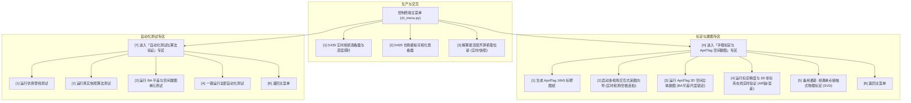

# 机械臂手眼标定与 AprilTag 空间建图子系统设计规范

> **创建日期**：2026-09-08  
> **文档状态**：已评审通过 (Approved)  
> **模块范围**：`flux_vision_3d` 控制终端、标定采图向导、空间平差建图、AR 在线验证工具及自动化测试体系

---

## 1. 架构目标与设计原则

解决原有系统两套标定体系并存、菜单层级碎片化、缺少交互式采图向导与直观现场验证的问题。
打造一个**工序化、分步式、高鲁棒性**的手眼标定与空间建图一体化子系统。

### 核心工作流：四步闭环
1. **制靶 (Target Gen)**：生成 0~19 号 AprilTag 16h5 高清图纸与原点对齐标尺；
2. **采图 (Interactive Capture)**：实时视频流中实时检测 Tag、提示共视状态，空格一键连拍并自动编号存储；
3. **建图 (BA Mapping)**：读取图像集，执行 BA 全局平差，支持卷尺物理测距输入消除尺度漂移，自动以 Tag 0 对齐原点、Tag 0→1 对齐 X 轴，导出 `config/tags_map.yaml`；
4. **验证 (AR Verification)**：开启实时画面，AR 叠加 3D 直角坐标轴与相机 6DoF 坐标，直观检验原点与位姿精度。

---

## 2. 系统层级与菜单流向设计

---

## 3. 详细模块设计与规范

### 3.1 采图向导 (`tools/tag_capture_wizard.py`)
- **功能**：基于 RealSense 彩色视频流，实时检测 AprilTag 16h5。
- **界面交互**：
  - 画面上高亮绘制检测到的各 Tag 边界框与 ID。
  - 顶部状态条显示：`[已检测 N 个 Tag | 共视条件: 满足/不足] [按空格拍照 | 按 Q 退出]`。
  - 底部显示已采集帧数统计。
  - 按 `空格` 键保存当前无畸变彩色图至 `data/tag_calibration_images/view_XXXX.png`。
- **无硬件模式**：支持 `--mock` 模式，在无物理相机时可演示交互。

### 3.2 空间建图与平差向导 (`tools/tag_map_builder.py`)
- **功能**：读取 `data/tag_calibration_images/` 图像集，构建共视连通图，运行 Scipy BA 联合优化标靶 3D 坐标与相机位姿。
- **交互与尺度锁定**：
  - 提取角点并完成相对重构后，交互询问：“*请输入实测两标靶中心距离（例如 Tag 1 与 Tag 5 的卷尺距离 mm）*”。
  - 根据 $Scale = D_{real} / D_{nominal}$ 缩放全局空间坐标。
  - 以 Tag 0 为原点 $(0,0,0)$，法向为垂直 Z 轴，Tag 0→1 投影为 X 轴建立刚体坐标系。
  - 导出格式规范的 `config/tags_map.yaml`。

### 3.3 现场 AR 精度验证工具 (`tools/tag_calibration_verifier.py`)
- **功能**：加载 `config/tags_map.yaml`，读取实时相机视频流。
- **界面交互**：
  - 在视野内的 Tag 上绘制 3D 直角坐标轴（红色 X 轴，绿色 Y 轴，蓝色 Z 轴）。
  - 在画面左上角实时显示：
    - 当前相机在世界坐标系（SCARA 基座）下的 6DoF 位姿：`X, Y, Z (mm)`，`Roll, Pitch, Yaw (deg)`。
    - 重投影均方根误差 (px & mm) 与精度评估（如 `<0.5mm: 极佳`）。
    - Tag 0 原点位置与当前可见 Tag 列表。

### 3.4 自动化测试与 CI 体系
- 保持测试与现场验证的清晰分界。
- 自动化测试集中于 `tests/` 目录：
  - `tests/test_mock_pipeline.py`：端到端无相机视觉仿真测试；
  - `tests/test_real_snapshot.py`：真实工件图像算法测试；
  - `tests/test_tag_map_builder.py`：合成多视角仿真数据验证 BA 平差收敛性、尺度放缩与原点对齐数学正确性；
- 主菜单中设立专门的 `[T]` 测试专区统筹执行。
