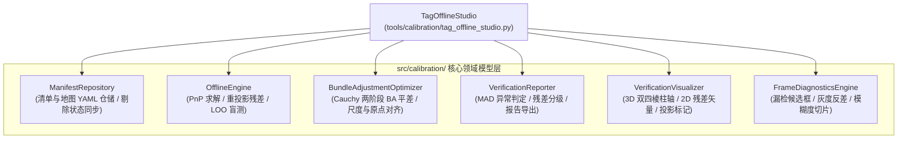

# AprilTag 离线标定综合工作站 (Offline Studio) 架构设计方案

**日期**: 2026-09-13  
**状态**: Approved (已获用户批准)  
**目标**: 构建统一集成的“资产中心化 (Asset-Centric)”离线标定与建图综合工作站，终结原本在 CLI 终端和多个小 GUI 工具之间频繁进出、割裂的交互痛点。

---

## 一、 系统背景与设计宗旨

在原本的工作流中，标定建图的离线工序被分散在终端的不同选项中：
- 工序 3：离线图像超精重提取 (`tag_super_extractor.py`)
- 工序 4：标靶观测样本交互审核画板 (`tag_manifest_reviewer.py`)
- 工序 5：空间立体建图与两阶段 BA 平差 (`tag_map_builder.py`)
- 工序 6：离线标定精度体检工作台 (`tag_offline_verifier.py`)
- 辅助诊断：单帧漏检病因深度诊断 (`diagnose_tag_frame.py`)

**核心痛点**：当用户在体检台中发现某张图残差偏大时，必须退出体检台 -> 进画板找到该帧剔除 -> 退出画板 -> 进建图平差重新跑 BA -> 再进体检台检验，流程繁琐割裂。

**设计宗旨**：
以**“帧序列资产 (Asset/Frame-Centric)”**为中枢，打造统一的 **Offline Studio**。用户先选帧，在统一的高清视口与属性诊断侧栏中执行单帧剔除、病因诊断、超精微调，并直接通过底部控制栏原地触发全局 BA 平差优化，就地热刷新全部指标，完成全流程闭环。

---

## 二、 核心架构与领域模型装配 (零重复造轮子)

得益于此前对 `TagOfflineVerifier` 和 `TagMapBuilder` 的面向对象单一职责重构，底层的核心领域模型均已沉淀在 `src/calibration/`，`OfflineStudio` 作为高层装配器与 GUI 控制器直接复用：



---

## 三、 界面布局规格 (1920 × 1080 三栏分区)

采用深灰/暗黑科技感工业设计规范，基于 `src/utils/viewport_manager.py` 实现自适应排版：

```text
+-------------------------------------------------------------------------------------------------------------------------------+
| TOP BAR (高度: 44px): [STUDIO] AprilTag 离线标定综合工作站 | 数据集: 22帧 | 标靶: 13个 | 全局 RMSE: 0.18px | 地图: tags_map.yaml (OK)    |
+------------------------------+---------------------------------------------------------------+--------------------------------+
| 左栏: 帧序列紧凑列表          | 中栏: 高清工作视口 (Viewport)                                 | 右栏: 属性与单帧诊断面板        |
| (宽: 340px)                  | (宽: 1240px, 自动居中等比贴入)                                 | (宽: 340px)                    |
|                              |                                                               |                                |
| 搜索/筛选: [全部|仅异常|已剔除] | - 1080P 原始底图 / 亚像素角点标注                             | [选定帧]: view_0003.png        |
| [1] view_0001 [T:4] 0.12px   | - 绿/蓝框标记正常标靶；红/灰线标记已剔除标靶                   | 状态: [保留中] (按 T 剔除)     |
| [2] view_0002 [T:3] 0.15px   | - 叠加 3D 正四棱柱立体轴 (虚实重投影)                          | 位姿: X:-65.2 Y:-69.9 Z:796mm  |
| [*] view_0003 [T:5] 0.82px   | - 亚像素残差向量红色箭头放大                                   |                                |
|     (黄色高亮 · 选中)         | - 交互: 鼠标点击画面中任意 Tag 可单独剔除/聚焦                 | 【标靶细目清单】               |
| [X] view_0004 [T:1] [已剔除] |                                                               | - Tag #18: 0.11px (良)         |
| [5] view_0005 [T:4] 0.19px   |                                                               | - Tag #19: 0.89px (偏高·警告)  |
| ... 可容纳 20 帧高密滚动      |                                                               | - Tag #20: 0.14px (良)         |
| (支持滚轮滑滚 / 上下键切换)   |                                                               |                                |
|                              |                                                               | 【单帧病因与微调动作】         |
|                              |                                                               | [D] 展开漏检切片病因分析       |
|                              |                                                               | [E] 对当前帧单帧超精重提取     |
|                              |                                                               | [L] 设为本帧留一盲测靶标       |
+------------------------------+---------------------------------------------------------------+--------------------------------+
| BOTTOM BAR (高度: 52px): 全局调度控制栏 (1:1 独立常驻，绝对不会溢出屏幕)                                                       |
|   [一键全局平差 BA (B)]   [全量体检 (P)]   [拓扑连通图 (G)]   [报告导出 (R)]   [保存地图 (S)]   [退出工作台 (Q)]                     |
+-------------------------------------------------------------------------------------------------------------------------------+
```

---

## 四、 核心工作流规范

1. **左栏帧列表高密联动**：
   - 一屏展示 15~20 帧，绿色点标识正常帧、黄色警告标识残差偏高帧、灰色删除线标识已剔除帧；
   - 鼠标单击或键盘 `W/S`/方向键切换选定帧，毫秒级就地切帧。
2. **单帧审核与细目把关**：
   - 按 `[T]` 键一键翻转整帧有效性状态，或在右栏细目中点击单靶剔除；
   - 清单变更后内存即时同步，左栏指示灯即刻响应。
3. **单帧漏检深度病因切片**：
   - 按 `[D]` 键唤出漏检切片，针对未被检测到的标靶区域分析反差、灰度动态范围、四边形长宽比，就地指导拍摄问题。
4. **一键全局平差优化 (BA)**：
   - 点击底栏 `[一键全局平差 (B)]`，启动异步后台平差求解；
   - 前台界面保持流畅交互并展示进度浮层，计算完成后自动热重载地图并就地刷新全部帧的残差数值。
5. **全量体检与报告导出**：
   - 按 `[P]` 重新计算全局留一盲测指标，按 `[R]` 一键生成格式化 Markdown 质检单。

---

## 五、 控制台入口集成与向前兼容

在 `tools/cli_menu.py` 的手眼标定与 AprilTag 空间建图专区中：
- 推荐首选入口：`[O] 进入 AprilTag 离线标定综合工作站 (Offline Studio)`；
- 原独立脚本选项（3/4/5/6）依然保持可用，底层完全解耦互通。
