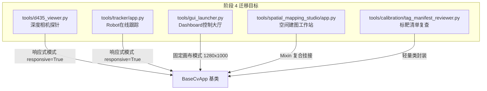

# 阶段 4：重型交互与视口类 GUI 应用迁移规划文档 (BaseCvApp 统一架构)

> **创建日期**：2026-09-24  
> **所属项目**：`flux_vision_3d`  
> **基类前置**：[`src/utils/base_cv_app.py`](file:///d:/Software/antigravity/flux_vision_3d/src/utils/base_cv_app.py)（阶段 1~3 已完成，192 项测试用例 100% 通过）  
> **文档目的**：供空闲时有序推进剩余 5 个重型交互与视口类应用的轻量化基类迁移，指导模块化拆解、避免踩坑与保障回归测试。

---

## 一、当前工程架构与迁移基准

### 1.1 前三阶段已完成的成果清单
在阶段 1~3 中，我们已完成 6 个核心应用的重构并继承自 `BaseCvApp`，累计消除重复样板代码 600+ 行：
1. `tools/isolate_wheels_debug/app.py`（8 通道宽屏机架工位，1280×760）
2. `tools/net_camera_debug/app.py`（手机网络相机调试，1280×760）
3. `tools/scara_debug/app.py`（SCARA 机械臂调试终端，1280×720）
4. `tools/capture/capture_wizard.py`（多视角向导，1280×720）
5. `tools/workspace_hub/app.py`（工位综合管理中枢，960×720）
6. `tools/asparagus_pose_studio/app.py`（芦笋位姿工作室，`responsive=True` 动态矢量自适应）

### 1.2 `BaseCvApp` 提供的核心支撑能力
- **视窗生命周期与 DPI 记忆**：自动对接 `GuiWindowManager` 与本地 `config/gui_settings.json`；
- **双模呈现体系**：
  - **模式 A (固定逻辑画布)**：`responsive=False`（默认），固定分辨率如 1280×760，窗口拉伸时自动进行严格等比缩放并上下/左右居中补黑边（Letterboxing），输入坐标自动逆变换为逻辑像素；
  - **模式 B (真矢量响应式)**：`responsive=True`，针对如位姿工作室、实时探针等全宽动态排版应用，直接按当前窗口物理尺寸 `(canvas_w, canvas_h)` 矢量重绘，坐标 1:1 映射；
- **全鼠标化与快捷键链路**：统一派发 `on_click`、`on_double_click`、`on_mouse_down`、`on_mouse_up`、`on_mouse_move`、`on_mouse_wheel`、`on_key`；
- **安全生命周期**：`setup()`、`on_tick()`、`render()`、`cleanup()`、`stop()`。

---

## 二、阶段 4 待迁移的 5 个应用深度剖析与技术方案



---

### 应用 1：`tools/d435_viewer.py`（D435 深度相机纯预览与探针）

#### 1. 现状分析
- **文件规模**：单文件约 1081 行，类 `D435Viewer`；
- **现有痛点**：手动初始化 `GuiWindowManager`，手写 `while self.is_running` 事件循环与 `cv2.waitKey(30)` 轮询，鼠标悬停深度探针坐标需要手动逆算；
- **硬件特征**：持有 RealSense pipeline 或 USB `cv2.VideoCapture`，单次点击 [Space] 可冻结/恢复画面。

#### 2. 改造方案
- **基类配置**：
  ```python
  class D435Viewer(BaseCvApp):
      def __init__(self, ...):
          super().__init__(
              app_id="d435_viewer",
              base_w=1280, base_h=720,
              window_name="d435_viewer",
              window_title="RealSense D435 双流探针 | flux_vision_3d",
              responsive=True,  # 探针工具界面随窗口拉伸自适应填满
          )
  ```
- **生命周期映射**：
  - `setup(self)`：配置初始相机参数，若用户配置自动开启则启动取流；
  - `cleanup(self)`：调用现有 `self.close_camera()` 释放 RealSense 流；
  - `render(self) -> np.ndarray`：获取最新 RGB/Depth 帧（或暂停帧），绘制上下/左右分屏与工具栏，返回合成画布；
  - `on_mouse_move(self, x, y)`：更新悬停探针坐标 `(x, y)`，读取对应像素点的毫米级深度与空间 3D 坐标；
  - `on_click(self, x, y)`：命中测试工具栏按钮（相机开关、分辨率切换、排列方式、暂停）；
  - `on_key(self, key) -> bool`：响应空格 `[Space]` 暂停/继续、`[V]` 视图切换、`[ESC]` 退出。

---

### 应用 2：`tools/tracker/app.py`（Robot 在线跟踪主工具）

#### 1. 现状分析
- **文件规模**：约 1353 行，类 `RobotOnlineTracker`；
- **核心模块装配**：装配 `CameraController`、`RobotSerial`（串口机械臂）、`TrackerRenderer`（UI 渲染）；
- **业务机制**：主循环中每一帧进行图像采集、AprilTag 识别、相机世界系位姿 PnP 解算、目标 Tag 坐标 EMA 滤波、连续跟踪伺服指令下发与 M114 坐标回读。

#### 2. 改造方案
- **基类配置**：
  ```python
  class RobotOnlineTracker(BaseCvApp):
      def __init__(self, ...):
          super().__init__(
              app_id="robot_online_tracker",
              base_w=1280, base_h=720,
              window_name="robot_online_tracker",
              window_title="Robot 在线跟踪 | flux_vision_3d",
              responsive=True,
          )
  ```
- **生命周期映射**：
  - `cleanup(self)`：安全释放硬件资源：
    ```python
    def cleanup(self):
        self.robot.close()
        self._toggle_camera(force_off=True)
        log.info("[OK] Robot 在线跟踪已安全退出")
    ```
  - `render(self) -> np.ndarray`：
    - 若取流运行中：抓取当帧图像，执行 `det = self.solve_frame(frame)`，绘制 3D 棱柱、XY 标定参考平面，调用 `renderer.compose_canvas(frame)` 与 `renderer.draw_toolbar(canvas)`；
    - 若静态照片展示态：合成历史单帧；
    - 若未开启：返回带指引提示的占位背景；
  - `on_tick(self)`：处理持续跟踪心跳与串口消息节流 `self._maybe_continuous_track()`；
  - `on_click(self, x, y)`：委托 `self.renderer.hit_test(x, y)` 并分发动作；
  - `on_key(self, key) -> bool`：
    - `'s'`：一次性建立世界坐标系；
    - `'a'`：切换已知 Tag 理论/实测棱柱显隐；
    - `'r'`：乒乓切换连续识别；
    - `'t'`：勾选/取消连续跟踪；
    - `'c'`：机械臂串口连接/断开；
    - `'l'`：锁定/解锁世界坐标系。

---

### 应用 3：`tools/gui_launcher.py`（3D Vision 控制中心大厅）

#### 1. 现状分析
- **文件规模**：约 1405 行，类 `GuiLauncherApp`；
- **特殊交互**：
  - 12 张工具卡片（A 工位沙盒、B 标定建图、D 硬件与运维）；
  - 拥有内嵌式终端控件 `TerminalPanel`（运行诊断与 pip 安装）；
  - 子工具拉起逻辑：前台启动子进程后，主窗口进入挂起态，子进程结束后恢复主窗口。

#### 2. 改造方案
- **基类配置**：
  ```python
  class GuiLauncherApp(BaseCvApp):
      def __init__(self, ...):
          super().__init__(
              app_id="gui_launcher",
              base_w=1280, base_h=1000,
              window_name="flux_vision_3d_suite_dashboard",
              window_title="3D Vision 自动化控制中心",
              responsive=False,  # 保持 1280x1000 标准工业大屏比例与居中黑边补偿
          )
  ```
- **生命周期映射**：
  - `render(self) -> np.ndarray`：直接复用现有的 `self._render_canvas()`（绘制左侧三组网格卡片、右侧即时说明大屏或实时终端输出流）；
  - `on_mouse_move(self, x, y)`：高亮鼠标悬停卡片 `self.hover_tool_idx`；
  - `on_click(self, x, y)`：点击卡片启动工具、点击终端按钮（终止/重启/清屏）；
  - `on_key(self, key) -> bool`：响应数字键 `1~9` 及字母键一键启动对应工具；
  - **子工具唤起优化**：
    子工具执行前后调用基类提供的 `self.create_window()`，替代手动编写的 `cv2.namedWindow` 与回调重绑。

---

### 应用 4：`tools/spatial_mapping_studio/app.py`（AprilTag 空间建图工作站）

#### 1. 现状分析
- **文件规模**：核心控制器 842 行，配合 `mapping_events.py`、`mapping_workflows.py`、`mapping_ba_runner.py`；
- **继承体系**：`class SpatialMappingStudioApp(MappingEventMixin, MappingWorkflowMixin)`；
- **核心能力**：1920×1080 工业级三栏界面、3D 空间立体视口平移/缩放/漫游、异步两阶段 Cauchy BA 全局平差、粗差自动剪枝与热重载。

#### 2. 改造方案
- **继承结构改组**：
  ```python
  class SpatialMappingStudioApp(BaseCvApp, MappingEventMixin, MappingWorkflowMixin):
      def __init__(self, ...):
          super().__init__(
              app_id="spatial_mapping_studio",
              base_w=1920, base_h=1080,
              window_name="spatial_mapping_studio",
              window_title="AprilTag 空间建图工作站 - Spatial Mapping Studio",
              responsive=False,
          )
  ```
- **生命周期映射**：
  - 消除 `app.py` 内部手写的 80 行 `run()` 循环；
  - `render(self) -> np.ndarray`：委托现有 `self.renderer.render_workspace(...)`；
  - `on_mouse_down` / `on_mouse_up` / `on_mouse_move`：统一接入 3D 视口平移（右键/中键）与多选框选；
  - `on_mouse_wheel(self, delta, flags)`：无极平滑缩放三维点云与标靶地图；
  - `cleanup(self)`：确保正在后台运行的 BA 平差任务线程安全 join 或取消。

---

### 应用 5：`tools/calibration/tag_manifest_reviewer.py`（标靶清单离线审查工具）

#### 1. 现状分析
- **定位**：早期编写的角点检测结果快速核验脚本；
- **现状**：大量直接使用 OpenCV 的基础函数，缺乏规范的生命周期与窗口管理。

#### 2. 改造方案
- 封装为标准类 `class TagManifestReviewerApp(BaseCvApp)`；
- 统一标题、字体抗锯齿与退出快捷键，使整个工具链风格 100% 归一化。

---

## 三、迁移实施推荐路线图 (Roadmap)

未来推进时，建议遵循**“由浅入深、先独立后复杂”**的顺序执行：

| 步骤 | 目标应用 | 复杂度 | 核心关注点 | 预计工时 |
| :---: | :--- | :---: | :--- | :---: |
| **Step 4.1** | `tools/d435_viewer.py` | 🟢 低 | `responsive=True` 模式、暂停冻结帧渲染、深度探针悬停 | 1.0 h |
| **Step 4.2** | `tools/tracker/app.py` | 🟡 中 | 机械臂串口与相机线程的 `cleanup` 安全释放、PnP 实时解算 | 1.5 h |
| **Step 4.3** | `tools/gui_launcher.py` | 🟡 中 | `TerminalPanel` 内嵌终端与外部控制台的切换、子工具挂起恢复 | 1.5 h |
| **Step 4.4** | `tools/spatial_mapping_studio/` | 🔴 较高 | `MappingEventMixin` 事件重组、3D 视口交互器对齐、异步 BA 状态 | 2.5 h |
| **Step 4.5** | `tag_manifest_reviewer.py` | 🟢 低 | 历史脚本类化封装 | 0.5 h |

---

## 四、历史踩坑经验与避坑指南 (Lessons Learned)

在执行阶段 1~3 的过程中，我们积累了以下关键经验，未来实施阶段 4 时务必严格遵守：

1. **退出状态统一为 `self.stop()`**：
   - 不要在子类中散装赋值 `self.is_running = False` 或 `self._quit_requested = True`；
   - 统一调用基类的 `self.stop()`，内部自动将 `self._running = False`。
2. **窗口分辨率记忆断言避坑**：
   - `GuiWindowManager` 会从 `config/gui_settings.json` 加载历史分辨率（如 1920×1017）；
   - 在单元测试中验证画布形状时，固定画布模式断言 `(app.base_h, app.base_w, 3)`，响应式模式断言 `(app.win_mgr.canvas_h, app.win_mgr.canvas_w, 3)`。
3. **OpenCV 特殊字符编码保护**：
   - 禁止在 `draw_text` 中直接使用易乱码的特殊 Unicode 符号（如实心三角 ▶、实心圆点等）；按钮尽量采用中英文常规字符或 ASCII 字符。

---

## 五、回归测试与质量守门矩阵

未来每完成一个应用的迁移，必须严格执行两道守门程序：

### 1. 静态编译与冒烟脚本
```powershell
# 1. 静态语法编译校验
python -c "import py_compile; py_compile.compile('<modified_file>.py', doraise=True); print('COMPILE OK')"

# 2. 无头实例化与首帧渲染
python -c "from <module> import <AppClass>; app = <AppClass>(); f = app.render(); print('RENDER OK', f.shape)"
```

### 2. 全量 192 项单元测试回归
```powershell
python -m unittest discover tests
```
必须确保全量套件继续保持 **192 tests OK (100% 通过)**，方可提交代码。
