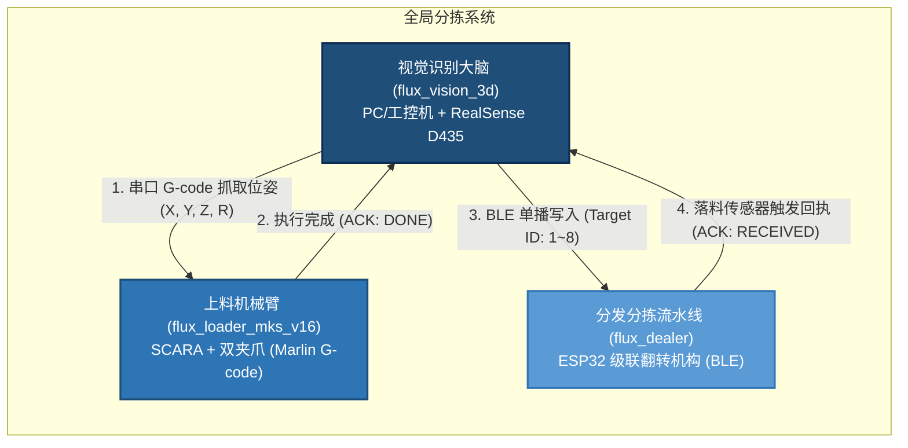
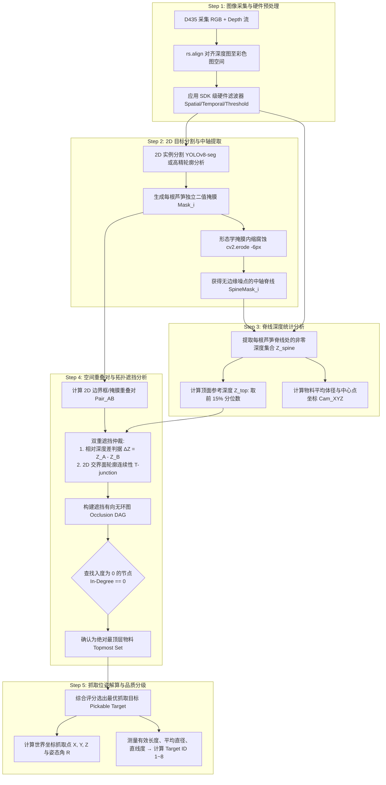

# 基于 Intel RealSense D435 的 3D 视觉识别子系统需求与设计规格书

> **项目名称**：`flux_vision_3d`  
> **项目定位**：分拣系统的“视觉大脑”与主调度中心（Vision Subsystem）。  
> **核心使命**：基于 Intel RealSense D435 RGB-D 3D 深度相机，对料槽/传送带上无序堆叠交叉的芦笋进行抗噪感知与空间遮挡拓扑推理，**100% 稳定提取最顶层可抓取目标（Topmost Pickable Target）**，解算其在世界坐标系下的笛卡尔位姿 $(X, Y, Z, R)$，驱动 SCARA 机械臂完成高可靠自动化抓取，并向 Dealer 分发机构输出品质分拣指令。

---

## 1. 系统架构与硬件应用场景

### 1.1 系统全局拓扑关系



### 1.2 物理工况与硬件规格

| 模块 | 硬件选型与规格 | 运行工况 / 安装参数 | 设计指标与约束 |
| :--- | :--- | :--- | :--- |
| **3D 视觉传感器** | **Intel RealSense D435** (主动红外双目 RGB-D) | 俯视垂直安装于传送带/料槽上方<br>架设高度：**$H \approx 70\text{ cm}$ (700 mm)** (允许 60~75cm 微调) | 视野范围：**$50 \sim 60\text{ cm}$**<br>避开近距盲区 (28cm)，处于散斑最佳分布区 |
| **执行机构 (Loader)**| **4轴单臂 SCARA 机械臂 + 双开闭夹爪** | MKS Base V1.6 控制板，Marlin 2.0+ 固件<br>通信：USB 虚拟串口（波特率 115200） | 接受标准笛卡尔坐标：`G1 X.. Y.. Z.. R.. F..`<br>双夹爪控制：`M280 P1/P2` |
| **分发机构 (Dealer)**| **8级级联步进电机翻转机构** | ESP32 控制器，BLE 4.2/5.0 单播通信 | 接收品质分级槽位：`Target ID: 1~8` |
| **宿主计算平台** | **PC / 工控主机 / 笔记本** | Windows 10/11 或 Ubuntu 22.04 LTS<br>Python 3.11+ / OpenCV / PyRealSense2 | 单帧完整推理决策耗时：$\le 200\text{ ms}$ |

---

## 2. 核心业务痛点剖析与算法破局设计

### 2.1 堆叠细长果蔬（芦笋）在 RealSense 下的 5 大物理风险与解决策略

堆叠分拣的核心瓶颈并非“检测出芦笋”，而是“**如何在杂乱重叠中确定哪一根在最上层**”。针对 RealSense D435 的物理特性，系统制定如下针对性规避方案：

```
                    ┌────────────────────────────────────────────────────────┐
                    │               RealSense 物理风险规避矩阵                │
                    └────────────────────────────────────────────────────────┘
                                     │
      ┌──────────────────────────────┼──────────────────────────────┐
      ▼                              ▼                              ▼
【风险 1: 边缘飞点与粘连】       【风险 2: 湿润表面镜面反光】      【风险 3: 深度高斯噪声】
细长圆柱边缘产生视差模糊,        蜡质/水膜引起红外过曝,          70cm 工作面带来 2~3mm
两根接触芦笋在深度图上粘连。      中心中轴线产生 0 值黑洞。        深度抖动, 影响叠压判断。
      │                              │                              │
      ▼ (对策)                       ▼ (对策)                       ▼ (对策)
严禁直接在 3D 点云做聚类!        1. 固件调低激光功率至 100mW;    启用 SDK 硬件级后处理滤波:
采用 2D Mask 形态学腐蚀          2. 深度提取采用脊线有效像素的    Spatial (保边空间滤波) +
(Erosion 5~8px), 剥离边缘,       前 15% 分位数/中位数, 免疫     Temporal (时间滤波) +
只在最凸起的【中轴脊线】采样。   零值黑洞。                     Threshold (500~850mm截断)。
```

### 2.2 视觉感知核心算法处理管线（“2D 引导 + 3D 脊线 + 拓扑遮挡图”）

系统采用深度解耦的五步决策管线，确保对最上层目标判定的 100% 鲁棒性：



---

## 3. 功能性需求 (Functional Requirements)

### 3.1 FR-1：相机生命周期与 RGB-D 数据采集模块 (`camera`)
* **FR-1.1 设备发现与热插拔管理**：自动枚举 USB 连接的 RealSense 设备，检验序列号与固件版本，支持断线重连。
* **FR-1.2 流格式与分辨率配置**：
  * Color Stream：$1280 \times 720$ @ 30fps（或 $640 \times 480$ @ 30fps，保证低延迟）；
  * Depth Stream：$848 \times 480$ @ 30fps，与 Color 流严格保持硬件同步。
* **FR-1.3 深度对齐**：调用 `rs.align(rs.stream.color)` 保证每一个深度像素与 RGB 像素在视场上逐像素对齐。
* **FR-1.4 硬件预设与滤波链**：
  * 自动应用 `Visual Preset = High Accuracy`；
  * 配置激光发射功率为 100~120 mW；
  * 管道挂载 `Decimation Filter`、`Spatial Filter`、`Temporal Filter` 及有效测距区间 `Threshold Filter (500~850mm)`。

### 3.2 FR-2：2D 目标实例分割模块 (`detector`)
* **FR-2.1 双模式架构设计**：
  * **模式 A（生产级）**：基于 Ultralytics YOLOv8-seg 深度学习实例分割，输出每个独立实体的像素多边形掩膜（Polygon Mask）；
  * **模式 B（低算力/自适应传统 CV 模式）**：基于 HSV 颜色空间二值化、自适应阈值与形态学开闭运算提取轮廓。
* **FR-2.2 实体有效性过滤**：剔除面积过小（断裂碎屑）或严重贴靠视场边界的残损目标。

### 3.3 FR-3：脊线提取与深度抗噪统计模块 (`depth_spine`)
* **FR-3.1 掩膜形态学腐蚀**：针对每一个 2D Mask，使用矩形或椭圆核执行 $5 \sim 8$ 个像素的连续腐蚀，剥除边缘 3~5mm 范围内的深度飞点。
* **FR-3.2 脊线点云提取**：将腐蚀后的内缩掩膜与对齐深度图作点乘，提取出纯净的沿轴中轴线深度数组。
* **FR-3.3 分位数顶面高度解算**：
  * 过滤深度值 $\le 0$ 或超出视场的无效点；
  * 计算有效深度值的 **前 15% 分位数（15th Percentile）** 作为顶面物理高度 $Z_{\text{top}}$；
  * 计算中位数（Median）作为轴心参考高度 $Z_{\text{center}}$。

### 3.4 FR-4：空间遮挡分析与最上层目标仲裁 (`occlusion_dag`)
* **FR-4.1 空间重叠对发现**：对场景内所有检测到的芦笋执行 2D Bounding Box / Mask 相交检测，建立重叠芦笋候选对集合。
* **FR-4.2 双重遮挡关系判定**：
  * **判据一（高程差）**：若在重叠区域内，$Z_A^{\text{top}} + \delta < Z_B^{\text{top}}$（其中容差阈值 $\delta = 4\text{ mm}$），则确立 $A$ 压在 $B$ 之上；
  * **判据二（几何连续性）**：若深度差接近容差极限，检测两者交叉处的边缘轮廓连续性——具有连续无中断边界的实体判定为上层，被截断（T-junction）的实体判定为下层。
* **FR-4.3 遮挡有向无环图构建**：构建有向图 $G = (V, E)$，其中节点为芦笋实体，有向边 $A \to B$ 表示 $A$ 压在 $B$ 上。
* **FR-4.4 最顶层无遮挡节点提取**：遍历计算图中所有节点的入度（In-degree），**所有入度为 0（即没有被任何物体压住）的芦笋即为合法的“最顶层可抓取物料（Topmost Set）”**。

### 3.5 FR-5：位姿解算与品质分级决策 (`pose_estimator`)
* **FR-5.1 抓取中心点与长轴方向解算**：
  * 基于最小外接矩形或主成分分析（PCA）求解芦笋在相机平面的长轴方向夹角 $\theta \in [-90^\circ, 90^\circ]$；
  * 确定抓取点（芦笋几何中心或两夹爪等间距抓取点）的像素坐标 $(u, v)$，并反投影得到相机系空间坐标 $(X_{\text{cam}}, Y_{\text{cam}}, Z_{\text{cam}})$。
* **FR-5.2 物理品质分级度量**：
  * 沿长轴扫描截面轮廓，计算平均外径 $D_{\text{mm}}$；
  * 计算骨架弧长获取实际展开长度 $L_{\text{mm}}$；
  * 计算骨架最大偏离直线距离评估直线度 $S \in [0.0, 1.0]$；
  * 根据分级规则映射到目标槽位 `Target ID`（1～8 号）。

### 3.6 FR-6：手眼标定与世界坐标变换 (`transformer`)
* **FR-6.1 标定方案（Eye-to-Hand）**：相机固定于大地俯视工作台，标定相机坐标系到 SCARA 机械臂基座坐标系的外参矩阵：
  $$\begin{bmatrix} X_{\text{scara}} \\ Y_{\text{scara}} \\ Z_{\text{scara}} \\ 1 \end{bmatrix} = \mathbf{T}_{\text{cam}}^{\text{scara}} \begin{bmatrix} X_{\text{cam}} \\ Y_{\text{cam}} \\ Z_{\text{cam}} \\ 1 \end{bmatrix}$$
* **FR-6.2 姿态角对齐**：将相机系下的长轴夹角 $\theta$ 转换折算为 SCARA 机械臂末端夹爪在世界坐标系下的绝对角度 $R_{\text{world}}$。

### 3.7 FR-7：子系统协同调度与通信 (`coordinator`)
* **FR-7.1 机械臂通信 (Loader Client)**：
  * 通过虚拟串口与 MKS Base 控制板连接，封装 G-code 生成器；
  * 生成抓取运动序列：移至安全高度上方 $\to$ 沿 $R$ 轴对齐旋转 $\to$ 下探至目标高度 $Z$ $\to$ 闭合双夹爪 (`M280 P1/P2`) $\to$ 提升至安全高度 $\to$ 运送至落料口上方打开夹爪；
  * 侦听机械臂返回的 `ok` 与执行闭环确认。
* **FR-7.2 分发子系统通信 (Dealer Client)**：
  * 通过 BLE 单播连接至 ESP32 Dealer，将判定后的 `Target ID` 写入特征值；
  * 侦听落料传感器触发的 ACK 回执，形成完整分拣任务闭环。

### 3.8 FR-8：调试开发与可视化工具链 (`tools`)
* **FR-8.1 实时点云与深度探针工具 (`tools/d435_viewer.py`)**：实时显示彩色图、对齐深度热力图，鼠标点击可显示对应位置的物理深度值 $(X, Y, Z)$ 及滤波后波动。
* **FR-8.2 多层分拣实测演示工具 (`tools/layer_seg_demo.py`)**：可视化标注场景中每根芦笋的 Mask、脊线、遮挡有向图指向，并在最顶层芦笋上高亮标注抓取十字线与姿态角。
* **FR-8.3 离线数据回放与仿真器 (`tools/dataset_recorder.py & replay.py`)**：支持将 D435 采集的数据录制为离线文件，便于脱机进行算法迭代测试。

---

## 4. 非功能性需求 (Non-Functional Requirements)

1. **时延与吞吐率**：
   * 在普通 PC（i5/i7 或带轻量独立显卡/集成显卡）上，单帧从图像采集、分割、分层推理到生成 G-code 的全流程时延 $\le 200\text{ ms}$（$\ge 5\text{ FPS}$ 决策速率），满足机械臂单个抓放周期（约 $1.5 \sim 2.5\text{ s}$）的时序余量。
2. **防错与安全冗余 (Fail-Safe)**：
   * **全遮挡互锁/环路保护**：若遮挡图中出现异常循环依赖，算法需退化为最高绝对高度优先策略，绝不导致主调度死锁挂起；
   * **视野空无/无效帧保护**：当视野内无可抓取芦笋时，主线程平滑等待，向终端与日志输出状态，不发出任何机械臂移动指令；
   * **防撞安全高度**：任何运动指令必须遵循“抬起到安全高度平移 $\to$ 垂直精准下落”原则，避免侧向推撞料槽堆叠物料。
3. **环境适应性**：
   * 支持室内日光灯、厂房条形补光灯等多种光照条件，抗环境光直射能力由 D435 主动红外散斑及偏振光学片保证。

---

## 5. 软件工程目录结构设计

工程根目录为 `d:\Software\antigravity\flux_vision_3d`：

```
flux_vision_3d/
├── README.md                          # 项目工程介绍与快速上手
├── requirements.txt                   # Python 依赖清单 (pyrealsense2, opencv-python, ultralytics, etc.)
├── config.yaml                        # 核心运行配置文件 (相机、滤波参数、手眼标定矩阵、通信配置)
│
├── docs/                              # 技术文档中心
│   ├── requirements.md                # 【本文档】系统需求与详细设计规格书
│   ├── calibration_guide.md           # D435 与 SCARA 手眼标定操作指引
│   └── occlusion_algorithm_spec.md    # 空间拓扑分层算法深度数学模型说明
│
├── src/                               # 核心源码目录
│   ├── __init__.py
│   ├── main.py                        # 主程序入口调度器 (FSM 任务状态机)
│   │
│   ├── camera/                        # 相机驱动与硬件采集层
│   │   ├── __init__.py
│   │   ├── d435_driver.py             # RealSense 管道、对齐流配置、SDK 硬件滤波器挂载
│   │   └── frame_types.py             # 帧数据结构体定义 (FrameSnapshot, IntrinsicData)
│   │
│   ├── vision/                        # 核心视觉感知与算法层
│   │   ├── __init__.py
│   │   ├── segmenter.py               # 2D 芦笋实例分割器 (支持 YOLOv8-seg 与传统轮廓)
│   │   ├── depth_spine.py             # 掩膜形态学腐蚀与脊线深度统计提取
│   │   ├── occlusion_dag.py           # 重叠判据、遮挡有向无环图构建与顶层判定
│   │   └── pose_estimator.py          # 空间位姿 (X,Y,Z,R) 与品质指标 (直径,长度,槽位) 估算
│   │
│   ├── transform/                     # 空间几何与坐标变换层
│   │   ├── __init__.py
│   │   └── hand_eye.py                # 像素坐标 -> 相机3D -> SCARA世界坐标系转换矩阵
│   │
│   ├── planner/                       # 机械臂抓取动作规划层
│   │   ├── __init__.py
│   │   └── scara_motion_planner.py    # 抓取目标选择、防撞轨迹规划、G-code 生成
│   │
│   └── comm/                          # 外设与子系统通讯层
│       ├── __init__.py
│       ├── serial_loader.py           # SCARA 串口客户端 (发送 G-code，处理 ACK)
│       └── ble_dealer.py              # Dealer 蓝牙客户端 (发送 Target ID，等待确认)
│
├── tools/                             # 调试、标定与可视化工具链
│   ├── d435_viewer.py                 # RealSense 实时彩色/深度/对齐流检测工具
│   ├── layer_seg_demo.py              # 堆叠分层算法静态与实时验证演示工具
│   ├── hand_eye_calibration_tool.py   # 相机-机械臂标定标定板采集与矩阵求解脚本
│   └── dataset_recorder.py            # 图像与对齐深度帧离线录制工具
│
└── tests/                             # 自动化单元测试与仿真用例
    ├── test_camera_mock.py            # 离线模拟相机数据流测试
    ├── test_depth_spine.py            # 脊线腐蚀与分位数深度单测
    └── test_occlusion_dag.py          # 遮挡有向图与入度算法逻辑单测
```

---

## 6. 开发里程碑与交付计划 (Milestones & Roadmap)

```
阶段划分：
┌────────────────────────────────────────────────────────────────────────────────────────┐
│ M0 (工具与采集就绪) ──► M1 (抗噪与脊线深度) ──► M2 (拓扑分层判定) ──► M3 (SCARA闭环) ──► M4 (全自动)│
└────────────────────────────────────────────────────────────────────────────────────────┘
```

| 里程碑 | 目标与核心交付物 | 验证与验收标准 |
| :--- | :--- | :--- |
| **M0：工具优先与采集验证** | 1. 建立工程结构，配置 `requirements.txt` 与 `config.yaml`；<br>2. 交付 `tools/d435_viewer.py`；<br>3. 验证 70cm 安装高度下的 RGB-D 对齐流与视野覆盖。 | 实机运行 `d435_viewer.py`，能流畅观察到 50~60cm 视野，对齐无明显错位，深度图有效率 $\ge 90\%$。 |
| **M1：2D 分割与脊线抗噪提取**| 1. 实现 `segmenter.py` 提取芦笋单体轮廓；<br>2. 实现 `depth_spine.py`：对掩膜进行形态学腐蚀，提取中心中轴脊线；<br>3. 实施分位数滤波消除反光黑洞与边缘飞点。 | 面对反光、潮湿的单根与多根芦笋，中轴脊线深度提取稳定，无边缘飞点干扰，深度偏差 $\le 2\text{ mm}$。 |
| **M2：拓扑遮挡分析与顶层判定**| 1. 实现 `occlusion_dag.py` 构建遮挡图；<br>2. 结合深度差与几何轮廓连续性仲裁重叠关系；<br>3. 交付 `tools/layer_seg_demo.py` 进行实时分层可视化。 | 针对 3~5 根随机多层交叉堆叠的芦笋，算法能 100% 准确挑出无任何压迫的最上层芦笋，并在图上高亮标出。 |
| **M3：手眼标定与 SCARA 抓取闭环**| 1. 实现 `hand_eye.py`，完成 D435 到 SCARA 笛卡尔空间标定；<br>2. 实现 `scara_motion_planner.py`，输出完整抓取 G-code；<br>3. 通过串口驱动 SCARA 机械臂下抓移载。 | 视觉给出最上层芦笋坐标后，SCARA 机械臂能精准下探并闭合夹爪，成功抓起最顶层芦笋并不触碰下层。 |
| **M4：全系统端到端自动分拣流水线**| 1. 串联 BLE 通信至 `flux_dealer`，发送品质分级槽位；<br>2. 整合主状态机 `main.py`，支持多周期循环连续作业；<br>3. 异常处理与现场压力测试。 | 能够连续自动抓取料槽内的所有芦笋，分层清空料槽，并将对应分类结果可靠录入 Dealer 流水线。 |
