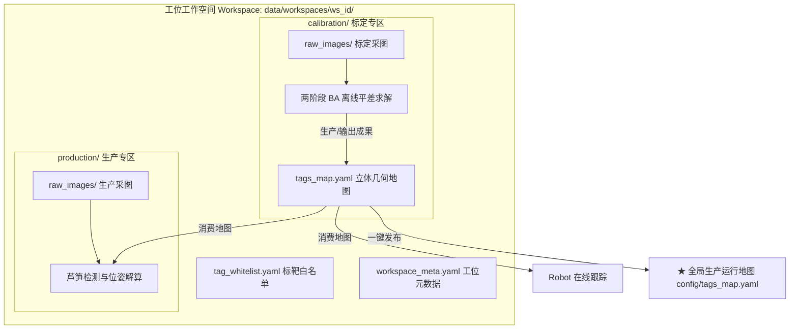

# 工位工作空间 (Workspace) 与管理中枢技术指南

> **文档版本**: v4.0 (2026-09)  
> **适用模块**: `tools/workspace_hub/` & `src/calibration/workspace_manager.py`  
> **系统环境**: Windows 10/11 x64, Python 3.11+, OpenCV 4.x

---

## 1. 系统概述与设计哲学

在工业 3D 视觉与多 AprilTag 空间定位任务中，系统以**“工位工作空间 (Workspace)”**作为物理工位与环境沙盒的顶层概念：
- **工位即完整环境沙盒**：每个 Workspace 自包含顶层公用资产（`tags_map.yaml` 空间几何地图、`tag_whitelist.yaml` 标靶白名单、`workspace_meta.yaml` 元数据）；
- **标定与生产业务双轨自包含**：
  - `calibration/`：专职管理标定采样图像 (`raw_images/`)、观测清单 (`tag_observations.yaml`)、平差质检报告 (`reports/`) 与残差场 (`visualized/`)；
  - `production/`：专职管理生产与模拟生产采图 (`raw_images/`)、离线算法评估报告 (`reports/`) 与批处理结果 (`results/`)；
- **核心基准资产解耦**：标定程序作为“生产者”，求解完成后将高精图谱写回工位顶层的 `tags_map.yaml`；生产与跟踪程序作为“消费者”，直接读取顶层地图，无需感知标定内部过程；
- **专职采图向导双用途联动**：由主仪表盘 (Dashboard) 入口拉起专职采图向导 `capture_wizard.py`（Workspace Hub 内部不再提供采图启动入口），工具栏支持自由切换【标定】与【生产】用途，采集图像自动路由分流存储。

---

## 2. 核心架构与工位资产流转



---

## 3. 界面布局与动态页签区指引

驾驶舱采用 1280x720 工业控制台深色科技风**左右两栏**布局：**左栏工位导航固定不动，右栏为随页签动态切换的内容区**，全部交互均为鼠标操作（已移除所有键盘快捷键）。

```
+---------------------------------------------------------------------------------------------------+
| flux_vision_3d | Workspace   [⊞标定相册][⚑Tag白名单][▤体检报告][▣生产相册]                [退出]   |
+-------------------+-------------------------------------------------------------------------------+
| 工位卡片列表       | 动态页签区 (340~1280, 随所选页签整体切换)                                     |
| (无标题行, 6 张)   |                                                                               |
| 01. 现场实测      | [⊞ 标定相册] 4 列 x 3 行图片卡片网格墙                                          |
|    [生效生产]     |   标定采样相册 (20帧)                          ● SANDBOX: 已平差 0.00px        |
| 02. 对照组A       |   ┌─────┐┌─────┐┌─────┐┌─────┐   卡片 218x182 / 缩略图 210x156                 |
|    [生效生产]     |   │ #01 ││ #02 ││ #03 ││ #04 │   单击选中 · 双击放大 · 滚轮翻页                |
| ...              |   └─────┘└─────┘└─────┘└─────┘   (共 3 行, 每页 12 张)                        |
|                  |   已选中: view_0004.png (4/20) | 第 1/2 页 | 单击选中 | 双击放大 | 滚轮翻页      |
|                  |                                                                               |
|                  | [⚑ Tag白名单] 白名单生效徽章 + 0~29 号放行矩阵               [刷新] [编辑]      |
|                  | [▤ 体检报告] 几何健康大屏 + 质检放行徽章 + Tag 覆盖矩阵                          |
|                  | [▣ 生产相册] 生产基准工位相册 (只读检视, 同款卡片网格墙)                         |
| ---------------- |                                                                               |
| 新建 Workspace   |                                                                               |
| 物理目录         |                                                                               |
+-------------------+-------------------------------------------------------------------------------+
| [系统反馈] Toast 提示 (无内容时保持留白)                                                            |
+---------------------------------------------------------------------------------------------------+
```

### 3.1 右侧动态区四页签机制

顶部 Header 的四片 Tab 胶囊（x 360~832）决定右栏内容，**页签展示顺序与 `HubState.TAB_ORDER` 单一数据源保持一致**：

| 页签 | 内容 | 说明 |
| :--- | :--- | :--- |
| **⊞ 标定相册** | 当前选中工位的采样卡片网格墙 | 默认页签；右上角同时展示合并后的沙盒状态胶囊 |
| **⚑ Tag白名单** | `tag_whitelist.yaml` 生效状态与 0~29 号放行矩阵 | 右上 `[刷新]` / `[编辑]` 按钮 |
| **▤ 体检报告** | 几何健康大屏 + 质检放行徽章 + Tag 覆盖矩阵 | 由原"纯净看板"演进而来 |
| **▣ 生产相册** | 生产基准工位相册（只读检视） | 卡片网格墙与标定相册同款布局 |

切换方式：**鼠标点击顶部页签胶囊**。切页过程中左栏工位列表保持稳定不闪烁，仅右栏内容整体更新。

### 3.2 顶部标题栏 (Header, 0~50px)
- **四页签 Tab 胶囊**：高亮描边 + 底部指示条标识当前页签，点击一秒直达；
- **退出按钮**：深红科技警戒按钮，鼠标点击即安全退出（亦可点击窗口右上角关闭）。

### 3.3 左侧导航栏 (Left Panel, 0~340px)
- **工位卡片列表**：居中顶部起始（已移除"Workspace 列表 (N)"标题行），单屏容纳 6 张卡片，支持鼠标滚轮翻页；
  - **生产基准卡片**：展示 `★ 生产运行` 金色徽章，点击徽章可唤出【生效到生产系统】业务说明窗；
  - **已平差卡片**：展示高亮 `生效生产` 按钮，点击一键原子发布；
  - **草稿卡片**：展示灰色 `草稿沙盒` 标签；
- **鼠标右键快捷上下文菜单 (Context Menu)**：
  - 在任意工位卡片上**点击鼠标右键**，即在光标处唤起专属深色科技浮层菜单；
  - 针对该条目的操作全部收敛进右键菜单中：
    1. **发布为生产运行基准**（仅已完成平差工位可用）
    2. **编辑 Tag 白名单配置**
    3. **重命名友好别名**
    4. **克隆此 Workspace**
    5. **打开物理目录**
    6. **删除此 Workspace**（生产中工位受保护禁止误删）
  - 支持鼠标 Hover 高亮，点击菜单外空白处安全关闭。
- **左下方全局级操作按钮**：
  - `新建 Workspace`：轻量级弹窗输入中文工位别名；
  - `物理目录`：在 Windows 资源管理器中打开该工位物理文件夹。

### 3.4 右侧动态区 (Right Panel, 340~1280px)
- **图片卡片网格墙**（标定相册 / 生产相册）：4 列 × 3 行大卡片（218×182，缩略图 210×156 保持 4:3），每页 12 张；
  - **单击卡片**：选中（绿色描边 + 左侧高亮条）；
  - **双击卡片**：进入 940px 全宽大图沉浸视口（大图内双击画面或点击 `返回网格` 回到网格墙）；
  - **鼠标滚轮**：按行滚动翻页，选中项自动翻页跟随；
  - 底部单行信息：`已选中文件名 (i/N) | 第 x/y 页 | 操作提示`。
- **沙盒状态胶囊**（标定相册页签右上角，x 1010~1264）：与页面帧数信息合并展示，三态自动变色：
  - `SANDBOX: ★ 生产运行基准`（金色）
  - `SANDBOX: 已平差 X.XXpx`（绿色）
  - `SANDBOX: 草稿沙盒`（浅蓝）
- **Tag 白名单页**：白名单生效徽章 + 模式说明 + 0~29 号标靶放行矩阵（小圆点标记已检测覆盖标靶）+ `[刷新]` / `[编辑]` 按钮；
- **体检报告页**：几何网络健康度、质检放行仪表盘与 0~29 号 Tag 拓扑覆盖矩阵。

### 3.5 底部状态栏 (Footer, 670~720px)
- **系统反馈 Toast**：仅在有操作反馈时显示（如"已切换页签""发布成功"），无内容时保持纯净留白；
- 原 Footer 的快捷键提示行与 SANDBOX 胶囊**已移除**（状态胶囊已上移至标定相册页签标题行右侧）。

---

## 4. 黄金闭环 3 步走 SOP 操作规范

生产现场推荐标准操作流程：

1. **Step 1: 新建或选定草稿工位**
   - 点击左下方 `新建 Workspace` 按钮（弹窗输入中文别名，如 `20260915_车间产线标定`）；
   - 或点击历史工位卡片选中目标沙盒。
2. **Step 2: 专职采图向导与深度平差**
   - 在**主仪表盘 (Dashboard)** 启动采图向导 (`capture_wizard.py`)，多视角多高度引导下抓拍 10~20 帧高质样本；
   - 返回 Workspace Hub 后自动刷新装载最新样本（标定相册页签可见卡片网格墙）；
   - 在**主仪表盘**启动空间建图工作站 (Spatial Mapping Studio)，剔除粗差并求解 3D 坐标；
   - 切到 `▤ 体检报告` 页签：确认 RMSE 重投影误差优于 0.8px 且几何网络健康度达标。
3. **Step 3: 严格质检后一键生效到生产**
   - 点击目标卡片右侧的 `生效生产` 按钮（或在卡片上右键 → **发布为生产运行基准**）；
   - 系统原子更新生产配置文件 `config/tags_map.yaml`，并建立时间戳安全备份；
   - 工位状态立即升级为 `★ 生产运行`，标定相册页签右上角状态胶囊同步变为金色，完成现场标定闭环！

---

## 5. 性能设计与高频交互优化

针对高频鼠标 Hover 与海量 YAML 数据处理，Workspace Hub 实现了全链路极致优化：
- **帧级命中区碰撞缓存 (Hit-box Cache - 248,000 FPS)**：
  - 传统方案只要鼠标产生微小位移（如每秒数十次微移动）即触发全屏重新渲染（包括所有卡片阴影、渐变与几十处中文文字光栅化）；
  - Scene Hub 创新设计 `_get_interactive_hover_key()`，精准判断当前光标是否处于任何交互热区（卡片、按钮、上下文菜单等）。若光标在空白区域移动或维持在同一按钮内，直接零拷贝返回已缓存的双缓冲画布；
  - Hover 响应时间从 ~13s 骤降至 **0.004 ms (248,000 FPS)**，彻底根治鼠标移动画面卡死冻结问题。
- **元数据惰性反序列化与多级缓存 (0ms 场景读取)**：
  - 传统模式每次渲染单帧都会穿透调用 `CalibrationScene.load()`，进而调用 `refresh_stats()`，使用纯 Python `yaml.safe_load` 反复从磁盘解析 70KB 观测数据 YAML，导致单次加载耗时 8~13 秒；
  - 优化后 `CalibrationScene.load()` 默认优先信赖 `scene_meta.yaml` 中的持久化状态；`CalibrationSceneManager` 建立内部场景内存缓存；`HubState` 直接从内存场景列表索引，场景数据读取实现 **0ms / 41ms 极速响应**（提速超 200 倍）。
- **微切片 Patch 局部贴图 (<1.2ms)**：
  - 非 ASCII 中文文本绘制基于 Bounding Box 进行轻量微切片贴图，内存操作量从 2.7MB 降低至 10KB。
- **Unicode / 中文路径安全兼容**：
  - 底层基于 `cv2.imdecode` 与 `cv2.imencode` 封装 `imread_unicode` 与 `imwrite_unicode`，杜绝 Windows 平台中文路径黑屏与加载失败。

## 6. 世界坐标系锚点与 anchor scale factor (锚点尺度因子)

为消除单一 Tag 边长 (50mm) 测量误差 (~0.5mm 即引入 1% 尺度漂移) 对全局空间精度的影响，Scene Hub 在【生效到生产】阶段引入绝对坐标系锚定与尺度因子同步机制：

### 6.1 绝对锚点定义 (与 `config.yaml` `calibration.world_anchor` 同源)

| 锚点 | 标靶 ID | 绝对坐标 (机械臂坐标系, mm) | 角色 |
| :---: | :---: | :---: | :--- |
| 原点锚点 | Tag 0 | $(0, 0, 405)$ | 平移原点 + $Z$ 轴方向参照 |
| 对齐锚点 | Tag 1 | $(0, 520, 196)$ | $X$ 轴方向参照 + 尺度基线 |

### 6.2 anchor scale factor 解算流程

1. **BA 平差阶段保持像素为单位**：避免在优化中混淆像素与物理量纲；
2. **平差收敛后引入绝对坐标**：计算 Tag 0 与 Tag 1 在 BA 解算地图中的标称距离 $D_{nominal}$，与绝对坐标物理距离 $D_{real} = \sqrt{0^2 + 520^2 + (405-196)^2} \approx 560.5\text{mm}$ 比对；
3. **尺度锁定**：$\text{anchor\_scale} = D_{real} / D_{nominal}$，作为全局等比缩放因子；
4. **marker 尺寸模型同步**：`real_marker_size = nominal_marker_size × anchor_scale` ( nominal = 50mm )，所有 Tag 位姿统一表达在以 Tag 0 为原点、Tag 0→Tag 1 为 $X$ 轴、Tag 0 法向为 $Z$ 轴的世界坐标系下。

### 6.3 与生产生效的衔接

`生效生产` 按钮触发时，原子写入 `config/tags_map.yaml` 的地图同时包含：
- 全部 Tag 的世界坐标系位姿 (已乘 anchor_scale)；
- `anchor_scale` 字段 (供下游 `tag_localizer.py` 在线解算时复用)；
- `world_anchor` 元信息 (origin/align tag id + 绝对 XYZ)。

下游生产程序 (芦笋抓取、Robot 在线跟踪) 读取地图时，统一基于该世界坐标系解算目标位姿，与机械臂绝对坐标 `(X0, Y600, Z80, R90°)` 直接对齐。
