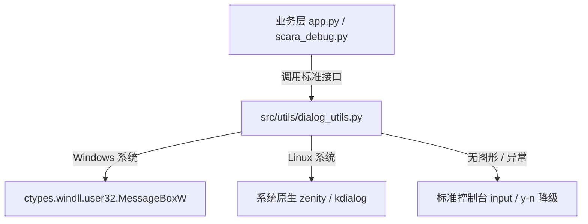

# 工位工作空间 (Workspace) 与管理中枢技术指南

> **文档版本**: v5.0 (2026-09)  
> **适用模块**: `tools/workspace_hub/` & `src/calibration/workspace_manager.py` & `src/utils/dialog_utils.py`  
> **系统环境**: Windows 10/11 x64 / Linux (Ubuntu 20.04+), Python 3.11+, OpenCV 4.x

---

## 1. 系统概述与设计哲学

在工业 3D 视觉与多 AprilTag 空间定位任务中，系统以**“工位工作空间 (Workspace)”**作为物理工位与环境沙盒的顶层概念：
- **工位即完整环境沙盒**：每个 Workspace 自包含顶层公用资产（`tags_map.yaml` 空间几何地图、`tag_whitelist.yaml` 标靶白名单、`workspace_meta.yaml` 元数据）；
- **标定与生产业务双轨自包含**：
  - `calibration/`：专职管理标定采样图像 (`raw_images/`)、观测清单 (`tag_observations.yaml`)、平差质检报告 (`reports/`) 与残差场 (`visualized/`)；
  - `production/`：专职管理生产与模拟生产采图 (`raw_images/`)、离线算法评估报告 (`reports/`) 与批处理结果 (`results/`)；
- **核心基准资产解耦**：标定程序作为“生产者”，求解完成后将高精图谱写回工位顶层的 `tags_map.yaml`；生产与跟踪程序作为“消费者”，直接读取顶层地图，无需感知标定内部过程；
- **全鼠标化与纯净交互**：已彻底剥除所有废弃的键盘快捷键，所有工位运维与状态切换均由精准鼠标点击直达；
- **零隐式垃圾与彻底去“发布”化**：彻底淘汰了历史遗留的“发布生产”隐性机制，工位状态直观透明。

---

## 2. 界面布局与动态四页签架构

Workspace Hub 采用精致紧凑的 **960x720** 工业控制台深色科技风**左右两栏**布局：
- **左栏 (0~340px) 固定**：工位导航列表，单屏支持 6 张工位卡片，卡片右上角实时展示标定/生产照片帧数及重投影误差 RMSE；
- **右栏 (340~960px) 动态**：随顶部四页签整体无缝切换，界面紧凑充实，无任何无意义空白；
- **视窗拉伸与上对齐 (Top-Aligned)**：窗口纵向拉伸放大时，实行严格的 `pad_y = 0` 上对齐与横向居中策略，彻底根治界面下坠与顶部巨大黑边问题，鼠标物理与逻辑坐标 100% 精准映射。

```
+-----------------------------------------------------------------------------------------------+
| flux_vision_3d  Workspace    [Dashboard] [Tag白名单] [标定相册] [★ 生产相册]          [退出]   |
+-------------------+---------------------------------------------------------------------------+
| 工位卡片列表      | 动态页签区 (340~960px, 随所选页签整体切换)                                 |
| 01. 现场实测      |                                                                           |
|    标定 20 帧     | [Tab 1: Dashboard] (原体检报告前置，工位管理与几何健康大屏)                 |
|    生产 0 帧      |   ├── 卡片 #1: 工位信息与运维条 [重命名] [打开] [修改]                     |
|                   |   │   └── 底栏操作行: [更新元数据]  [克隆工位]  [删除]                    |
| 02. 对照组A       |   ├── 卡片 #2: 质检放行仪表盘 (全局 RMSE、合格状态指示)                     |
|    RMSE: 1.41px   |   ├── 卡片 #3: 样本采样与观测有效性 (数据一致性诊断、真实物理照片数统计)     |
|                   |   └── 卡片 #4: 3D 空间拓扑与几何网络健康度 (基线跨度、闭环约束数)           |
| ...               |                                                                           |
|                   | [Tab 2: Tag白名单] 白名单生效徽章 + 0~29 号放行矩阵           [刷新] [编辑] |
|                   | [Tab 3: 标定相册] 3 列 x 3 行图片网格墙 (单击选中 / 双击全宽大图 / 滚轮翻页) |
|                   | [Tab 4: ★ 生产相册] 生产基准工位相册 (同款卡片网格墙，只读检视)            |
| ----------------- |                                                                           |
| + 新建 Workspace  |                                                                           |
+-------------------+---------------------------------------------------------------------------+
| [系统反馈] Toast 提示 (无内容时保持暗色留白)                                                    |
+-----------------------------------------------------------------------------------------------+
```

---

## 3. 顶部 Header 与四页签机制

顶部 Header 包含四片 Tab 胶囊（排布在 `348 ~ 812px`）及紧随其后的退出按钮（`824 ~ 948px`）：

| 页签顺序 | 名称 | 数据源 Key | 核心职责 |
| :---: | :--- | :--- | :--- |
| **Tab 0** | **Dashboard** | `HubState.TAB_REPORT` | **工位运维总控与几何健康大屏**。集成重命名、修改备注、打开目录、更新元数据、克隆、删除及 4 块核心健康卡片。 |
| **Tab 1** | **Tag白名单** | `HubState.TAB_WHITELIST` | 检视与维护 `tag_whitelist.yaml`。展示 0~29 号放行矩阵与右上角 `[刷新]` / `[编辑]` 按钮。 |
| **Tab 2** | **标定相册** | `HubState.TAB_CALIB_IMAGES` | 当前工位标定采样的 3 列 x 3 行网格相册。支持单击选中、双击全宽放大、鼠标滚轮翻页。空状态下仅展示纯净单行居中提示，已剔除多余引导红字。 |
| **Tab 3** | **★ 生产相册** | `HubState.TAB_PROD_IMAGES` | 生产基准工位相册只读检视。与标定相册同款网格架构。 |

> [!NOTE]
> **字体与排版规范**：已彻底移除特殊未映射 Unicode 符号，杜绝豆腐块方框乱码。胶囊内文本采用根据中英文字符宽度自适应计算的水平居中算法，视觉规整对称。

---

## 4. 工位管理操作完全内嵌收敛 (已彻底移除左侧右键菜单)

历史版本中在左侧列表弹出的右键 Context Menu 已**全量移除**。全部工位管理与生命周期操作收拢在 **Dashboard 卡片 #1** 内部：

1. **`[重命名]`**：修改工位人类可读友好别名；
2. **`[打开]`**：直接在操作系统原生文件管理器（Windows Explorer / Linux 文件管理器）中定位打开工位物理文件夹；
3. **`[修改]`**：编辑工位备注描述信息（独立成行展示）；
4. **`[更新元数据]`**（卡片底栏第 5 行左侧）：触发底层数据一致性核验与自动自愈；
5. **`[克隆工位]`**（卡片底栏第 5 行中间）：快速复制现有工位为新沙盒对照组；
6. **`[删除]`**（卡片底栏第 5 行右侧）：安全弹出原生二次确认框，彻底物理清理工位目录。

---

## 5. 数据一致性核验与自愈机制 (Data Consistency & Self-Healing)

### 5.1 痛点成因
工位元数据缓存文件 `workspace_meta.yaml` 中记录了上次解算时的 `image_count`（如 22 帧）。当用户在磁盘上物理删除了原始照片文件、或迁移工位未带图片时，左侧列表依然显示 `标定 22 帧`，而右侧相册扫描物理目录发现为空显示 `0 张`，引发两侧数据矛盾。

### 5.2 解决方案
1. **Dashboard 实时诊断**：
   在 Dashboard 板块 #3（样本采样与观测有效性）中，实时对比元数据记录值与磁盘真实物理文件数：
   - 一致时呈现：`• 刷新元数据 : ● 物理磁盘与元数据 100% 同步一致`（荧光绿）；
   - 出现偏差时呈现：`• 刷新元数据 : ⚠ 存在偏差 (记录标定 22 帧, 物理实际 0 帧)`（金黄色高亮警示）。
2. **一键自愈更新**：
   点击卡片 #1 底栏的 **`[更新元数据]`** 按钮，系统立即：
   - 重新执行物理磁盘 `glob` 扫描实际图片；
   - 重新解析 `tag_observations.yaml` 观测清单统计有效帧；
   - 重新计算并将真值原子写回 `workspace_meta.yaml`；
   - 实时同步内存与左侧工位卡片，使列表、相册与健康报告瞬间 100% 恢复真实统一。

---

## 6. 跨平台原生对话框架构 (`src/utils/dialog_utils.py`)

为彻底解决业务层散落 `import tkinter` 导致的代码突兀感、Tcl/Tk 运行时内存开销与任务栏幽灵窗口闪烁问题，系统建立了统一的跨平台系统级对话框适配层：



- **确认对话框 (`prompt_confirm`)**：
  - **Windows**：调用系统内核级 `MessageBoxW`，微秒级瞬发，零外部依赖，绝无 Tk 窗口闪烁；
  - **Linux**：调用 Linux 桌面标准 `zenity --question` 或 `kdialog --yesno`；
  - **服务器/无头环境**：自动降级为控制台标准输入。
- **文本输入对话框 (`prompt_input_text`)**：
  - **Linux**：调用 `zenity --entry`，完美挂载操作系统原生 Fcitx / IBus 中文输入法；
  - **Windows / 图形环境**：统一在底层受控托管，保障完整的中文拼音/五笔输入上屏体验，上层业务完全绝缘。

---

## 7. 自动化测试体系

Workspace Hub 具备完善的单元测试覆盖（[tests/test_workspace_hub.py](file:///d:/Software/antigravity/flux_vision_3d/tests/test_workspace_hub.py) 与 [tests/test_dialog_utils.py](file:///d:/Software/antigravity/flux_vision_3d/tests/test_dialog_utils.py)）：
- **Header 几何与四页签切换测试**；
- **卡片网格墙 3x3 分页、按行滚动与全宽大图沉浸视口测试**；
- **工位信息卡片内嵌按钮 Hit-Test 判定测试**；
- **数据一致性核验与自动自愈测试**；
- **拉伸缩放与严格上对齐 (pad_y = 0) 坐标反算测试**；
- **Windows 原生与 Linux zenity 对话框调用测试**。

执行测试命令：
```bash
python -m unittest tests.test_dialog_utils tests.test_workspace_hub
```
全套 **28 项测试持续保持 100% PASS**。
